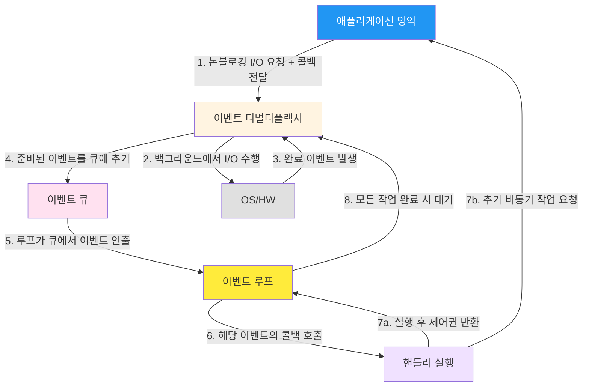
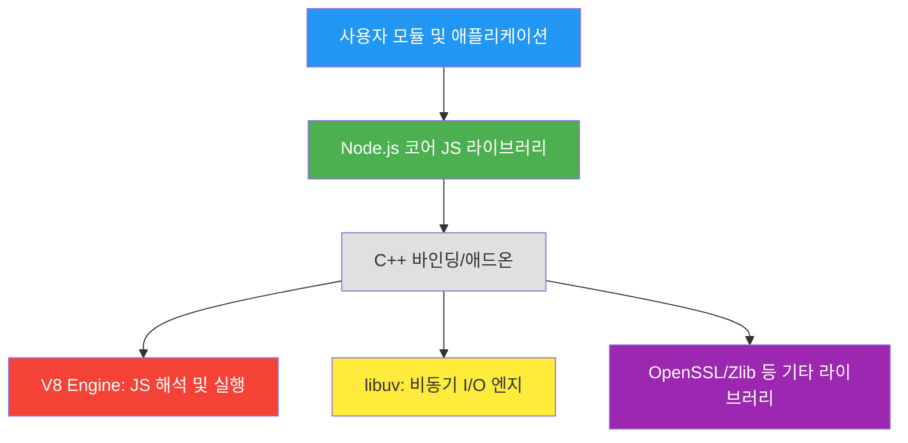

## 시작하며

노디패 스터디 1주차! 드디어 많은 시니어 개발자들이 필독서로 꼽는 'Node.js 디자인 패턴 바이블' 스터디의 서막이 올랐습니다.

사실 Node.js를 수년간 써오면서도 "그냥 비동기니까 빠르겠지" 혹은 "싱글 스레드라서 조심해야 해" 정도의 단편적인 지식만 가지고 있었던 것 같아요. 

하지만 이번 스터디를 통해 1장을 정독하며 Node.js라는 거대한 플랫폼이 어떤 철학적 배경 위에서 탄생했는지, 그리고 그 내부의 톱니바퀴들이 어떻게 맞물려 돌아가는지를 명확히 이해할 수 있었습니다.

이번 1장에서는 단순히 API 사용법을 익히는 것이 아니라, Node.js의 근간을 이루는 'Node way' 철학과 비동기 I/O의 핵심인 Reactor 패턴을 중점적으로 다룹니다. 

처음 이 책의 목차를 봤을 때 "1장부터 아키텍처 이야기를 한다고?" 하며 조금 당황하기도 했지만, 읽다 보니 왜 이 내용이 1장에 배치되었는지 절실히 깨닫게 되더라고요. 

우리가 앞으로 마주할 수많은 디자인 패턴들이 결국 이 플랫폼의 특성을 극대화하기 위해 탄생했기 때문입니다. 

개인적으로는 싱글 스레드 환경에서 어떻게 수천, 수만 개의 동시 접속을 효율적으로 처리하는지에 대한 미스터리가 풀리는 아주 짜릿한 과정이었습니다. 

"아, 그래서 Node.js가 싱글 스레드인데도 빠른 거구나"라는 감탄사가 절로 나오는 시간이었습니다. 

처음 라이언 달(Ryan Dahl)이 왜 하필 자바스크립트를 선택했는지에 대한 깊은 고민의 흔적을 엿볼 수 있었던 것도 큰 수확이었습니다.

개발자로서 시스템의 심장부를 들여다보는 것은 언제나 설레는 일입니다.

## Node.js의 철학 - "Node way"

Node.js는 단순히 구글의 V8 엔진 위에 올라간 자바스크립트 실행 환경이 아닙니다. 

그것은 하나의 '문화'이자 독특한 '설계 철학'의 집합체입니다. 

커뮤니티에서는 이를 "Node way"라고 부르며 존중하죠. 

이 철학은 우리가 애플리케이션을 어떻게 설계하고, 모듈을 어떻게 나누며, 커뮤니티와 어떻게 상호작용해야 하는지에 대한 강력한 가이드라인을 제시합니다.

### 경량 코어 (Lightweight Core)

Node.js 코어 팀의 가장 큰 원칙 중 하나는 코어 라이브러리를 최대한 작고 가볍게 유지하는 것입니다. 

이는 다른 서버 사이드 프레임워크들이 모든 기능을 내장하려 했던 것과는 정반대의 행보입니다. 

최소한의 기능 세트만 코어에 두고, 나머지 화려하고 복잡한 기능들은 '유저랜드(userland)', 개발자들이 만드는 생태계의 영역으로 밀어냈습니다.

이 부분을 읽으면서 "아, 그래서 Node.js 업데이트가 그렇게 안정적으로 이루어질 수 있었구나"라는 생각이 들었습니다. 

코어는 시스템의 안정성을 책임지며 천천히 진화하고, 대신 커뮤니티가 npm이라는 광활한 운동장에서 수많은 실험과 혁신을 빠르게 시도할 수 있도록 판을 깔아준 것이죠. 

코어가 커지면 커질수록 유지보수 비용이 기하급수적으로 늘어나는데, Node.js는 이 짐을 영리하게 생태계 전체로 분산시켰습니다.

실제로 코어에는 최소한의 API만 존재합니다. 예를 들어 웹 프레임워크 기능은 코어에 없습니다.

```javascript
// ❌ 코어에 모든 기능을 넣는 대신
// ✅ npm 생태계에서 필요한 기능을 선택

// 코어: 기본 HTTP 서버 기능만 제공 (매우 로우 레벨)
const http = require("http");

const server = http.createServer((req, res) => {
  // 저수준 API이므로 헤더부터 바디까지 직접 제어해야 함
  res.writeHead(200, { "Content-Type": "text/plain" });
  res.end("Hello World\n");
});

// 유저랜드: Express, Koa, Fastify 등 취향에 맞는 프레임워크 선택
// Express 같은 프레임워크는 내부적으로 이 http 모듈을 사용하여
// 사용자에게 더 편리한 추상화 레이어를 제공합니다.
```

실무에서도 모든 기능을 내장한 거대한 프레임워크보다는, Express나 Fastify처럼 딱 필요한 기능만 조립해서 쓰는 방식이 Node.js의 철학에 더 부합한다는 걸 다시금 확인하게 되었습니다. 

처음에는 "왜 프레임워크가 기본으로 없지?"라고 생각했는데, 이제는 이 유연함이 Node.js의 가장 큰 무기라는 걸 알 것 같습니다.

### 경량 모듈 (Small Modules)

Unix의 황금기부터 내려온 "작은 것이 아름답다"라는 철학은 Node.js에서 꽃을 피웠습니다. 

Node.js 생태계에서 좋은 모듈이란 '한 가지 일만 완벽하게 수행하는 모듈'을 의미합니다.

처음 npm 생태계를 접했을 때, 단 몇 줄짜리 코드만 들어있는 패키지들이 수만 개의 다운로드를 기록하는 걸 보고 "이게 왜 필요하지?"라고 의아해했던 적이 있습니다. 

하지만 이번에 깊이 있게 공부해보니, 작고 집중화된 모듈이야말로 소프트웨어의 복잡성을 관리하는 최고의 무기라는 걸 깨달았습니다. 

작은 모듈은 다음과 같은 엄청난 장점을 가집니다.

- **이해하기 쉽다**: 코드의 범위가 좁으니 누구나 금방 로직을 파악할 수 있습니다. 
- **테스트가 완벽하다**: 기능이 하나뿐이니 모든 엣지 케이스를 검증하기가 매우 쉽습니다. 
- **유지보수가 간편하다**: 수정이 필요할 때 다른 곳에 미치는 영향(Side Effect)이 거의 없습니다. 
- **재사용성이 극대화된다**: 범용적인 작은 도구들은 어디든 가져다 쓸 수 있습니다. 

실제로 Node.js의 혁신 중 하나는 npm이 패키지 간의 복잡한 종속성 문제를 '각 패키지가 자신만의 종속성 버전을 가질 수 있게' 함으로써 해결했다는 점입니다. 

과거 자바나 파이썬에서 겪었던 '종속성 지옥'을 해결한 이 방식은 Node.js가 폭발적으로 성장하는 밑거름이 되었습니다. 

실무에서도 `lodash` 전체를 가져오기보다 필요한 작은 유틸리티 함수 하나만 가져와서 쓰는 것이 번들 크기 최적화나 장기 유지보수에 얼마나 유리한지 새삼 느끼게 되었습니다.

### 작은 외부 인터페이스 (Small Surface Area)

Node.js 모듈은 외부로 노출하는 인터페이스 면적을 최소화하는 것을 권장합니다. 

이는 보통 `module.exports`를 통해 단일 함수나 클래스 딱 하나만을 노출하는 패턴으로 나타납니다.

```javascript
// ✅ 권장되는 패턴: 단일 진입점만 노출하여 사용성을 높임
// 사용자는 이 모듈을 가져와서 바로 실행할 수 있습니다.
module.exports = function logger(message) {
  console.log(`[LOG]: ${message}`);
};

// ❌ 피해야 할 패턴: 너무 많은 내부 구조를 노출하여 결합도를 높임
// 내부 구현 클래스나 변수까지 노출하면 나중에 수정하기가 매우 까다로워집니다.
module.exports = {
  Logger: class { ... },
  Formatter: class { ... },
  Transport: class { ... },
  internalBuffer: [] // 이런 걸 노출하면 외부에서 직접 수정할 위험이 있습니다.
};
```

개발자로서 항상 "이 객체의 메서드 중에서 어디까지를 public으로 열어둬야 할까?"라는 고민이 있었는데, Node.js의 방식은 매우 명쾌했습니다. 

내부 구현은 철저히 숨기고, 사용자가 실제로 사용해야 할 '단일 진입점'만 제공하는 것이죠. 

이렇게 하면 나중에 내부 로직을 대대적으로 리팩토링하더라도 외부 인터페이스만 유지된다면 사용자에게 아무런 영향을 주지 않습니다. 

이는 캡슐화의 정수이자, 모듈 간의 결합도를 낮추는 최고의 전략입니다. 

클래스보다는 함수를 선호하고, 생성자보다는 팩토리 함수를 선호하는 Node.js의 경향성도 결국 불필요한 표면적을 줄여 유지보수성을 높이려는 실용적인 선택이라는 점이 매우 인상적이었습니다.

### 간결함과 실용주의 (Simplicity & Pragmatism)

마지막으로 Node.js의 철학을 완성하는 것은 KISS(Keep It Simple, Stupid) 원칙과 실용주의입니다. 

레오나르도 다빈치가 말했듯 "단순함이야말로 궁극의 정교함"이라는 가치를 Node.js는 기술적으로 실현하고 있습니다.

특히 "Worse is Better"라는 리차드 가브리엘의 철학이 흥미로웠습니다. 

완벽하고 우아하지만 구현이 복잡한 설계보다는, 다소 불완전하더라도 단순하고 구현하기 쉬운 설계가 결국에는 더 널리 퍼지고 성공한다는 이론이죠.

```javascript
// ❌ 지나치게 복잡한 추상화 (Over-engineering)
// 현실에서는 이런 추상화가 오히려 독이 되는 경우가 많습니다.
class AbstractLoggingFactoryProvider {
  constructor(config) { /* ... */ }
  getLogInstance() { /* ... */ }
}

// ✅ Node.js스러운 단순하고 실용적인 접근
// 직관적이고 읽기 쉽습니다.
function createLogger(name) {
  return (msg) => console.log(`[${name}] ${msg}`);
}
```

JavaScript라는 언어 자체가 가지는 유연함과 실용성을 바탕으로, 현실의 복잡한 문제들을 거창한 이론 대신 단순한 함수와 콜백으로 풀어내는 Node.js의 접근 방식은 현대 백엔드 개발에 엄청난 시사점을 줍니다. 

실무에서도 복잡한 추상화 계층을 쌓느라 시간을 허비하기보다, 현재의 문제를 가장 명확하고 빠르게 해결할 수 있는 단순한 코드를 작성하는 것이 개발자에게 더 중요한 덕목이라는 걸 다시 한번 느꼈습니다. 

처음에는 "너무 날것 아닌가?"라고 생각했는데, 읽어보니 이게 바로 생태계를 이토록 크게 만든 핵심 동력이더라고요.

## Node.js는 어떻게 작동하는가

Node.js의 철학을 이해했다면, 이제 그 철학이 실제 기술적으로 어떻게 구현되었는지 살펴볼 차례입니다. 

우리가 매일 쓰는 비동기 코드들이 밑바닥에서 어떻게 움직이는지 아는 것은 성능 최적화의 첫걸음입니다.

### 2-1. I/O는 느리다

컴퓨터 아키텍처에서 연산을 담당하는 CPU에 비해 데이터를 읽고 쓰는 I/O 작업은 말도 안 되게 느립니다. 

단순히 느린 수준이 아니라, CPU 입장에서는 영겁의 시간과도 같죠.

| 리소스 유형 | 지연 시간 (상대적 수치) | 속도 단위 | 비유적인 거리감 |
| :--- | :--- | :--- | :--- |
| CPU 레지스터/L1 캐시 | 1나노초 미만 | - | 내 손안의 물건 집기 |
| RAM 접근 | 100나노초 내외 | GB/s | 집 앞 편의점 다녀오기 |
| SSD 디스크 접근 | 10~100마이크로초 | MB/s ~ GB/s | 옆 동네 다녀오기 |
| 네트워크 전송 (LAN) | 1밀리초 내외 | MB/s | 서울에서 대전 가기 |
| 네트워크 전송 (Global) | 100밀리초 내외 | MB/s | 서울에서 지구 반대편 가기 |

CPU가 1초에 수십억 번의 연산을 수행하는 동안, 네트워크에서 응답 하나를 기다리는 시간은 CPU 입장에서는 수백만 년을 멍하니 서 있는 것과 같습니다. 

이 시간 동안 아무것도 못 한다면 엄청난 손해겠죠? 

Node.js는 바로 이 '기다리는 시간'을 어떻게 하면 CPU가 놀지 않고 다른 생산적인 일을 하게 만들 것인가에 대한 고민에서 출발했습니다. 

"CPU Bound" 작업보다는 "I/O Bound" 작업이 많은 현대 웹 서비스 환경에 Node.js가 최적인 이유가 바로 여기에 있습니다.

### 2-2. 블로킹 I/O (Blocking I/O)

전통적인 방식은 I/O 요청을 보낸 뒤 결과가 올 때까지 현재 실행 중인 스레드(Thread)를 멈춰 세웁니다. 

데이터가 준비될 때까지 스레드는 아무것도 못 하고 대기 상태(Waiting)에 빠지죠.

이 모델에서 여러 요청을 동시에 처리하려면 요청마다 스레드를 새로 만들어야 합니다. 

하지만 스레드는 공짜가 아닙니다. 

메모리를 소모하고(보통 스레드당 1MB 이상), CPU가 여러 스레드를 왔다 갔다 하며 작업하는 '컨텍스트 스위칭' 비용도 만만치 않습니다. 

수천 개의 동시 연결이 발생하면 서버는 스레드 관리만 하다가 자원을 다 써버리게 됩니다. 

"사용자가 늘어날수록 서버 대수를 늘려야 한다"는 압박이 바로 여기서 옵니다. 

이를 'C10K 문제(1만 개의 동시 접속 처리 문제)'라고 부르기도 합니다.

### 2-3. 논블로킹 I/O (Non-blocking I/O)

반면 현대적인 OS는 시스템 호출이 즉시 반환되는 논블로킹 모드를 지원합니다. 

데이터가 아직 준비되지 않았다면 시스템은 "데이터가 아직 없으니 나중에 다시 물어봐"라는 에러 코드(EAGAIN)를 즉시 반환하고, 스레드는 멈추지 않고 다음 코드를 실행합니다.

처음에는 이 방식이 무조건 효율적이라고 생각했는데, 공부하다 보니 함정이 있더라고요. 

데이터가 왔는지 확인하기 위해 무한 루프를 돌며 계속 물어보는 '폴링(Polling)' 방식은 CPU 자원을 엄청나게 낭비하게 됩니다.

```javascript
// 논블로킹 폴링의 의사코드 (Busy-waiting)
// CPU 사용량이 100%를 찍게 만드는 아주 비효율적인 방식입니다.
while (true) {
  for (const resource of resources) {
    const data = resource.read();
    if (data === NO_DATA) continue; // 계속 뺑뺑이 돌며 확인
    if (data === CLOSED) {
      resources.remove(resource);
      break;
    }
    process(data);
  }
}
```

"나왔니? 아니. 나왔니? 아니..."를 반복하는 것이죠. 

효율적으로 대기하면서도 데이터가 왔을 때만 알림을 받을 수 있는 더 영리한 방법이 필요해졌습니다.

### 2-4. 이벤트 디멀티플렉싱 (Event Demultiplexing)

이 문제를 해결하기 위해 등장한 것이 '동기 이벤트 디멀티플렉서'입니다. 

이름은 거창하지만 원리는 단순합니다. 

관찰하고 싶은 여러 리소스(소켓, 파일 등)를 하나의 바구니에 담아두고, OS에게 "이 바구니에 든 것들 중에 하나라도 준비되면 나한테 알려줘"라고 부탁하는 것입니다.

OS는 준비된 리소스가 생길 때까지 스레드를 효율적으로 블로킹시켰다가, 이벤트가 발생하면 그 목록을 반환합니다. 

개발자는 반환된 리소스들을 돌면서 필요한 작업을 처리하면 되죠.

- **select/poll**: 가장 기본적인 방식이지만 리소스가 많아지면 모든 리소스를 순회해야 하므로 성능이 저하됩니다.
- **epoll (Linux)**: 리소스 상태를 커널에서 관리하여, 리소스가 많아져도 성능이 일정하게 유지되는 현대적인 방식입니다.
- **kqueue (macOS/BSD)**: 리눅스의 epoll과 유사하게 파일 디스크립터 상태 변화를 효율적으로 감시하는 메커니즘입니다.

덕분에 단일 스레드 하나만으로도 수많은 I/O 작업을 CPU 낭비 없이 동시에 감시할 수 있게 되었습니다. 

이것이 Node.js 동시성의 하드웨어적 기반입니다.

### 2-5. Reactor 패턴

Reactor 패턴은 위에서 설명한 이벤트 디멀티플렉싱 기술을 활용해 Node.js의 비동기 환경을 완성하는 디자인 패턴입니다. 

"반응(React)"한다는 이름처럼, 특정 이벤트가 발생했을 때 미리 등록해둔 핸들러(콜백)를 호출하며 동작합니다.

Node.js 비동기 아키텍처의 심장부인 Reactor 패턴의 흐름을 정리해 보았습니다.



1. **애플리케이션**이 I/O 작업을 요청하면서 그 작업이 끝났을 때 실행될 **핸들러(콜백)**를 함께 넘깁니다. 이 요청은 논블로킹이라 즉시 제어권이 앱으로 돌아옵니다.
2. I/O 작업은 OS 백그라운드에서 처리됩니다.
3. 작업이 완료되면 **이벤트 디멀티플렉서**가 이를 감지하고 해당 정보를 **이벤트 큐**에 집어넣습니다.
4. **이벤트 루프**는 큐를 계속 돌면서 처리할 이벤트가 있는지 감시합니다.
5. 이벤트가 발견되면 연결된 **핸들러를 호출**합니다.
6. 핸들러 실행이 끝나면 다시 이벤트 루프가 제어권을 가져가고, 처리할 이벤트가 없으면 다시 디멀티플렉서에서 새로운 이벤트를 기다립니다.

이런 세부사항들까지 고려해야 한다는 걸 보고 "Node.js는 단순히 빠른 게 아니라, 대기 시간을 예술적으로 관리하는 시스템이구나"라고 생각했습니다. 

우리가 흔히 쓰는 `fs.readFile()` 같은 비동기 함수 하나하나가 사실은 이 거대한 Reactor 엔진의 톱니바퀴였다는 사실이 정말 흥미로웠어요. 

실무에서 비동기 콜백을 작성할 때, 이제는 이 거대한 흐름의 어디쯤에 내 코드가 위치하는지 상상하게 될 것 같습니다. 

"아, 내 콜백이 큐에 들어갔다가 루프에 의해 불려 나오겠구나" 하고 말이죠.

### 2-6. Libuv - Node.js의 심장

앞서 언급했듯이 각 운영체제마다 이벤트 디멀티플렉싱을 구현하는 라이브러리가 제각각입니다. 

Node.js가 플랫폼에 상관없이 동일한 비동기 API를 제공할 수 있는 일등 공신은 바로 **libuv**입니다.

libuv는 OS별 저수준 비동기 인터페이스를 하나로 묶어주는 강력한 추상화 계층입니다. 

하지만 libuv의 역할은 단순히 인터페이스 통일에 그치지 않습니다. 

유닉스 계열의 OS에서 일반 파일 시스템은 완벽한 논블로킹 I/O를 지원하지 않는 경우가 많은데, libuv는 이를 해결하기 위해 내부적으로 **스레드 풀(Thread Pool)**을 운용합니다.

쉽게 말해 우리가 파일 읽기 같은 작업을 시키면 libuv가 보이지 않는 곳에서 별도의 스레드를 사용해 작업을 처리하고, 결과만 메인 이벤트 루프로 알려주는 것이죠. 

"Node.js는 싱글 스레드다"라는 말은 자바스크립트가 실행되는 영역에서는 맞지만, 시스템 전체적으로 보면 libuv가 관리하는 여러 스레드가 협업하고 있는 구조입니다. 

기본 설정으로 4개의 스레드가 할당되며 필요에 따라 늘릴 수도 있죠. 

이 부분을 읽으면서 "아, 그래서 무거운 파일 작업을 할 때 성능 저하가 덜했던 거구나"라는 이해가 됐습니다. 

libuv는 Node.js의 정체성 그 자체라고 해도 과언이 아닙니다.

### 2-7. Node.js 전체 아키텍처

지금까지 살펴본 요소들을 종합하여 Node.js의 전체 아키텍처를 시각화해 보겠습니다.



결국 Node.js는 **V8 엔진**의 강력한 성능, **libuv**의 효율적인 비동기 처리, 그리고 이들을 자바스크립트 세계와 연결해 주는 **바인딩** 기술이 합쳐진 결정체입니다. 

이 아키텍처를 이해하고 나니, 왜 Node.js가 네트워크 서버나 실시간 애플리케이션에 그토록 강력한 성능을 발휘하는지 고개를 끄덕이게 됩니다. 

특히 V8 엔진은 단순한 인터프리터가 아니라 JIT(Just-In-Time) 컴파일러로서 코드를 실행 중에 최적화한다는 점도 Node.js의 성능에 큰 기여를 합니다.

## Node.js에서의 JavaScript

Node.js 환경의 자바스크립트는 브라우저에서 쓰던 것과 문법은 동일하지만, 그 '권한'과 '책임'의 범위가 완전히 다릅니다.

### 3-1. 브라우저 vs Node.js

두 환경의 차이점을 명확히 이해하는 것은 중요합니다. 핵심 차이점을 비교 테이블로 정리했습니다.

| 비교 항목 | 브라우저 (Browser) | Node.js |
| :--- | :--- | :--- |
| **핵심 목적** | 사용자 인터페이스(UI) 표현 및 상호작용 | 서버 사이드 로직 처리 및 시스템 제어 |
| **전역 객체** | `window`, `document`, `history` 등 | `global`, `process`, `__dirname` 등 |
| **DOM/BOM 접근** | ✅ 자유롭게 가능 | ❌ 불가능 (UI가 없음) |
| **파일 시스템 접근** | ❌ 보안상 엄격히 차단 (샌드박스) | ✅ `fs` 모듈로 모든 파일 제어 가능 |
| **네트워크 제어** | ❌ HTTP 요청만 가능 (포트 제어 불가) | ✅ 모든 포트 리스닝 및 프로토콜 구현 가능 |
| **보안 모델** | 샌드박스 안에서 안전하게 실행 | 로컬 시스템의 모든 권한을 가짐 |
| **모듈 시스템** | ES Modules (최신) | CommonJS & ES Modules |

브라우저는 사용자를 보호하기 위해 자바스크립트를 철저히 격리된 공간(샌드박스)에 가두지만, Node.js는 개발자에게 시스템의 모든 열쇠를 쥐여줍니다. 

그래서 파일을 생성하고, 데이터베이스에 연결하고, 다른 프로세스를 띄우는 일들이 가능해지는 것이죠. 

특히 `process` 객체를 통해 환경 변수(`process.env`)에 접근하거나 프로세스를 종료(`process.exit()`)하는 기능은 서버 개발에서 필수적입니다.

### 3-2. 최신 JavaScript 실행

Node.js는 구글의 최신 V8 엔진을 탑재하고 있어, 최신 자바스크립트 명세(ES6+)를 매우 빠르게 도입합니다. 

브라우저처럼 "사용자가 구버전 인터넷 익스플로러를 쓰면 어떡하지?" 하는 고민에서 자유롭습니다. 

`package.json`의 `engines` 필드를 통해 서버의 실행 버전을 고정할 수 있기 때문에, 바벨(Babel) 같은 트랜스파일러 없이도 현대적인 문법을 마음껏 즐길 수 있다는 점은 개발 생산성에 엄청난 이점을 줍니다. 

실무에서도 별도의 빌드 과정 없이 `async/await`나 `Optional Chaining`을 바로 쓸 수 있다는 게 얼마나 큰 축복인지 모릅니다.

### 3-3. 모듈 시스템의 공존

Node.js는 역사가 깊은 만큼 두 가지 모듈 시스템이 공존합니다. 

전통적인 `require/module.exports` 방식인 **CommonJS**와, 자바스크립트 표준인 **ES Modules(`import/export`)**입니다. 

처음에는 이 둘이 섞여 있는 게 참 헷갈렸는데, 각각의 로딩 방식(동기 vs 비동기)과 설계 철학이 다르다는 걸 이해하고 나니 상황에 맞게 선택할 수 있는 눈이 생기더라고요. 

최근에는 대부분의 새로운 프로젝트가 ESM으로 넘어가는 추세지만, 여전히 수많은 기존 패키지들이 CJS로 되어 있어 두 세계를 넘나드는 능력이 중요합니다. 

특히 `node_modules` 내부에서 이 두 시스템이 어떻게 얽혀 돌아가는지 이해하는 것이 고급 Node.js 개발자로 가는 길입니다.

### 3-4. 운영체제 기능 및 네이티브 코드

Node.js는 `fs`, `http`, `net`, `crypto` 등 강력한 내장 모듈을 통해 운영체제의 기능을 직접적으로 제어합니다. 

또한 자바스크립트만으로 해결하기 힘든 극한의 성능이 필요한 작업이 있다면, C/C++로 작성된 네이티브 코드를 연동하는 'N-API'를 활용하거나, Rust 같은 언어를 **WebAssembly(WASM)**로 컴파일하여 실행할 수도 있습니다. 

이런 확장성 덕분에 Node.js는 단순한 웹 프레임워크를 넘어 복잡한 데이터 처리, IoT, 심지어는 로보틱스 분야까지 영역을 넓혀가고 있습니다. 

`child_process` 모듈을 사용해 쉘 명령어를 실행하거나 다른 프로그램을 자식 프로세스로 관리하는 기능도 매우 강력하죠.

## 실무에 적용할 수 있는 인사이트들

1. **이벤트 루프 차단(Block) 절대 금지**: Node.js 개발 시 가장 주의해야 할 점입니다. 이벤트 루프는 단일 스레드이기 때문에, 핸들러 안에서 CPU 집약적인 무거운 연산(복잡한 정렬, 암호화 등)을 수행하면 전체 서버가 먹통이 됩니다. 이런 작업은 워커 스레드(Worker Threads)로 분리하거나 별도 마이크로서비스로 넘기는 것이 정석입니다. "아, 내 코드가 0.1초라도 루프를 잡고 있으면 수천 명의 사용자가 대기하게 되는구나"라는 경각심을 가져야 합니다.

2. **모듈 설계 시 인터페이스 최소화**: `module.exports`를 통해 외부로 노출하는 기능을 최소한으로 유지하세요. 사용자가 알 필요 없는 내부 로직은 철저히 숨기는 것이 나중에 코드를 수정할 때 발생하는 사이드 이펙트를 줄이는 최고의 방법입니다. "작은 표면적(Small Surface Area)" 원칙을 명심하세요. 불필요하게 클래스 구조를 복잡하게 가져가기보다 명확한 함수 하나를 노출하는 게 더 나을 때가 많습니다.

3. **작고 집중된 모듈 만들기**: 하나의 모듈이 너무 많은 일을 하고 있지는 않은지 늘 경계해야 합니다. "이 모듈을 한 문장으로 설명할 수 있는가?"를 질문해 보세요. 그렇지 않다면 더 작은 단위로 쪼갤 때입니다. 이는 테스트 코드의 가독성과 커버리지를 높이는 데에도 직결됩니다. 실제로 제가 경험한 프로젝트에서도 모듈을 잘게 쪼갰을 때 버그 추적이 훨씬 빨랐습니다.

4. **논블로킹의 특성 활용하기**: I/O 요청을 보낼 때 순차적으로 기다리기보다, 가능하다면 여러 요청을 동시에 날리고 결과를 한꺼번에 받는(`Promise.all` 등) 패턴을 적극 활용하세요. Node.js의 Reactor 패턴은 여러 비동기 요청을 한꺼번에 처리할 때 진가를 발휘합니다. "A 끝나고 B 하기"보다는 "A와 B를 동시에 던져놓고 둘 다 끝나길 기다리기"가 훨씬 빠릅니다.

5. **실용주의적 접근**: 과도한 추상화나 거창한 설계 패턴에 매몰되기보다, 현재 비즈니스 요구사항을 가장 명확하고 단순하게 해결할 수 있는 코드를 지향하세요. "단순함이 정교함"이라는 Node.js의 철학은 실제 유지보수 단계에서 코드를 읽는 동료들에게 가장 큰 선물이 됩니다. 가끔은 복잡한 디자인 패턴보다 잘 짠 함수 하나가 더 위력적일 때가 많더라고요.

## 마무리

Node.js 디자인 패턴의 첫 관문인 1장을 마치며, 제가 그동안 Node.js를 얼마나 피상적으로만 이해하고 있었는지 깨닫는 소중한 시간이었습니다. 

특히 **"Node.js의 성능은 언어 자체의 속도가 아니라, '기다림'을 관리하는 아키텍처에서 온다"**는 사실이 머릿속을 강하게 때렸습니다.

싱글 스레드라는 제약 조건을 Reactor 패턴과 이벤트 디멀티플렉싱이라는 기술로 승화시켜 고성능 비동기 플랫폼을 만들어낸 과정은, 기술적인 해결책을 넘어 공학적인 예술성까지 느껴지더라고요. 

처음에는 어렵게 느껴졌던 libuv나 디멀티플렉서 같은 개념들이 이제는 우리 서버의 성능을 지탱해 주는 든든한 조력자로 보이기 시작했습니다. 

개발자로서 항상 최적의 성능을 고민했는데, 이 책에서 그 실마리를 찾은 것 같습니다. 

"왜 자바스크립트였는가?"에 대한 질문에 "가장 완벽한 비동기 핸들러를 만들 수 있는 언어였기 때문"이라는 답을 내릴 수 있게 되었습니다.

다음 포스트에서는 드디어 **2장 "모듈 시스템"**을 다룰 예정입니다. 

Node.js의 혈관과도 같은 CommonJS와 ES Modules의 심오한 차이점, 그리고 모듈이 어떻게 메모리에 로드되고 캐싱되는지 그 내부 메커니즘을 낱낱이 파헤쳐 보겠습니다. 

2장에서도 흥미로운 이야기가 가득하니 기대해 주세요! 

1장만으로도 배울 게 이렇게 많은데, 앞으로가 더 기대됩니다.

### 🏗️ 아키텍처와 설계에 대한 질문
- Reactor 패턴에서 이벤트 루프가 단일 스레드임에도 불구하고 어떻게 '동시성(Concurrency)'을 구현할 수 있는 것일까요? 병렬성(Parallelism)과는 어떤 차이가 있을까요?
- Libuv가 내부적으로 스레드 풀을 사용하는 구체적인 사례(파일 I/O, DNS 조회 등)는 무엇이며, 왜 모든 비동기 작업에 스레드 풀을 쓰지 않는지 OS 관점에서 생각해 본다면 어떨까요?
- "경량 코어" 철학이 Node.js 생태계의 폭발적인 성장에 기여한 점과, 반대로 이로 인해 발생한 부작용(예: left-pad 사건 등)에 대해 어떻게 생각하시나요?

### 💻 실무 및 개발 경험에 대한 질문
- 프로젝트를 진행하면서 하나의 모듈을 아주 작게 쪼개어 설계해 본 경험이 있으신가요? 그 과정에서 느꼈던 장점이나 어려움은 무엇이었나요?
- Node.js 서버 운영 중 이벤트 루프가 차단되어 서비스 장애가 발생했던 경험이 있나요? 어떤 코드에서 문제가 발생했었으며, 어떻게 해결하셨나요?
- 여러분의 팀에서는 CommonJS와 ES Modules 중 어떤 방식을 주력으로 사용하시나요? ESM으로의 전환을 고려하고 있다면 가장 큰 걸림돌은 무엇인가요?

### 🚀 성능과 확장성에 대한 질문
- CPU 집약적인 작업(CPU Bound)이 많은 애플리케이션을 Node.js로 구축해야 한다면, 여러분은 어떤 아키텍처(워커 스레드, 외부 프로세스 분리 등)를 선택하시겠습니까?
- WebAssembly(WASM)나 Rust 등을 활용한 네이티브 모듈 연동을 고려해 본 적이 있나요? 자바스크립트만으로 해결하기 힘든 어떤 성능 한계를 극복하고 싶으신가요?
- 브라우저의 샌드박스 모델과 Node.js의 무제한 권한 모델 사이에서, 서버 애플리케이션의 보안을 강화하기 위해 코드 레벨에서 할 수 있는 노력은 무엇이 있을까요?

댓글로 공유해주시면 함께 배워나갈 수 있을 것 같습니다!
