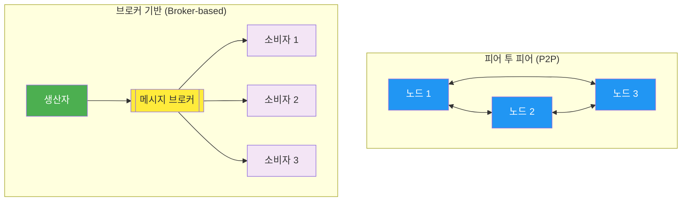
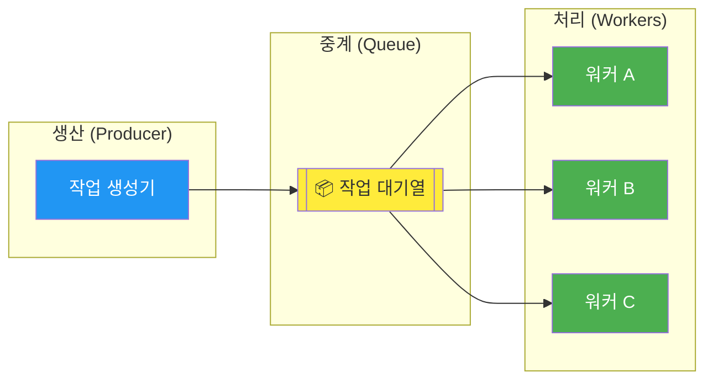
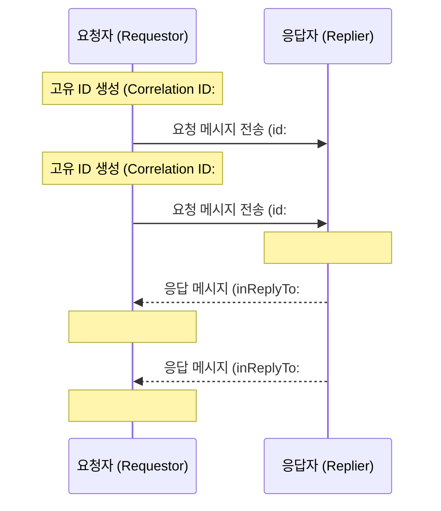

## 시작하며

노디패 스터디 13주차! 드디어 "Node.js 디자인 패턴 시리즈"의 대장정을 마무리하는 마지막 장에 도달했습니다. 

지난 9장에서는 객체들 사이의 대화를 조율하는 행위 디자인 패턴들을 다뤘었죠. 그 이후 10장부터 12장까지는 스터디 범위 외라 잠시 건너뛰고, 시스템 설계의 정점이자 고급 기술들의 집합체인 13장 '고급 레시피와 메시징 패턴'으로 바로 넘어왔습니다.

처음 1장에서 Reactor 패턴의 기본 원리를 공부하며 "아, 이래서 Node.js가 빠르구나"라고 감탄하던 때가 엊그제 같은데, 어느덧 마지막 포스트를 쓰고 있다니 감회가 정말 새롭더라고요. 13장은 단순히 좋은 코드를 작성하는 수준을 넘어, 여러 대의 서버가 거대한 시스템으로 조화롭게 작동하게 만드는 '통합'의 기술들을 다룹니다.

사실 이번 장은 분량이 워낙 많고 내용도 깊어서 정리하는 데 시간이 꽤 걸렸습니다. 하지만 그만큼 실무에서 가장 가려웠던 부분들을 시원하게 긁어주는 내용들이 가득했어요. 특히 메시징 시스템에서의 신뢰성 문제나 CPU 집약적 작업을 Node.js에서 우아하게 처리하는 방법들은 주니어 개발자에서 미들급으로 넘어가기 위해 반드시 정복해야 할 산이라는 생각이 들었습니다. 

시리즈를 마무리하는 포스트인 만큼, 책의 핵심 내용에 저의 개인적인 고민과 실무 경험을 듬뿍 담아보았습니다. 지식의 파편들이 하나의 커다란 지도로 완성되는 과정, 지금부터 하나씩 파헤쳐 보겠습니다.

## 시리즈를 돌아보며: 우리가 걸어온 길

본격적인 13장 내용에 들어가기에 앞서, 그동안 우리가 어떤 여정을 거쳐왔는지 잠시 되돌아보고 싶습니다. 이번 시리즈는 Node.js라는 거대한 생태계를 이해하기 위한 지도와 같았습니다.

| 회차 | 주제 | 핵심 내용 |
|------|------|-----------|
| #1 | Node.js 플랫폼 | Reactor 패턴, libuv, Node way 철학 |
| #2 | 모듈 시스템 | CommonJS vs ESM, 모듈 로딩 메커니즘 |
| #3 | 콜백과 이벤트 | EventEmitter, 비동기 API 설계 원칙 |
| #4 | 비동기 제어 흐름 | 콜백 지옥 탈출, 순차/병렬 처리 패턴 |
| #5 | Promise와 async/await | 현대적인 비동기 처리와 에러 핸들링 |
| #6 | 스트림(Streams) | 데이터 흐름 제어, 파이핑, 역압력(Backpressure) |
| #7 | 생성 디자인 패턴 | 팩토리, 빌더, 싱글톤, 의존성 주입 |
| #8 | 구조 디자인 패턴 | 프록시, 데코레이터, 어댑터, 플라이웨이트 |
| #9 | 행위 디자인 패턴 | 전략, 상태, 템플릿, 관찰자, 커맨드 |
| **#13** | **고급 레시피 & 메시징** | **통합 패턴, 멱등성, 분산 처리** |

이렇게 정리하고 보니 정말 먼 길을 왔네요. 처음에는 각각의 패턴이 서로 상관없는 도구들처럼 보였는데, 13장에 이르러 이 모든 것들이 어떻게 대규모 시스템의 일부로 녹아드는지 보게 되니 전율이 느껴지기도 했습니다. 단순히 코드를 짜는 기술을 넘어 '아키텍처'를 고민하게 된 것이 이번 스터디의 가장 큰 수확인 것 같아요.

## 메시징 시스템의 기초 - 분산 시스템의 언어

확장성이 시스템을 어떻게 배치하느냐의 문제라면, 통합은 그 배치된 시스템들을 어떻게 연결하느냐의 문제입니다. 서비스가 커지면 서비스 간의 대화 방식이 곧 시스템의 아키텍처가 되더라고요.

메시징은 서비스 간의 '느슨한 결합(Loose Coupling)'을 가능하게 하는 핵심 도구입니다. 직접적인 함수 호출이나 REST API 호출은 상대방이 살아있는지, 응답을 언제 주는지에 강하게 묶여있지만, 메시징은 그 중간에 '완충 지대'를 만들어줍니다.

### 메시지의 세 가지 목적

메시지에는 크게 세 가지 유형이 있다는 점을 명확히 하는 것부터 시작해야 합니다. 이 구분을 섞어서 쓰기 시작하면 나중에 유지보수가 정말 힘들어지거든요.

1. **명령 (Command)**: 특정 작업을 수행하라는 명시적 지시입니다. (예: "주문을 생성해줘"). 이 메시지는 보통 한 명의 수신자만 처리해야 하며, 보낸 쪽에서는 작업이 성공했는지에 관심이 많습니다.
2. **이벤트 (Event)**: 이미 발생한 사실에 대한 알림입니다. (예: "결제가 완료됐어"). 발행자는 누가 이 정보를 가져가는지 신경 쓰지 않습니다. 그저 "이런 일이 있었어!"라고 외칠 뿐이죠.
3. **문서 (Document)**: 단순히 정보 자체를 전달합니다. (예: "이게 사용자 프로필이야"). 어떤 동작을 유도하기보다는 데이터를 공유하는 데 목적이 있습니다.

이 구분이 중요한 이유는 설계의 '책임' 때문입니다. 이벤트를 보냈는데 보낸 쪽에서 "누군가는 꼭 이걸 처리해야 해"라고 기대하기 시작하면, 그건 이미 이벤트가 아니라 명령의 성격을 띠게 되고 시스템이 복잡해지기 시작합니다.

### 통신 아키텍처의 선택

또한, 통신의 아키텍처도 상황에 따라 선택해야 합니다.



P2P는 ZeroMQ 같은 기술을 써서 직접 노드끼리 통신하는 방식인데, 지연 시간이 짧고 단일 장애 지점이 없다는 장점이 있습니다. 반면 브로커 방식은 Redis나 RabbitMQ 같은 중간 매개체가 메시지를 보관해주니 관리가 편하고 영속성을 보장하기 쉽죠. 

개인적으로는 실무에서 대부분 브로커 방식을 선호했습니다. 서버 한두 대가 죽어도 메시지가 증발하지 않는다는 심리적 안정감이 크거든요. 하지만 극도의 성능이 필요한 구간, 예를 들어 마이크로서비스 간의 초고속 통신이 필요한 경우에는 P2P가 훌륭한 대안이 된다는 걸 이번에 깊이 배웠습니다.

## 고급 레시피 1: 비동기 초기화와 일괄 처리

메시징으로 넘어가기 전, Node.js 애플리케이션 내부에서 마주하는 까다로운 문제들도 13장의 중요한 주제입니다. 그중에서도 '비동기 초기화'는 누구나 한 번쯤 겪어봤을 문제더라고요.

데이터베이스 연결이 아직 안 됐는데 쿼리를 날리려고 하면 에러가 나죠. 이걸 해결하려고 모든 모듈에 `if (!ready)`를 넣는 건 너무 지저분합니다. 책에서는 이를 **Pre-initialization Queue** 패턴으로 해결합니다.

```javascript
// 비동기 초기화 문제를 해결하는 래퍼 클래스 예시
class AsyncModule {
  constructor() {
    this.initialized = false;
    this.queue = []; // 초기화 완료 전까지 요청을 담아둘 큐
    this.init();
  }

  // 내부적인 비동기 초기화 로직 (예: DB 연결)
  async init() {
    console.log('연결 초기화 시작...');
    try {
      await someAsyncConnection(); // 실제 비동기 연결 작업
      this.initialized = true;
      console.log('초기화 완료. 대기 중인 요청들을 처리합니다.');
      
      // 큐에 쌓여있던 콜백들을 순서대로 실행하여 완료 처리합니다.
      while (this.queue.length > 0) {
        const callback = this.queue.shift();
        callback();
      }
    } catch (err) {
      console.error('초기화 실패:', err);
      // 실패 시 큐에 대기 중인 요청들에게도 에러를 전파해야 합니다.
    }
  }

  // 사용자가 호출하는 공개 메서드
  query(data) {
    // 아직 초기화 전이라면 요청을 큐에 저장하고 나중에 실행되도록 약속(Promise)을 반환합니다.
    if (!this.initialized) {
      console.log('아직 연결이 준비되지 않았습니다. 큐에 추가합니다.');
      return new Promise((resolve, reject) => {
        this.queue.push(() => {
          this.query(data)
            .then(resolve)
            .catch(reject);
        });
      });
    }
    
    // 실제 로직 수행
    console.log('실제 데이터베이스 쿼리를 실행합니다:', data);
    return actualDatabaseQuery(data);
  }
}
```

이 패턴을 보고 "아, 이렇게 하면 사용자 입장에서는 모듈의 상태를 전혀 신경 쓰지 않고 바로 API를 호출할 수 있겠구나"라는 생각이 들었습니다. 내부의 복잡한 상태 관리를 캡슐화하고 외부에는 일관된 인터페이스만 제공하는, 디자인 패턴의 진정한 목적을 보여주는 예시였습니다.

또한, **이벤트 루프 기반의 일괄 처리(Batching)**와 **캐싱**도 인상적이었습니다. 동일한 비동기 요청이 순식간에 수백 번 들어올 때, 첫 번째 요청의 결과가 나올 때까지 나머지 요청들을 대기시켰다가 한 번에 결과를 공유하는 방식입니다. 

실무에서 특히 API 요청이 몰리는 특정 시간에 데이터베이스 부하를 줄이는 데 이만한 보약이 없더라고요. "똑같은 질문을 수백 명이 한다면, 대답은 한 번만 준비해서 모두에게 보여주자"는 논리인데, 이게 Node.js의 싱글 스레드 특성과 맞물려 아주 효율적으로 작동합니다.

최근 Node.js에 표준으로 자리 잡은 **AbortController**에 대한 내용도 흥미로웠습니다. 비동기 작업을 중단시키는 표준화된 방법을 제공하는데, 특히 타임아웃 처리를 하거나 사용자가 페이지를 이탈했을 때 불필요한 네트워크 요청을 끊어주는 용도로 쓰면 코드가 훨씬 깔끔해지더라고요.

## 게시/구독 패턴(Pub/Sub) - 정보의 전파

분산 시스템의 관찰자 패턴이라 불리는 Pub/Sub은 이벤트 기반 아키텍처의 핵심입니다. 발행자는 구독자가 누구인지, 몇 명인지 알 필요가 없습니다. 그저 메시지를 '발행'할 뿐이죠.

이 패턴의 진가는 '확장성'에서 나옵니다. 새로운 기능을 추가하고 싶을 때 기존 코드를 건드리지 않고 새로운 구독자만 추가하면 되니까요. 

### 기술별 비교: 어떤 무기를 선택할 것인가?

| 기술 | 유형 | 영속성 | 주요 특징 및 적합한 상황 |
|------|------|--------|--------------------------|
| **Redis Pub/Sub** | 브로커 | ❌ | 초경량, 실시간성 극대화. 메시지 유실이 상관없는 단순 알림에 최적 |
| **ZeroMQ (PUB/SUB)** | P2P | ❌ | 브로커 없는 고성능 통신. 라이브러리 레벨의 강력한 연결 복구 |
| **RabbitMQ (AMQP)** | 브로커 | ✅ | Exchange를 통한 정교한 라우팅. 기업용 신뢰성 보장 시스템 |
| **Redis Streams** | 브로커 | ✅ | 메시지 히스토리 보관, 소비자 그룹을 통한 분산 처리 지원 |

처음에는 Redis Pub/Sub만 주로 썼었는데, 구독자가 잠시 네트워크 문제로 죽었을 때 그 사이에 발행된 메시지를 영영 잃어버린다는 점이 늘 불안했습니다. 

그래서 최근에는 메시지를 보관해주는 **Redis Streams**나 **RabbitMQ** 같은 기술들이 왜 각광받는지 절실히 이해하게 됐습니다. "메시지는 소중하니까, 함부로 버리면 안 된다"는 교훈을 얻었죠. 특히 Redis Streams는 기존 Redis 인프라를 그대로 쓰면서도 영속성을 챙길 수 있어 아주 매력적인 선택지라는 생각이 들었습니다.

RabbitMQ의 **Exchange** 개념도 짚고 넘어가고 싶습니다. 메시지를 바로 큐에 넣는 게 아니라 Exchange라는 중개인에게 주면, 이 친구가 설정된 규칙(Direct, Topic, Fanout)에 따라 적절한 큐로 배달해줍니다. "로그는 이쪽으로, 결제 알림은 저쪽으로" 하는 식의 복잡한 라우팅을 코드 밖에서 설정으로 관리할 수 있다는 게 무척 강력하더라고요.

## 작업 분배와 파이프라인 - 일감 나눠주기

작업 분배 패턴은 소위 '경쟁 소비자(Competing Consumers)' 패턴으로도 불립니다. 하나의 대기열에 쌓인 일감을 여러 워커가 나눠서 가져가는 방식입니다. 

마치 피자집에서 주문이 쏟아질 때 여러 명의 배달원이 주문표를 하나씩 가져가는 것과 같습니다. 한 주문은 반드시 한 명만 처리해야 하죠. 이 방식은 로드 밸런싱이 자연스럽게 이루어집니다. 손이 빠른 워커는 더 많은 일을 가져가고, 느린 워커는 자기 속도에 맞춰 일을 처리하죠. 



여기에 '파이프라인' 개념을 도입하면 복잡한 데이터 처리 공정도 분산할 수 있습니다. 예를 들어 영상 인코딩 작업이라면 다음과 같은 단계를 거칠 수 있습니다.

1. **Step 1**: 원본 영상 다운로드 워커
2. **Step 2**: 영상 포맷 변환(Transcoding) 워커
3. **Step 3**: 썸네일 추출 워커
4. **Step 4**: 최종 결과 클라우드 저장 워커

각 단계를 별도의 워커 그룹이 맡게 하면, 특정 단계가 병목이 될 때 그 단계의 워커만 늘려주면 됩니다. "인코딩이 너무 느리네? 인코딩 워커만 5대 더 늘리자!" 하는 식의 유연한 확장이 가능해지는 거죠. 

실무에서 대량의 데이터를 처리할 때 이런 구조를 잡지 않으면 메인 서버의 이벤트 루프가 차단되어 전체 서비스가 먹통이 되는 대참사가 일어날 수 있습니다. 13장을 읽으며 "CPU Bound 작업은 무조건 밖으로 밀어내야 한다"는 철칙을 다시 한번 가슴에 새겼습니다.

## 딥다이브: At-least-once 처리와 멱등성(Idempotency) 전략

이번 포스트의 가장 중요한 내용이자, 실무에서 가장 실수가 잦은 부분입니다. 분산 시스템에서 메시지는 절대 '정확히 한 번(Exactly-once)' 전달된다고 가정해서는 안 됩니다. 

네트워크 환경은 언제나 불안정합니다. 메시지를 보냈는데 응답이 안 오면, 보낸 쪽에서는 "안 갔나?" 싶어서 다시 보냅니다. 받는 쪽에서는 이미 처리했는데 또 올 수 있는 거죠. 대부분의 메시징 시스템(SQS, Kafka 등)은 **최소 한 번(At-least-once)** 전달을 보장합니다. 

이 말은 "안 가는 일은 없게 하겠지만, 중복해서 갈 수는 있다"는 뜻입니다. 이 부분을 처음 접했을 때 "아니, 기술이 이렇게 발전했는데 왜 한 번만 주는 게 힘들지?"라는 의문이 들었지만, 딥다이브를 통해 그 이유를 명확히 알게 됐습니다.

### 왜 메시지는 중복될까?

- **소비자 장애**: 작업을 다 마쳤는데 "다 했어"라고 브로커에게 보고(ACK)하기 직전에 소비자 서버가 죽어버리면, 브로커는 처리가 안 된 줄 알고 다른 서버에 같은 메시지를 또 주게 됩니다.
- **네트워크 타임아웃**: 작업은 잘 끝났는데 보고하러 가는 길이 막히면 브로커는 실패로 간주합니다.
- **가시성 타임아웃(Visibility Timeout)**: 작업이 너무 길어져서 브로커가 정해둔 시간을 넘기면, 브로커는 "얘 죽었나 봐" 하고 메시지를 다시 노출시킵니다.

### 해결의 열쇠: Insert First 패턴

메시지가 여러 번 와도 결과는 한 번만 반영되게 만드는 **멱등성(Idempotency)**이 필수입니다. 그중에서도 실무에서 가장 강력한 무기는 **Insert First 패턴**입니다.

보통 "이미 처리했는지 조회(Select)하고 없으면 삽입(Insert)"하는 방식을 생각하기 쉬운데, 이건 동시성 문제가 생깁니다. 두 요청이 동시에 Select를 하면 둘 다 "없네?"라고 판단하고 둘 다 Insert를 시도할 수 있거든요.

그래서 **일단 바로 삽입(Insert First)**하는 게 정답입니다.

```typescript
// Insert First 패턴의 실무 구현 예시
async function processOrderEvent(event) {
  const { orderId, eventType } = event;
  // 비즈니스적으로 고유한 키를 생성합니다.
  const eventKey = `event:${eventType}:${orderId}`;

  try {
    // 1. DB의 Unique 제약 조건을 활용해 기록 삽입을 먼저 시도합니다.
    // 이 테이블의 'id' 컬럼에는 반드시 UNIQUE 인덱스가 걸려있어야 합니다.
    await db.insert('processed_events', {
      id: eventKey,
      status: 'PROCESSING',
      startedAt: new Date()
    });
    console.log(`[START] 이벤트 처리 시작: ${eventKey}`);
  } catch (err) {
    // 2. 만약 이미 존재한다면 중복 키 에러(Duplicate Key Error)가 발생합니다.
    if (err.code === 'ER_DUP_ENTRY' || err.code === '23505') {
      const existing = await db.findOne('processed_events', eventKey);
      if (existing.status === 'COMPLETED') {
        console.log(`[SKIP] 이미 완전히 처리된 이벤트입니다: ${eventKey}`);
        return; // 정상 종료
      }
      // 아직 처리 중이라면 에러를 던져 메시지 큐가 나중에 다시 시도(Retry)하게 합니다.
      throw new Error(`이벤트가 현재 처리 중입니다: ${eventKey}`);
    }
    throw err; // 다른 DB 에러는 그대로 던집니다.
  }

  try {
    // 3. 실제 중요한 비즈니스 로직을 수행합니다. (결제 처리, DB 업데이트 등)
    await executeOrderLogic(orderId);
    
    // 4. 성공적으로 끝나면 상태를 'COMPLETED'로 업데이트합니다.
    await db.update('processed_events', eventKey, { status: 'COMPLETED' });
    console.log(`[SUCCESS] 이벤트 처리 완료: ${eventKey}`);
  } catch (logicErr) {
    // 5. 비즈니스 로직 실패 시, 나중에 재시도할 수 있도록 레코드를 삭제하거나 'FAILED'로 표시합니다.
    console.error(`[ERROR] 비즈니스 로직 실패: ${logicErr.message}`);
    await db.delete('processed_events', eventKey); 
    throw logicErr; // 메시지 큐에게 실패를 알립니다.
  }
}
```

실무에서 SQS와 Lambda를 조합해 쓸 때 이런 멱등성 설계를 빼먹으면 간헐적으로 발생하는 중복 처리 때문에 밤잠을 설치게 됩니다. 특히 결제나 포인트 적립처럼 돈과 관련된 로직에서는 치명적이죠. "메시지 브로커를 믿지 말고, 내 데이터베이스의 Unique 제약을 믿어라"라는 말의 의미를 뼈저리게 느꼈습니다. 실패는 상수고, 그 실패를 견디는 설계가 진짜 실력이더라고요.

## 고급 레시피 2: CPU 집약적 작업의 한계 돌파

Node.js의 영원한 숙제, 'CPU Bound 작업'을 어떻게 처리할 것인가에 대한 답도 13장에서 제시합니다. 1장에서 배웠듯 Node.js는 싱글 스레드 기반이라 무거운 연산을 하면 이벤트 루프가 멈춰버립니다.

이를 해결하기 위한 전략들을 비교해 보았습니다.

| 전략 | 설명 | 장점 | 단점 |
|------|------|------|------|
| **Child Process** | `fork()`로 별도 프로세스 생성 | 완벽한 격리, 코드가 단순함 | 높은 메모리 점유, 프로세스 생성 비용 |
| **Worker Threads** | 한 프로세스 내 여러 스레드 활용 | 효율적인 자원 공유 (SharedArrayBuffer) | 동기화 문제(Race Condition) 주의 필요 |
| **Cluster** | 여러 인스턴스로 코어 분산 | 마스터-워커 구조로 병렬화 용이 | 프로세스 간 상태 공유가 어려움 |

특히 **SharedArrayBuffer**를 이용해 여러 워커 스레드가 메모리를 직접 공유하며 통신하는 내용은 꽤 충격적이었습니다. 자바스크립트에서도 이런 로우 레벨의 메모리 제어가 가능하다니, Node.js가 단순한 스크립트 실행 환경을 넘어 얼마나 고도로 진화했는지 알 수 있었죠.

하지만 실무에서는 이런 복잡한 구조를 직접 짜기보다는, 앞서 배운 '작업 분배 패턴'을 활용해 아예 별도의 마이크로서비스로 작업을 격리하는 편이 유지보수 면에서 더 낫다는 생각도 들었습니다. 기술적인 가능성과 실무적인 합리성 사이의 트레이드오프를 고민해보는 계기가 됐습니다. "할 수 있는 것"과 "해야 하는 것"은 다르니까요.

## 요청/응답 패턴 - 비동기 채널에서의 질서

때로는 비동기 채널 위에서도 동기식 통신(Request/Reply)이 필요할 때가 있습니다. 질문을 던지고 답을 기다리는 구조죠. 하지만 비동기 채널은 질문을 던지고 나면 내 손을 떠나버립니다. 나중에 답이 돌아와도 이게 내 질문에 대한 답인지, 아니면 다른 사람이 물어본 거에 대한 답인지 어떻게 알까요?

이때 필요한 것이 **상관 식별자(Correlation ID)**입니다. 요청할 때 번호표를 붙여서 보내고, 응답하는 쪽도 그 번호표를 그대로 붙여서 돌려주는 것이죠. 요청자는 로컬의 `Map` 같은 곳에 ID와 콜백을 저장해뒀다가, 응답이 오면 ID로 콜백을 찾아 실행합니다.



여기에 여러 요청자가 섞여 있다면 **반환 주소(Return Address)** 패턴까지 더해집니다. 응답자가 어디로 답장을 보내야 할지도 메시지에 담는 것이죠. 이런 패턴들을 보고 나니, 우리가 당연하게 쓰는 HTTP 통신도 밑바닥에서는 이런 고군분투가 벌어지고 있겠구나 싶어 숙연해지기도 했습니다.

## 실무에 적용할 수 있는 인사이트들

### 1. 멱등성은 시스템의 '생명줄'입니다

- 분산 시스템에서 중복 메시지는 예외가 아니라 정상적인 상황으로 받아들여야 합니다. 
- 결제, 주문, 알림 등 시스템의 상태를 변경하는 모든 로직에는 반드시 멱등성 설계를 포함하세요. `Insert First` 패턴은 이를 구현하는 가장 쉽고 강력한 방법입니다.

### 2. 이벤트 루프를 존중하라

- 아무리 좋은 패턴을 써도 이벤트 루프를 막으면 Node.js는 죽은 것과 다름없습니다. 
- CPU 집약적인 작업이 있다면 워커 스레드나 별도 마이크로서비스로 주저 없이 밀어내세요. "내 코드의 0.1초가 수만 명의 대기 시간을 만든다"는 경각심이 필요합니다.

### 3. 메시지 브로커 선택의 기준

- 메시지를 잃어버려도 되는 실시간 알림이라면 Redis Pub/Sub을, 한 건이라도 놓치면 안 되는 비즈니스 로직이라면 RabbitMQ나 Kafka, Redis Streams를 선택하세요.
- 기술의 화려함보다 우리 비즈니스가 허용하는 '데이터 유실의 범위'를 먼저 정의하는 게 순서더라고요.

### 4. 비동기 초기화의 우아한 은닉

- 모듈을 사용할 때마다 `if (!ready)`를 체크하는 코드를 짜고 있다면 지금 당장 리팩토링하세요. 
- `Pre-initialization Queue` 패턴을 활용하면 사용자에게는 깨끗한 API만 노출하고, 복잡한 초기화 대기 로직은 내부로 숨길 수 있습니다.

### 5. AbortController를 활용한 자원 최적화

- 비동기 작업은 시작하는 것만큼이나 '끝내는 것'도 중요합니다. 
- 타임아웃이나 중복 요청 발생 시 `AbortController`를 통해 불필요한 작업을 즉시 중단시키세요. 이는 서버 자원 절약뿐만 아니라 전체적인 시스템 응답성 향상에도 큰 도움이 됩니다.

### 6. SharedArrayBuffer와 원자적 연산

- 성능 최적화가 극단적으로 필요한 상황이라면 `SharedArrayBuffer`와 `Atomics`를 검토해보세요. 하지만 코드의 복잡도가 비약적으로 상승하므로 최후의 수단으로 남겨두는 게 좋습니다.

### 7. 메시지 유형의 엄격한 분리

- 명령과 이벤트를 혼동하지 마세요. 이벤트 메시지는 "이런 일이 있었다"는 사실 전달에만 집중해야 하며, 이를 수신한 쪽에서 어떤 행동을 할지는 수신자의 책임입니다.

## 마무리 (시리즈를 마치며)

드디어 "Node.js 디자인 패턴 시리즈" 전체를 마무리합니다. 1장부터 13장까지 숨 가쁘게 달려오며 Node.js의 깊은 속살을 들여다본 기분입니다. 

처음 스터디를 시작할 때는 단순히 "패키지 사용법이나 좀 익히겠지"라고 생각했었는데, 책을 덮고 나니 Node.js라는 거대한 플랫폼이 어떤 철학적 배경 위에서 탄생했는지, 그리고 그 철학을 지키기 위해 엔지니어들이 얼마나 치열하게 고민했는지를 배울 수 있었습니다. 싱글 스레드의 제약을 Reactor 패턴이라는 예술적인 아키텍처로 승화시킨 것부터, 오늘 다룬 분산 시스템의 통합 전략까지 모든 내용이 하나로 연결되는 느낌을 받았습니다.

개인적으로는 이번 시리즈를 정리하며 지식의 파편들이 정돈되는 아주 소중한 경험을 했습니다. 단순히 "돌아가는 코드"를 짜는 개발자에서, "왜 이렇게 돌아가는지 설명할 수 있는" 개발자로 한 걸음 더 성장한 것 같아 뿌듯합니다. 

이번 13장 포스트로 시리즈를 마치게 되어 시원섭섭한 마음도 들지만, 여기서 배운 도구들이 제 개발 인생의 든든한 무기가 될 것임을 확신합니다. 그동안 긴 여정을 함께해주신 모든 분께 진심으로 감사드립니다. 여러분의 Node.js 프로젝트에도 이 패턴들이 녹아들어 더 견고하고 우아한 시스템이 탄생하기를 응원하겠습니다.

### 마지막으로 드리는 작은 팁

혹시 이 시리즈를 처음부터 정주행하시려는 분이 있다면, 단순히 코드를 따라 치기보다 "왜 이 상황에서 이 패턴을 썼을까?"를 스스로에게 계속 질문해보시길 권합니다. Node.js의 진짜 힘은 화려한 프레임워크가 아니라, 그 밑바닥에 흐르는 견고한 설계 원칙에서 나오기 때문입니다. 때로는 공식 문서보다 이 책의 패턴들이 실무의 복잡한 문제를 해결하는 데 훨씬 더 큰 영감을 줄 것입니다.

저는 이제 이 지식의 지도를 들고, 현실 세계의 더 복잡하고 흥미로운 문제들을 해결하러 가보겠습니다. 언젠가 실무 현장에서 이 패턴들을 적용하며 "아, 그때 그 블로그에서 봤던 게 바로 이거였지!"라고 떠올리는 순간이 오길 기대해 봅니다.

그동안 정말 감사했습니다!

댓글로 공유해주시면 함께 배워나갈 수 있을 것 같습니다!

### 📡 메시징 아키텍처에 대한 질문

- 서비스 간의 결합을 낮추기 위해 Pub/Sub 패턴을 도입해 보신 적이 있나요? 도입 후 시스템의 확장성이 실제로 좋아졌다고 느끼신 지점은 어디인가요?
- P2P 방식(ZeroMQ)과 브로커 방식(RabbitMQ/Kafka) 중 하나를 선택해야 한다면, 여러분의 프로젝트에서는 어떤 기준(지연 시간, 관리 편의성 등)을 가장 중요하게 생각하시나요?
- 메시지 브로커 자체가 장애가 났을 때를 대비한 'Fallback' 전략(예: 로컬 DB에 임시 저장 후 재시도)을 운영해 본 경험이 있으신가요?

### 🛠️ 신뢰성과 멱등성에 대한 질문

- 분산 시스템에서 '정확히 한 번(Exactly-once)' 전달이 불가능하다는 사실을 처음 접했을 때 어떤 느낌이셨나요? 실무에서 중복 처리 방지를 위해 가장 선호하는 패턴은 무엇인가요?
- `Insert First` 패턴을 구현할 때, 처리 기록 테이블의 데이터가 무한히 쌓이는 문제는 어떻게 관리하시나요? (TTL 설정, 배치 삭제 등)
- SQS + Lambda 같은 서버리스 환경에서 메시지 재처리(Retry)와 데드 레터 큐(DLQ)를 운영하며 겪었던 가장 까다로운 문제는 무엇이었나요?

### 🚀 고급 기술과 미래에 대한 질문

- Node.js에서 `Worker Threads`나 `SharedArrayBuffer`를 써야 할 만큼 극한의 성능이 필요한 작업을 마주해 보신 적이 있나요? 그때의 해결책은 무엇이었나요?
- `AbortController`를 프로젝트에 도입해보셨나요? 기존의 타임아웃 처리 방식과 비교했을 때 어떤 점이 가장 개선되었다고 느끼시나요?
- 이번 시리즈 전체를 통해 배운 패턴들 중, 여러분의 현재 프로젝트에 당장 적용해보고 싶은 '원픽' 패턴은 무엇인가요? 그 이유는 무엇인가요?

댓글로 공유해주시면 함께 배워나갈 수 있을 것 같습니다!
