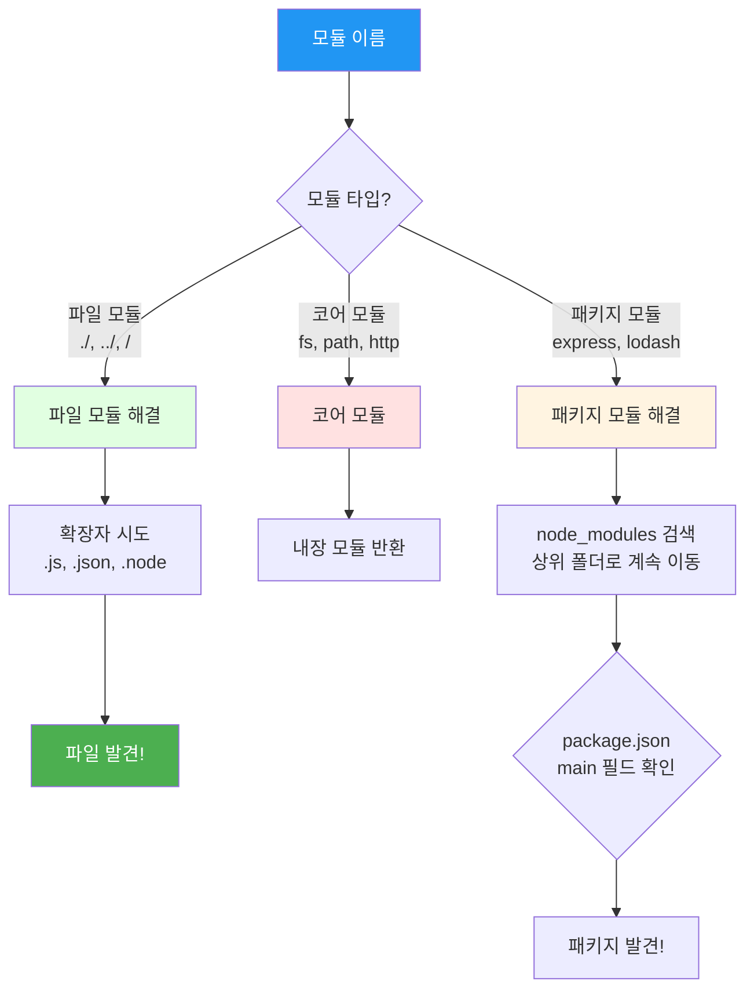
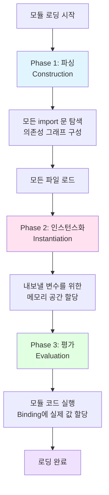

## 시작하며

노디패 스터디 2주차! 지난 1장에서 Node.js의 철학과 Reactor 패턴이라는 거대한 아키텍처를 확인했다면, 이번 2장에서는 그 시스템 위에서 돌아가는 가장 작은 부품이자 혈관인 **모듈 시스템**에 대해 다룹니다.

사실 평소에 아무 생각 없이 사용하던 `require`나 `import`가 내부적으로 이렇게 복잡하고 영리하게 동작한다는 사실을 이번에 처음 알게 되었습니다. 단순히 파일 하나를 불러오는 행위 뒤에 경로 해결 알고리즘, 캐싱 메커니즘, 그리고 순환 종속성을 처리하기 위한 치열한 고민들이 숨어있더라고요.

스터디원들과 함께 "왜 exports는 재할당하면 안 될까?" 혹은 "ESM의 라이브 바인딩은 왜 필요한 걸까?" 같은 주제로 열띤 토론을 벌이면서, 모듈 시스템이야말로 Node.js 프로젝트의 성패를 결정짓는 구조적 근간이라는 점을 깊이 이해하게 됐습니다. 주니어 개발자 시절에 겪었던 수많은 모듈 관련 에러들이 이제야 퍼즐 맞추듯 이해되는 짜릿한 시간이었습니다.

## 모듈이 왜 필요한가?

우리가 작성하는 코드가 수천, 수만 줄로 늘어날 때 모듈 시스템이 없다면 어떤 일이 벌어질까요? 아마 전역 네임스페이스 오염과 종속성 지옥 속에서 길을 잃을 것입니다. 모듈은 현대 소프트웨어 엔지니어링의 네 가지 기본적인 필요를 충족시키기 위해 존재합니다.

### 1. 코드 분할

거대한 애플리케이션을 관리 가능한 작은 단위로 쪼갤 수 있습니다. 5,000줄짜리 `app.js`를 보는 것보다 기능별로 나눠진 여러 개의 파일을 관리하는 게 훨씬 수월하죠. 파일 하나가 비대해지면 협업할 때 충돌이 잦아지고 가독성도 떨어지는데, 모듈화는 이를 미연에 방지합니다.

### 2. 재사용성

한 번 잘 만들어둔 로거(Logger)나 유틸리티 함수를 다른 프로젝트에서도 그대로 가져다 쓸 수 있습니다. 이는 단순히 복사-붙여넣기가 아니라, 패키지 형태로 관리하며 여러 곳에서 공유할 수 있다는 뜻입니다. 오픈 소스 생태계가 이토록 발전한 것도 바로 이 재사용성 덕분입니다.

### 3. 은닉성 (Information Hiding)

복잡한 내부 로직은 꽁꽁 숨기고, 꼭 필요한 인터페이스만 외부에 노출할 수 있습니다. 이는 유지보수성을 높이는 비결입니다. 사용자가 내부 구현에 의존하지 않게 함으로써, 내부 로직이 바뀌어도 사용자 코드는 깨지지 않게 보호할 수 있습니다.

### 4. 종속성 관리

어떤 모듈이 어떤 서드파티 라이브러리에 의존하고 있는지 명시적으로 선언함으로써, 복잡한 의존 관계를 자동으로 해결할 수 있게 해줍니다. 모듈 시스템은 각 모듈이 필요로 하는 자원을 명확히 정의하게 함으로써 런타임 에러를 줄여줍니다.

실무에서도 프로젝트 초기에는 모듈화를 소홀히 하다가 나중에 리팩토링하느라 고생하는 경우를 종종 봅니다. 처음부터 "이 모듈은 한 가지 일만 완벽하게 수행하는가?"라는 질문을 던지며 코드를 나누는 습관이 결국 생산성을 결정한다는 걸 다시금 확인했습니다.

### 좋은 모듈의 3가지 조건

- **응집도(Cohesion)**: 모듈 내부의 요소들이 얼마나 밀접하게 관련되어 있는지 나타냅니다. 관련 있는 기능끼리 뭉쳐있어야 관리하기 편하죠.
- **결합도(Coupling)**: 모듈 간에 얼마나 의존하고 있는지 나타냅니다. 결합도가 낮을수록 한 모듈을 수정해도 다른 모듈에 영향이 덜 갑니다.
- **은닉성**: 앞서 언급했듯 내부 구현은 감추고 인터페이스만 노출하는 것이 중요합니다.

## Node.js 모듈 시스템의 역사와 배경

자바스크립트는 처음 탄생했을 때 모듈 시스템이라는 개념이 없었습니다. HTML 파일에 `<script>` 태그를 순서대로 나열하는 게 전부였죠. 하지만 프로젝트가 커지면서 이 방식은 한계에 부딪혔습니다. 전역 변수가 충돌하고, 스크립트 로드 순서가 조금만 어긋나도 에러가 터졌으니까요.

이를 해결하기 위해 브라우저 환경에서는 비동기 로딩을 지원하는 **AMD**가, 서버 환경에서는 파일 시스템에 바로 접근할 수 있는 특성을 살린 **CommonJS**가 등장했습니다. Node.js는 2009년 탄생 당시 CommonJS를 표준으로 채택하며 폭발적인 성장을 이뤘습니다.

이후 2015년, 자바스크립트 표준 명세에 **ESM (ECMAScript Modules)**이 포함되면서 드디어 언어 차원의 표준 모듈 시스템이 생겼습니다. 현재 Node.js는 이 두 시스템을 모두 지원하며 과도기를 지나고 있습니다. 이 역사적 배경을 알고 나니 왜 우리가 지금 `require`와 `import`를 혼용하며 쓰고 있는지, 그리고 왜 그 차이점을 아는 게 중요한지 보이기 시작했습니다.

## 노출식 모듈 패턴 - 모듈 시스템의 조상님

네이티브 모듈 시스템이 없던 시절, 개발자들은 자바스크립트의 **IIFE (즉시 실행 함수)**를 활용해 은닉성을 구현했습니다. 이를 **노출식 모듈 패턴(Revealing Module Pattern)**이라고 부르는데, 사실상 모듈 시스템의 조상입니다.

```javascript
const myModule = (() => {
  // 비공개 변수와 함수 (외부에서 접근 불가)
  const privateFoo = () => console.log('This is private');
  const privateBar = [];

  // 공개 인터페이스 (반환되는 객체만 노출)
  return {
    publicFoo: () => {
      privateFoo();
      console.log('This is public');
    },
    publicBar: () => {
      privateBar.push('value');
      return privateBar;
    }
  };
})();

myModule.publicFoo(); // 성공
// myModule.privateFoo(); // ReferenceError!
```

이 패턴의 핵심은 함수 내부에서 정의된 변수는 외부에서 절대 건드릴 수 없다는 점입니다. 오직 반환된 객체의 메서드를 통해서만 상호작용할 수 있죠. 비록 지금은 강력한 모듈 시스템들이 있지만, 이 원리는 여전히 유효합니다. 최신 라이브러리들도 내부 상태를 보호하기 위해 이 클로저(Closure)의 원리를 기반으로 동작하고 있으니까요.

## CommonJS 깊이 파헤치기

Node.js의 심장과도 같은 CommonJS는 `require()` 함수를 중심으로 돌아갑니다. 이 함수의 내부 동작을 직접 구현해 보는 과정을 통해 모듈 로딩의 정수를 맛볼 수 있었습니다.

### 직접 만드는 모듈 로더

Node.js가 모듈을 로드할 때 사실은 우리가 짠 코드를 **함수 래퍼(Wrapper)**로 감싸서 실행합니다.

```javascript
function loadModule(filename, module, require) {
  const wrappedSrc = `(function(module, exports, require) {
    ${fs.readFileSync(filename, 'utf8')}
  })(module, module.exports, require)`;

  eval(wrappedSrc);
}
```

이 래핑 덕분에 우리가 모듈 안에서 `module`, `exports`, `require` 같은 변수들을 마치 전역 변수인 양 자유롭게 쓸 수 있었던 것이죠. 사실은 함수 인자로 전달받은 것들이었습니다.

### module.exports vs exports의 진실

많은 입문자가 겪는 혼란 중 하나가 "왜 `exports = ...`는 안 되고 `module.exports = ...`는 될까?" 하는 점입니다.

```javascript
// require() 내부 동작의 간략한 모습
function require(moduleName) {
  const module = { exports: {} };
  let exports = module.exports; // exports는 module.exports를 참조할 뿐!

  // 모듈 코드 실행
  ((module, exports) => {
    // ❌ 여기서 exports = function... 해버리면 참조가 끊깁니다.
    // 하지만 module.exports는 여전히 원래 빈 객체 {}를 가리킵니다.
  })(module, exports);

  return module.exports; // 결국 반환되는 건 언제나 module.exports!
}
```

결론은 간단합니다. `exports`는 단지 `module.exports`를 가리키는 편리한 '별칭'일 뿐입니다. 별칭에 새로운 값을 할당해버리면 원래의 연결 고리가 끊어져 버리죠. 그래서 단일 항목(함수나 클래스)을 내보낼 때는 반드시 `module.exports`를 써야 합니다. 실무에서 이 실수를 하면 `require` 했을 때 빈 객체만 넘어오는 당황스러운 상황을 마주하게 되니 꼭 주의해야겠더라고요.

## 모듈을 찾는 지도: Resolving 알고리즘

우리가 `require('express')`라고 치면 Node.js는 수많은 폴더 중에서 어떻게 정확한 파일을 찾아낼까요? 여기에는 꽤 영리한 **해결(Resolving) 알고리즘**이 작동합니다.



코어 모듈은 항상 최우선 순위를 가집니다. 패키지 모듈의 경우, 현재 폴더의 `node_modules`에 없으면 한 단계 위 폴더로 올라가며 루트 폴더까지 끈질기게 찾아냅니다. 실제 `require.resolve()`가 동작하는 순서는 다음과 같습니다.

1. **코어 모듈**: `fs`, `http` 같은 내장 모듈인지 확인합니다.
2. **파일 모듈**: `./`나 `/`로 시작하면 해당 경로의 파일을 찾습니다. 이때 `.js`, `.json`, `.node` 확장자를 순서대로 붙여봅니다.
3. **패키지 모듈**: 앞의 두 경우가 아니면 `node_modules` 폴더를 뒤집니다. 여기서 `package.json`의 `main` 필드를 읽어 진입점을 찾거나, 기본값인 `index.js`를 찾습니다.

이 메커니즘 덕분에 프로젝트마다 서로 다른 버전의 라이브러리를 안전하게 격리해서 쓸 수 있습니다. 가끔 "왜 내 로컬에서는 되는데 서버에서는 안 되지?" 싶을 때 이 검색 경로를 역추적해 보면 대부분 정답이 있더라고요.

## 똑똑한 캐싱과 순환 종속성의 함정

Node.js는 효율성을 위해 한 번 로드한 모듈은 `require.cache`에 보관합니다. 다음에 똑같은 모듈을 부르면 파일 시스템을 읽지 않고 캐시에서 바로 꺼내 주죠.

### Singleton 패턴과의 관계

이 캐싱 메커니즘을 잘 활용하면 아주 쉽게 **싱글톤(Singleton)** 패턴을 구현할 수 있습니다.

```javascript
// logger.js
class Logger {
  constructor() { this.count = 0; }
  log(msg) { console.log(`[${++this.count}] ${msg}`); }
}
module.exports = new Logger(); // 인스턴스를 내보냄

// main.js
const logger1 = require('./logger');
const logger2 = require('./logger');
logger1.log('Hello'); // [1] Hello
logger2.log('World'); // [2] World (같은 인스턴스!)
```

CommonJS는 이런 경우 '불완전하게 로드된 객체'를 반환하며 실행을 강행합니다. 이 때문에 어떤 프로퍼티가 `undefined`로 찍히는 기괴한 버그를 만나기도 하는데, 결국에는 순환 고리를 끊도록 구조를 개선하는 게 정답입니다.

### 싱글톤을 위협하는 것들

캐싱 덕분에 싱글톤이 유지되지만, 몇 가지 상황에서는 캐시가 깨질 수 있어 주의해야 합니다.

- **대소문자 문제**: 파일 시스템이 대소문자를 구분하지 않는 경우(Windows, macOS 일부), 서로 다른 대소문자로 `require` 하면 다른 캐시 키로 인식될 수 있습니다.
- **node_modules 중복**: 의존성 그래프 상에서 같은 패키지가 여러 번 설치되면, 각각 다른 경로에서 로드되어 서로 다른 인스턴스가 생성될 수 있습니다.
- **심볼릭 링크**: 심볼릭 링크를 통해 모듈을 불러올 때도 경로가 다르게 인식되어 캐시가 갈릴 수 있습니다.

실무에서 "분명 싱글톤인데 왜 값이 공유가 안 되지?" 싶을 때는 이 캐싱 조건을 다시 한번 점검해 볼 필요가 있더라고요.

### 모듈 정의 패턴: 실무에서 쓰이는 5가지 무기

책에서는 CommonJS에서 자주 쓰이는 다섯 가지 패턴을 소개합니다. 상황에 맞는 적절한 무기를 고르는 게 실력이라는 생각이 들었습니다.

### 1. Named Exports (속성 지정)

`exports.foo = ...` 방식입니다. 여러 기능을 한곳에 담아 내보낼 때 좋습니다. Node.js 코어 모듈인 `fs`나 `path`가 이 방식을 사용합니다. 사용자가 필요한 기능만 쏙쏙 골라 쓰기 편하다는 장점이 있습니다.

```javascript
// logger.js
exports.info = (msg) => console.log(`INFO: ${msg}`);
exports.error = (msg) => console.error(`ERROR: ${msg}`);
```

#### 2. Substack 패턴 (함수 내보내기)

`module.exports = function...` 방식입니다. 제임스 할리데이(James Halliday)라는 개발자가 대중화시켜서 그의 별명을 딴 패턴이에요. 모듈이 딱 하나의 기능에 집중할 때 가장 추천되는 방식입니다. `express()`가 대표적이죠.

```javascript
// logger.js
module.exports = (msg) => console.log(`LOG: ${msg}`);
module.exports.verbose = (msg) => console.log(`VERBOSE: ${msg}`);
```

#### 3. 클래스 내보내기

클래스 자체를 내보내어 사용자가 `new` 키워드로 직접 인스턴스를 만들게 하고 싶을 때 씁니다. 프로토타입을 확장하거나 상속 구조를 만들 때 유리하지만, 내부 구현이 노출될 위험도 있습니다.

#### 4. 인스턴스 내보내기

인스턴스를 아예 생성해서 내보내는 방식입니다. 상태를 공유해야 하는 데이터베이스 연결 객체나 설정 정보 객체에 아주 적합합니다. 앞서 살펴본 모듈 캐싱 덕분에 시스템 전체에서 하나의 인스턴스만 공유하게 됩니다.

#### 5. 몽키 패칭 (Monkey Patching)

런타임에 다른 모듈을 수정하는 방식입니다. 테스트할 때 특정 기능을 가짜(Mock)로 갈아끼우거나, 전역 객체에 기능을 추가할 때 씁니다. 하지만 남발하면 "도대체 이 메서드가 어디서 왔지?" 하는 혼란을 야기하며 유지보수 지옥이 열릴 수 있으니 주의해야 합니다.

개인적으로는 **Substack 패턴**을 선호합니다. 모듈의 주 진입점이 명확하고 사용법이 단순해서 협업할 때 오해의 소지가 가장 적더라고요. "작은 표면적(Small Surface Area)"이라는 Node.js의 철학에도 가장 부합하는 패턴입니다.

## 자바스크립트 표준: ESM의 등장

이제 드디어 표준의 시대입니다. ESM은 드디어 자바스크립트가 가지게 된 공식적인 모듈 시스템입니다. 브라우저와 Node.js 모두에서 동일한 문법으로 동작하죠.

### ESM의 주요 특징

- **정적 구조**: `import`와 `export`는 반드시 파일의 최상단(Top-level)에 위치해야 합니다. 조건문이나 함수 안에서 쓸 수 없죠. 이 제약 덕분에 엔진은 실행 전부터 모듈 구조를 완벽하게 파악할 수 있습니다.
- **비동기성**: 모듈 로딩 과정이 비동기로 이루어집니다. `top-level await`를 지원하여 모듈 초기화 단계에서 비동기 작업을 수행할 수 있습니다.
- **엄격 모드 (Strict Mode)**: ESM 내부에서는 항상 `'use strict'`가 강제됩니다. 더 안전한 코드를 짜게 해주는 장치죠.

Node.js에서 ESM을 쓰려면 파일 확장자를 `.mjs`로 하거나, `package.json`에 `"type": "module"`을 설정하면 됩니다. 이제는 `require` 대신 `import`, `module.exports` 대신 `export`를 쓰는 게 점점 당연해지고 있습니다. 실제 ESM을 사용해보면 CommonJS보다 훨씬 깐깐하다는 느낌을 받습니다. 하지만 그 깐깐함 덕분에 코드가 더 명확해지고, 런타임 에러가 줄어드는 걸 체감할 수 있었습니다. 이제는 피할 수 없는 흐름이 된 만큼, 이 시스템에 익숙해지는 게 필수라는 생각이 드네요.

## ESM의 3단계 로딩 프로세스

ESM은 3단계 과정을 거칩니다. 이 과정은 브라우저 환경에서 네트워크 지연을 고려하여 설계되었기 때문에 서버 사이드에서도 매우 효율적으로 작동합니다. 3단계로 분리함으로써 엔진은 코드를 실행하기 전에 전체 의존성 관계를 완벽하게 파악할 수 있고, 덕분에 최적화 기회를 얻습니다.

### ESM의 3단계 로딩 프로세스 상세

1. **Phase 1: Construction (파싱)**
   - 소스 파일을 로드하고 구문을 분석합니다.
   - `import`와 `export`를 찾아내어 모듈 간의 연결 관계를 나타내는 **의존성 그래프(Dependency Graph)**를 구성합니다.
   - 이 단계는 완전히 정적으로 이루어집니다. 즉, 코드를 한 줄도 실행하지 않고 파일의 구조만 보고 판단합니다.

2. **Phase 2: Instantiation (인스턴스화)**
   - 내보낼 모든 심볼에 대해 메모리 공간을 확보합니다.
   - 이때 중요한 점은 아직 **값(Value)**은 할당되지 않았다는 것입니다. 오직 메모리 주소(Pointer)만 생성됩니다.
   - 부모 모듈과 자식 모듈 사이의 연결(Binding)이 이 시점에 형성됩니다.

3. **Phase 3: Evaluation (평가)**
   - 드디어 모듈 내부의 코드를 실제로 실행합니다.
   - 실행 결과 얻어진 실제 값들을 미리 확보해둔 메모리 주소에 채워 넣습니다.
   - 이제야 모듈을 사용할 준비가 끝난 것입니다.



1. **파싱 (Construction)**: 모든 `import` 문을 찾아 의존성 그래프를 그립니다. 이때 파일들을 다 내려받거나 읽습니다. 이 단계에서 구문 오류가 발견되면 코드가 하나도 실행되지 않은 채 에러가 발생합니다.
2. **인스턴스화 (Instantiation)**: 내보낼 변수들을 위한 메모리 주소를 확보합니다. 아직 값은 비어있습니다. 이 단계를 통해 모든 모듈이 서로의 위치를 알게 됩니다.
3. **평가 (Evaluation)**: 드디어 코드를 실행하고 메모리 주소에 실제 값을 채워 넣습니다.

이 3단계 구조 덕분에 ESM은 순환 종속성을 훨씬 더 깔끔하게 처리할 수 있습니다. 이미 메모리 주소(Binding)는 만들어져 있으니, 나중에 값이 채워지기만 하면 되기 때문입니다. CommonJS에서 겪었던 "아직 로드되지 않은 객체" 문제를 해결한 영리한 방식이라고 생각합니다.

## ESM의 강력한 무기: Live Bindings

ESM의 가장 신기한 특징은 내보낸 값이 **참조(Reference)**로 연결된다는 점입니다. 이를 **Live Bindings**라고 부릅니다. 이 개념은 모듈 간의 협력을 한 단계 더 높은 수준으로 끌어올렸습니다.

```javascript
// counter.mjs
export let count = 0;
export function increment() { count++; }

// main.mjs
import { count, increment } from './counter.mjs';

console.log(count); // 0
increment();
console.log(count); // 1 (변경이 실시간으로 반영됩니다!)

// count = 10; // ❌ TypeError: Assignment to constant variable!
```

CommonJS는 값을 복사해서 가져오기 때문에 이런 식의 실시간 동기화가 불가능했습니다. 한쪽에서 값을 바꿔도 다른 쪽에서는 예전 값을 들고 있는 경우가 허다했죠. ESM은 이 참조 덕분에 모듈 간의 상태를 훨씬 더 안전하고 직관적으로 공유할 수 있게 됐습니다. 

특히 외부에서 값을 직접 수정할 수 없고 오직 내보낸 모듈 내부에서만 수정 가능하다는 점이 마음에 듭니다. 일종의 '읽기 전용' 인터페이스를 강제하는 셈인데, 데이터의 흐름을 추적하기가 훨씬 수월해지더라고요. 실무에서 상태 관리 로직을 짤 때 이 라이브 바인딩의 특성을 잘 활용하면 불필요한 이벤트 발행이나 복잡한 동기화 로직을 줄일 수 있을 것 같습니다.


## ESM에서의 참조 유실과 해결책

ESM으로 넘어오면서 가장 당황스러운 점 중 하나는 `__dirname`이나 `__filename` 같은 변수를 쓸 수 없다는 점입니다. 이는 ESM이 정적 분석을 위해 설계되었기 때문에 실행 시점의 경로 정보를 내장하지 않기로 결정했기 때문인데요.

하지만 실무에서 파일 경로 접근은 필수적이죠. Node.js는 이를 위해 `import.meta.url`이라는 새로운 표준을 제공합니다.

```javascript
import { fileURLToPath } from 'url';
import { dirname } from 'path';
import { createRequire } from 'module';

// __filename 재구성
const __filename = fileURLToPath(import.meta.url);

// __dirname 재구성
const __dirname = dirname(__filename);

// require 재구성 (ESM에서 CJS 모듈을 불러올 때 유용)
const require = createRequire(import.meta.url);

console.log(__dirname);
```

처음에는 이 코드를 매번 써야 한다는 게 꽤 귀찮게 느껴졌습니다. 하지만 생각해보면 `import.meta.url`은 파일이 아닌 'URL' 기반이라서 로컬 파일뿐만 아니라 원격지의 모듈까지도 일관된 방식으로 다룰 수 있다는 장점이 있더라고요. "불편하지만 더 넓은 세계로 나가기 위한 준비"라고 생각하니 이해가 됐습니다.

## 상호 운용성(Interoperability)

과도기인 만큼 ESM에서 CommonJS를 부르거나, 그 반대의 상황이 자주 발생합니다.

- **ESM → CommonJS**: `import` 문으로 불러오면 됩니다. Node.js가 알아서 처리해 줍니다. 단, CommonJS의 `module.exports`가 ESM의 `default export`로 매핑됩니다.
- **CommonJS → ESM**: `require`로는 절대 부를 수 없습니다. 로딩 방식이 다르기 때문이죠. 대신 비동기 함수 내에서 `await import()`를 사용해야 합니다.

실무에서는 점진적으로 ESM으로 넘어가되, 아직 지원하지 않는 라이브러리들은 위와 같은 방식으로 유연하게 대처하는 능력이 필요하다는 걸 배웠습니다.

## CommonJS vs ESM: 무엇이 다른가?

두 시스템은 생각보다 많은 점이 다릅니다. 실무에서 가장 자주 마주치는 차이점들을 표로 정리해 보았습니다.

| 특징 | CommonJS | ESM |
| :--- | :--- | :--- |
| **로딩 방식** | 동기적 (파일 읽을 때까지 멈춤) | 비동기적 (3단계 분리 로딩) |
| **시점** | 런타임에 결정됨 | 파싱 시점에 미리 결정됨 |
| **캐싱 방식** | 값의 복사 (Snapshot) | 실시간 참조 (Live Bindings) |
| **특수 변수** | `__dirname`, `__filename` 제공 | 제공 안 함 (`import.meta.url` 사용) |
| **조건부 로딩** | `if`문 안에서 `require` 가능 | 불가 (대신 동적 `import()` 사용) |

특히 ESM으로 마이그레이션 할 때 `__dirname`이 없어서 당황하는 경우가 많은데, `fileURLToPath(import.meta.url)`을 조합해서 직접 만들어 써야 한다는 점이 처음엔 꽤 번거로웠습니다. 하지만 이런 불편함은 '정적 분석'을 통한 성능 최적화와 트리 쉐이킹(Tree Shaking)이라는 거대한 이득을 얻기 위한 작은 대가라는 걸 이해하게 됐습니다.

## 실무에 적용할 수 있는 인사이트들

### 1. exports 재할당 실수 방지

- 단일 함수나 클래스를 내보낼 때는 항상 `module.exports = ...`를 사용하세요.
- `exports = ...`는 참조를 끊어버려 빈 객체만 내보내게 됩니다. 이 사소한 실수가 디버깅 시간을 몇 시간씩 잡아먹기도 하더라고요.

### 2. 신규 프로젝트는 ESM 우선 고려

- 이제 Node.js 생태계의 표준은 ESM입니다.
- 트리 쉐이킹을 통해 번들 크기를 줄일 수 있고, 라이브 바인딩으로 더 예측 가능한 코드를 짤 수 있습니다. 라이브러리 제작자라면 두 환경을 모두 지원하는 'Dual Package' 구성을 추천합니다.

### 3. 순환 종속성은 구조적 신호

- 모듈 간 순환 호출이 발생한다면 이는 설계가 엉켜있다는 위험 신호입니다.
- 억지로 기술적인 해결책을 찾기보다, 공통 부분을 제3의 모듈로 분리하여 의존성 방향을 한쪽으로 흐르게 리팩토링하는 것이 가장 깔끔합니다.

## 마무리

Node.js의 혈관인 모듈 시스템을 낱낱이 파헤쳐 본 2장이었습니다. 단순히 `require` 한 줄 쓰는 것 뒤에 이렇게 많은 메커니즘이 숨어있다는 걸 알고 나니, 제가 짠 코드 한 줄 한 줄이 더 무겁게 느껴지네요.

특히 CommonJS의 실용주의적인 탄생 배경과 ESM의 엄격한 표준화 과정을 비교해 보는 것이 무척 흥미로웠습니다. 비록 지금은 두 시스템 사이에서 조금 번거로운 설정들을 거쳐야 하지만, 결국에는 더 견고하고 최적화된 자바스크립트 생태계로 나아가는 과정이라는 확신이 듭니다.

개인적으로는 **Live Bindings**의 원리를 이해한 것이 가장 큰 수확이었습니다. 왜 어떤 라이브러리들은 상태가 공유되고, 어떤 것들은 그렇지 않은지 그 이유를 알게 됐으니까요. 이번 2장 학습을 통해 모듈 시스템의 견고한 설계가 코드의 품질로 직결된다는 것을 뼈저리게 느꼈습니다.

다음 포스트에서는 드디어 **3장 "콜백과 이벤트"**를 다룰 예정입니다. Node.js의 정체성이라 할 수 있는 비동기 프로그래밍의 기초, 콜백 지옥을 넘어서는 방법과 `EventEmitter`를 활용한 강력한 이벤트 기반 설계 패턴을 파헤쳐 보겠습니다. 비동기의 진짜 세계로 들어가는 문이 열리는 셈이니 많은 기대 부탁드립니다!

### 🏗️ 모듈 시스템 아키텍처에 대한 질문

- CommonJS의 동기적 로딩 방식이 서버 환경(Node.js)에서는 큰 문제가 되지 않지만, 왜 브라우저 환경에서는 치명적인 약점이 되었을까요?
- ESM의 3단계 로딩 프로세스가 '정적 분석'을 가능하게 함으로써 얻는 가장 큰 기술적 이점(예: 트리 쉐이킹 등)은 구체적으로 무엇일까요?
- Node.js가 CommonJS를 즉시 버리지 않고 ESM과 공존시키는 전략을 취한 이유는 무엇이며, 이 과정에서 발생하는 '상호 운용성(Interoperability)' 문제는 어떻게 해결하고 있나요?

### 💻 실무에서의 모듈 활용에 대한 질문

- 여러분의 프로젝트에서 `module.exports` 재할당 실수로 인해 발생했던 재밌는 에러 에피소드가 있나요? 어떻게 원인을 찾아내셨나요?
- `__dirname`이나 `require`가 없는 ESM 환경으로 마이그레이션 할 때 겪었던 가장 큰 고충은 무엇이었고, 여러분만의 해결 팁이 있다면 무엇인가요?
- 모듈 설계 시 'Named Exports'와 'Default Export(Substack 패턴)' 중 어느 쪽을 더 선호하시나요? 팀 내 컨벤션이 있다면 그 이유는 무엇인가요?

### 🎯 설계와 패턴에 대한 질문

- 모듈 캐싱을 활용한 싱글톤 패턴 구현 시, 서로 다른 경로에서 모듈을 부를 때 캐시가 깨지는 상황(심볼릭 링크 등)을 어떻게 방지할 수 있을까요?
- 몽키 패칭(Monkey Patching)은 강력하지만 위험한 무기입니다. 실무에서 이 패턴이 꼭 필요했던 순간이 있었나요? 있었다면 부작용을 최소화하기 위해 어떤 안전장치를 두셨나요?
- 순환 종속성 문제를 해결하기 위해 모듈 구조를 대대적으로 개편해 본 경험이 있으신가요? 어떤 원칙(예: 의존성 역전 원칙 등)을 적용해 보셨나요?

댓글로 공유해주시면 함께 배워나갈 수 있을 것 같습니다!
