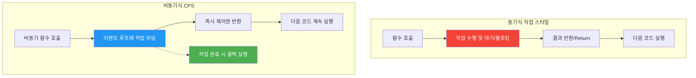
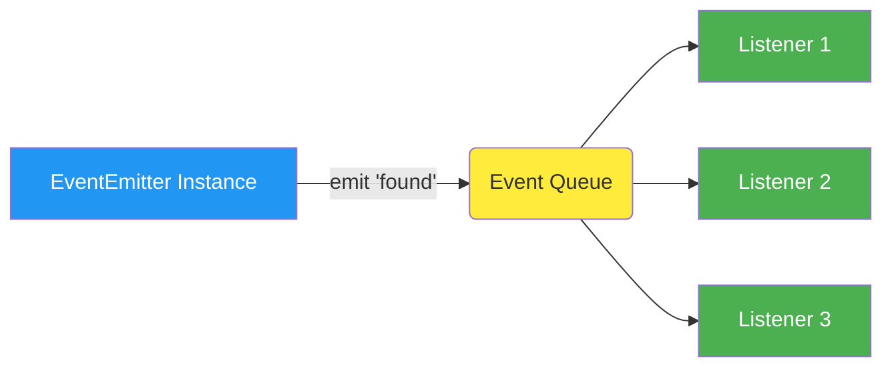

## 시작하며

노디패 스터디 3주차에 접어들었습니다! 지난 2장에서는 Node.js의 모듈 시스템이 어떻게 구성되어 있는지, 그리고 CommonJS와 ESM 사이의 미묘한 차이들을 위주로 공부했었는데요. 이번 3장에서는 Node.js의 심장이라고도 부를 수 있는 비동기 프로그래밍의 기초, '콜백과 이벤트'를 다뤘습니다.

사실 실무에서 JavaScript를 쓰다 보면 `callback`이라는 단어는 정말 귀에 못이 박히도록 듣게 되잖아요? 그런데 막상 "콜백이 정확히 어떻게 동작하고, 왜 Node.js에서 이런 규칙을 따르는가?"라고 물으면 말문이 막힐 때가 있더라고요. 저도 한동안은 "그냥 남들이 다 그렇게 쓰니까"라며 관성적으로 코드를 짜왔던 것 같습니다.

이번 챕터를 공부하면서 제가 그동안 "당연하게" 써왔던 패턴들이 왜 그렇게 설계되었는지, 그리고 자칫하면 놓치기 쉬운 'Zalgo' 같은 위험 요소가 무엇인지 명확하게 배울 수 있었습니다. 특히 단순한 문법적인 지식을 넘어, Node.js가 지향하는 비동기 철학이 무엇인지 조금은 엿볼 수 있었던 시간이었어요.

이번 포스트에서는 비동기 작업의 완료를 통지받는 가장 기본적인 메커니즘인 콜백 패턴부터, 다중 이벤트를 다루기에 최적인 관찰자 패턴(EventEmitter)까지 제가 공부하고 실습하며 느낀 점들을 꾹꾹 눌러 담아 공유해 보려고 합니다. 49줄짜리 짤막한 스터디 노트에서 시작했지만, 책의 방대한 내용을 다시 복기하다 보니 할 말이 정말 많아지네요.

## 콜백 패턴과 비동기 프로그래밍

Node.js에서 비동기 작업의 완료를 통지받는 가장 원초적인 방법이 바로 콜백입니다. 콜백은 이전 장에서 배웠던 리액터(Reactor) 패턴의 핸들러를 실제로 구현한 모습이라고 볼 수 있습니다. 비동기 세계에서 콜백은 동기 세계의 `return` 명령을 대신하는 아주 중요한 역할을 수행하죠.

JavaScript는 이 콜백 패턴을 구현하기에 정말 최적화된 언어라는 생각이 듭니다. 함수가 일급 객체(First-class Object)이기 때문에 변수에 할당하거나 다른 함수의 인자로 넘기는 게 너무나 자연스럽거든요. 게다가 클로저(Closure)라는 강력한 무기가 있어서, 비동기 작업이 언제 끝날지 모르는 상황에서도 작업이 요청된 당시의 환경(Context)을 그대로 유지할 수 있습니다. 

어떻게 보면 Node.js가 이렇게까지 성장할 수 있었던 것도, JavaScript가 가진 이러한 유연한 특성들을 비동기 I/O와 잘 결합했기 때문이 아닐까 싶더라고요.

### 연속 전달 방식 (Continuation-Passing Style, CPS)

여기서 재미있는 개념이 나오는데, 바로 **CPS(Continuation-Passing Style)**입니다. 보통 함수는 결과를 `return` 문으로 돌려주잖아요? 이걸 '직접 스타일(Direct Style)'이라고 부릅니다. 반면에 CPS는 결과를 반환하는 대신 다음 작업을 수행할 '함수(콜백)'를 인자로 전달하는 방식이에요.

사실 CPS는 비동기하고만 상관있는 개념은 아닙니다. 함수형 프로그래밍에서 결과를 전달하는 아주 일반적인 방식일 뿐이죠. 제가 코드로 간단하게 비교해 봤습니다.

```javascript
// 직접 스타일 (Direct Style)
function add(a, b) {
  return a + b;
}

// 동기식 CPS (Synchronous CPS)
function addCps(a, b, callback) {
  callback(a + b);
}
```

여기서 주의할 점은 CPS라고 해서 무조건 비동기인 건 아니라는 사실입니다. 위 코드의 `addCps`는 분명 콜백을 쓰지만, 실행 순서는 아주 정직하게 위에서 아래로 순차적으로 진행되거든요. 동기식 CPS는 작업을 완료할 때까지 블로킹하며 제어권을 돌려주지 않습니다. 반대로 비동기 CPS는 제어권을 즉시 돌려준다는 차이가 있죠.

### 비동기 CPS의 마법

진짜 비동기 CPS는 `setTimeout`이나 `fs.readFile` 같은 함수를 만났을 때 시작됩니다.

```javascript
function additionAsync(a, b, callback) {
  setTimeout(() => callback(a + b), 100);
}

console.log('before');
additionAsync(1, 2, result => console.log(`Result: ${result}`));
console.log('after');
```

이 코드를 실행하면 `before` -> `after` -> `Result: 3` 순서로 출력되죠. 비동기 함수가 호출되는 순간 제어권이 즉시 이벤트 루프에 반환되기 때문입니다. 제가 예전에 처음 Node.js를 접했을 때 이 순서가 헷갈려서 고생했던 기억이 나네요. 

비동기 작업이 진행되는 동안 애플리케이션은 멈추지 않고 다른 일을 할 수 있다는 게 Node.js의 가장 큰 장점인데, 이때 클로저(Closure) 덕분에 콜백이 나중에 실행되어도 이전의 컨텍스트를 기억하고 있는 게 참 신기했습니다. 클로저는 생성된 당시의 환경을 참조하기 때문에, 콜백이 언제 어디서 호출되더라도 비동기 작업이 요청된 컨텍스트를 유지할 수 있게 해 주더라고요.

#### 동기 vs 비동기 제어 흐름 비교

동기 방식과 비동기 방식의 제어 흐름이 어떻게 다른지 Mermaid 다이어그램으로 그려봤습니다.



### 비 연속 전달 방식 (Non-CPS) 콜백

간혹 콜백을 인자로 받는다고 해서 무조건 CPS라고 오해할 수 있는데, 항상 그런 건 아니었습니다. 예를 들어 `Array.prototype.map`이나 `forEach` 같은 것들이죠.

```javascript
const result = [1, 5, 7].map(element => element - 1);
console.log(result); // [0, 4, 6]
```

여기서 전달되는 콜백은 배열의 요소를 반복하기 위한 도구일 뿐, 비동기 작업의 결과를 전달하는 용도가 아닙니다. 결과도 동기적으로 즉시 반환되죠. 그래서 API 문서를 읽을 때 이 콜백이 CPS인지 아닌지 잘 구분하는 눈이 필요할 것 같습니다.

## Zalgo: 예측 불가능한 API의 위험성

이번 챕터에서 가장 인상 깊었던 용어는 단연 **'Zalgo(잘고)'**였습니다. "Zalgo를 풀어놓는다(Unleashing Zalgo)"는 표현이 있는데, 이게 무슨 뜻이냐면 **어떤 조건에서는 동기적으로 동작하고, 어떤 조건에서는 비동기적으로 동작하는 예측 불가능한 API**를 만드는 걸 경고하는 말이더라고요.

Zalgo라는 이름 자체가 인터넷 전설에서 온 파괴적인 존재를 의미한다고 하니, 얼마나 위험하게 생각하는지 알 수 있었습니다. Node.js의 리더였던 Issac Z. Schlueter가 블로그에서 처음 쓴 표현이라고 하네요. 

그의 주장에 따르면, API 설계에서 가장 중요한 원칙 중 하나는 **"함수가 동기적으로 실행될지 비동기적으로 실행될지 사용자가 고민하게 만들지 마라"**는 것입니다. 사용자는 당연히 API가 비동기라고 생각하고 그 이후에 리스너를 등록하는 등의 설계를 할 텐데, 내부 구현의 사정(캐시 유무 등)에 따라 그 가정이 깨져버리면 시스템은 걷잡을 수 없는 혼란에 빠지게 된다는 거죠. 

저도 이 글을 찾아보면서 느낀 게, 단순히 "작동하는 코드"를 짜는 것과 "남들이 믿고 쓸 수 있는 일관된 API"를 짜는 것 사이에는 정말 큰 격차가 있다는 점이었습니다.

### 왜 Zalgo가 위험한가요?

예를 들어, 파일을 읽어서 캐싱하는 함수를 만든다고 가정해 봅시다. 처음에는 파일을 읽어야 하니 비동기적으로 동작하겠죠. 그런데 두 번째 호출부터는 캐시에 데이터가 있으니 바로 콜백을 실행해 버린다면? 이게 바로 Zalgo입니다.

제가 스터디 중에 본 예제 코드를 조금 변형해 봤습니다.

```javascript
const cache = new Map();

function inconsistentRead(filename, cb) {
  if (cache.has(filename)) {
    // 캐시에 있으면 동기적으로 즉시 실행! (Zalgo!)
    cb(cache.get(filename));
  } else {
    // 캐시에 없으면 비동기적으로 실행
    fs.readFile(filename, 'utf8', (err, data) => {
      cache.set(filename, data);
      cb(data);
    });
  }
}
```

이 코드가 왜 파괴적이냐면, 실행 순서가 뒤죽박죽이 되기 때문입니다. 다음 사례를 볼까요?

```javascript
function createFileReader(filename) {
  const listeners = [];
  inconsistentRead(filename, value => {
    listeners.forEach(listener => listener(value));
  });

  return {
    onDataReady: listener => listeners.push(listener)
  };
}

const reader1 = createFileReader('data.txt');
reader1.onDataReady(data => {
  console.log('First call:', data);
  
  const reader2 = createFileReader('data.txt');
  reader2.onDataReady(data => {
    console.log('Second call:', data);
  });
});
```

위 코드에서 `reader2`의 콜백은 **절대 실행되지 않습니다.** 왜 그럴까요? `inconsistentRead`가 캐시된 데이터를 보고 동기적으로 콜백을 실행해 버렸는데, 그 시점에는 `reader2.onDataReady`를 통해 리스너가 등록되기도 전이기 때문이죠.

이게 바로 Zalgo가 무서운 이유입니다. 어떤 상황에서는 잘 돌아가다가, 특정 조건(캐시가 찼을 때)이 되면 소리 소문 없이 기능이 멈춰버리거든요. 실제로 이런 버그를 웹 서버에서 만난다면, 특정 사용자의 요청만 이유 없이 무한 로딩에 빠지는 현상이 발생할 수 있습니다. 제가 예전에 비동기 처리 라이브러리를 직접 구현하다가, 딱 이런 상황을 겪은 적이 있었는데 그때 원인이 바로 '일관성 없는 비동기 처리'였다는 걸 깨닫는 데만 꼬박 사흘이 걸렸습니다. 정말 등골이 서늘해지는 경험이었고, 그 이후로는 API 설계 시 무조건 '비동기 일관성'을 최우선으로 고려하게 되었습니다.

## Zalgo 길들이기: 일관성 있는 비동기 API

Zalgo 문제를 해결하는 방법은 의외로 명확했습니다. **무조건 동기로 만들거나, 무조건 비동기로 만들거나** 둘 중 하나를 선택하는 거죠.

### 1. 완전히 동기적으로 만들기 (fs.readFileSync)

만약 성능에 큰 지장이 없다면, `fs.readFileSync`처럼 항상 동기로 동작하게 만드는 방법이 있습니다.

```javascript
function consistentReadSync(filename) {
  if (cache.has(filename)) {
    return cache.get(filename);
  } else {
    const data = fs.readFileSync(filename, 'utf8');
    cache.set(filename, data);
    return data;
  }
}
```

전체가 직접 스타일(Direct Style)로 바뀌었습니다. 하지만 Node.js의 철학상 대용량 I/O를 동기로 처리하면 이벤트 루프가 멈춰버리기 때문에, 애플리케이션 부트스트랩 시점에 환경 설정 파일을 읽는 정도의 용도로만 쓰는 게 좋겠더라고요. 큰 파일을 동기로 읽으면 그동안 들어오는 모든 네트워크 요청이 보류되어 버리니까요.

### 2. 지연 실행(Deferred Execution) 사용하기

Node.js에서 권장하는 가장 좋은 방법은 `process.nextTick()`이나 `setImmediate()`를 사용하여 **동기적인 상황에서도 콜백 실행을 다음 사이클로 미루는 것**입니다.

```javascript
function consistentReadAsync(filename, callback) {
  if (cache.has(filename)) {
    // 동기적인 상황이라도 강제로 다음 사이클에 실행하도록 지연시킴
    process.nextTick(() => callback(cache.get(filename)));
  } else {
    fs.readFile(filename, 'utf8', (err, data) => {
      cache.set(filename, data);
      callback(data);
    });
  }
}
```

이렇게 하면 `consistentReadAsync`를 호출한 직후에 어떤 작업을 하더라도, 콜백은 항상 그 작업이 끝난 뒤(이벤트 루프의 다음 사이클)에 실행된다는 게 보장됩니다. API의 일관성을 지키는 게 얼마나 중요한지 새삼 깨닫게 된 대목이었습니다.

특히 `process.nextTick()`은 마이크로태스크 큐에 작업을 쌓기 때문에, 현재 실행 중인 작업이 끝나자마자 바로 실행됩니다. I/O 작업보다도 우선순위가 높죠. 그래서 정말 "찰나의 순간"만 뒤로 미루고 싶을 때 아주 유용합니다. 반면 `setImmediate()`는 이벤트 루프의 'Check' 단계에서 실행되므로, 이미 대기 중인 다른 I/O 이벤트들보다 뒤로 밀리게 됩니다. 상황에 따라 적절한 도구를 선택하는 눈이 필요하겠더라고요.

#### 비동기 지연 실행 API 비교

Node.js에는 실행을 지연시키는 여러 방법이 있는데, 그 차이점을 테이블로 정리해 봤습니다.

| API | 특징 | 실행 시점 | 비고 |
| :--- | :--- | :--- | :--- |
| **`process.nextTick()`** | 마이크로태스크 (Microtask) | 현재 작업 완료 직후, 다른 I/O 이벤트가 발생하기 전 | 우선순위가 매우 높음. 재귀 호출 시 I/O 기아 현상(Starvation) 유발 위험 |
| **`setImmediate()`** | 체크 단계 (Check phase) | 현재 이벤트 루프 사이클의 I/O 이벤트들 처리 직후 | 이미 큐에 있는 I/O 이벤트들의 뒤에 대기. 안전하게 지연 실행 가능 |
| **`setTimeout(cb, 0)`** | 타이머 단계 (Timer phase) | 최소 지연 시간(보통 1ms)이 지난 후 다음 사이클의 타이머 단계 | `setImmediate`와 비슷해 보이지만 루프 단계가 달라 실행 순서가 달라질 수 있음 |

## Node.js 콜백 규약과 에러 처리

Node.js 커뮤니티에는 수년간 지켜져 온 암묵적인 룰, '콜백 규약'이 있습니다. 이 규약을 따르지 않으면 다른 모듈과 함께 쓸 때 큰 혼란이 생기겠더라고요.

### 1. 콜백은 마지막 인자로

모든 Node.js 코어 함수는 콜백을 맨 마지막 인자로 받습니다. `readFile(filename, [options], callback)` 처럼요. 이렇게 해야 인자가 가변적이더라도 콜백의 위치가 명확해져서 가독성이 좋아집니다.

예를 들어 옵션 인자가 있을 수도 있고 없을 수도 있는데, 콜백이 항상 마지막에 있으면 우리는 "아, 마지막 건 무조건 콜백이겠구나"라고 예측할 수 있게 됩니다. 만약 콜백이 중간에 있다면 인자 개수에 따라 콜백의 위치를 계속 계산해야 하는 번거로움이 생겼을 거예요. 이런 작은 약속들이 모여서 Node.js 생태계의 높은 생산성을 만들어낸다는 게 참 인상적이었습니다.

### 2. 오류는 맨 처음에 (Error-First Callback)

비동기 작업에서 에러는 반환값이 아니라 인자로 전달됩니다. 이때 첫 번째 인자는 항상 에러 객체(`Error` 타입)여야 합니다. 작업이 성공하면 이 자리에 `null`이나 `undefined`를 채우고, 두 번째 인자부터 실제 데이터를 넘깁니다.

이 규칙이 정말 중요한 이유는 **"에러 처리를 강제"**하기 때문입니다. 첫 번째 인자가 에러라면, 개발자는 데이터를 쓰기 전에 반드시 `if (err)` 체크를 하게 되거든요. 만약 데이터가 먼저 오고 에러가 나중에 온다면, 실수로 에러를 체크하지 않고 잘못된 데이터를 처리해 버리는 실수를 할 확률이 훨씬 높았을 것 같아요. 역시 디자인 패턴은 인간의 실수를 방어하는 방향으로 발전한다는 걸 다시 느꼈습니다.

```javascript
fs.readFile('foo.txt', 'utf8', (err, data) => {
  if (err) {
    // 에러 처리 로직
    return console.error(err);
  }
  // 데이터 처리 로직
  console.log(data);
});
```

여기서 또 하나 배운 건 에러를 넘길 때 반드시 `Error` 객체를 써야 한다는 점입니다. 단순한 문자열이나 숫자를 넘기면 나중에 스택 트레이스를 확인할 수 없어서 디버깅이 정말 힘들어지거든요. 사소해 보이지만 실무에서는 정말 큰 차이를 만드는 디테일이었습니다.

### 비동기에서의 에러 전파

비동기 콜백 안에서는 `try...catch`가 제 역할을 못 할 때가 많습니다. 에러가 발생한 지점의 스택이 이미 호출 시점의 스택과 다르기 때문이죠. 그래서 우리는 에러를 **직접 다음 콜백으로 전달**해 줘야 합니다.

이 전파 과정이 처음에는 좀 귀찮게 느껴질 수도 있습니다. 모든 콜백마다 `if (err) return callback(err)`를 써줘야 하니까요. 하지만 이렇게 명시적으로 에러를 전달하는 과정 자체가, 개발자로 하여금 "이 작업에서 에러가 날 수 있다"는 사실을 계속 상기시켜 줍니다. 나중에 `Promise`를 쓰면 `.catch()` 한 번으로 퉁치게 되지만, 이 원초적인 에러 전달 방식을 이해하고 있어야만 나중에 복잡한 에러 핸들링 로직도 흔들림 없이 짤 수 있겠더라고요.

```javascript
function readJSON(filename, callback) {
  fs.readFile(filename, 'utf8', (err, data) => {
    let parsed;
    if (err) {
      // 비동기 작업 중 발생한 에러 전파
      return callback(err);
    }

    try {
      // 동기 작업(JSON.parse) 중 발생할 수 있는 에러는 직접 잡아줘야 함
      parsed = JSON.parse(data);
    } catch (parseErr) {
      return callback(parseErr);
    }

    // 성공 시 에러 자리에 null 전달
    callback(null, parsed);
  });
}
```

이때 `return callback(err)`처럼 호출하고 바로 리턴해 주는 게 중요합니다. 안 그러면 콜백이 실행된 뒤에 밑에 있는 코드까지 실행되어 버리는 불상사가 생기니까요. 저도 초보 시절에 리턴문을 빼먹어서 콜백이 두 번 실행되는 버그를 냈던 부끄러운 기억이 나네요. 

만약 콜백 안에서 발생한 예외를 잡지 못하면, 그 예외는 이벤트 루프까지 흘러가서 프로세스를 아예 종료시켜 버립니다. `uncaughtException` 이벤트를 통해 마지막으로 로그를 남길 수는 있지만, 이미 애플리케이션 상태가 깨진 뒤라 프로세스를 재시작하는 'fail-fast' 방식이 Node.js의 권장 사항이더라고요.

### 캐치되지 않는 예외 (Uncaught Exception)

때때로 비동기 함수의 콜백 내에서 에러를 처리하지 못하거나 깜빡하는 경우가 생깁니다. 만약 `readJSON` 함수에서 `try...catch`를 쓰지 않고 `JSON.parse`를 호출했는데 데이터가 잘못되었다면 어떻게 될까요?

에러는 이벤트 루프까지 도달하게 되고, Node.js 프로세스는 즉시 종료됩니다. 

```javascript
process.on('uncaughtException', (err) => {
  console.error(`마지막 수단으로 에러 포착: ${err.message}`);
  // 필요한 자원 정리 후 종료
  process.exit(1);
});
```

여기서 중요한 건 **'Fail-Fast'** 원칙입니다. 캐치되지 않은 예외가 발생했다는 건 애플리케이션의 상태가 이미 오염되었을 가능성이 높다는 뜻이거든요. 이 상태에서 서버를 계속 돌리는 건 더 큰 위험을 초래할 수 있습니다. 그래서 로그만 남기고 프로세스를 죽인 뒤, PM2 같은 프로세스 관리자가 다시 살리게 하는 게 Node.js 시스템 디자인의 핵심 전략 중 하나더라고요. 실무에서도 에러가 나면 억지로 살려두기보다 깔끔하게 죽고 다시 시작하는 게 데이터 정합성 측면에서 훨씬 안전하다는 걸 배웠습니다.

## 관찰자 패턴과 EventEmitter

콜백이 작업의 '결과'를 한 번 받는 데 집중한다면, **EventEmitter**는 여러 개의 이벤트를 처리하거나 여러 구독자에게 상태를 알릴 때 정말 유용합니다.

Node.js의 수많은 내장 모듈(HTTP 서버, 스트림 등)이 이 `EventEmitter`를 기반으로 만들어졌더라고요. 관찰자 패턴(Observer Pattern)을 JavaScript 스타일로 아주 깔끔하게 구현해 놓은 클래스입니다. 전통적인 OOP 언어에서는 인터페이스나 클래스 상속 구조가 복잡한데, Node.js에서는 `EventEmitter` 하나로 종결되는 게 참 매력적이었습니다.

여기서 관찰자 패턴이란, 주체(Subject)의 상태가 변했을 때 관찰자(Observer)들에게 자동으로 알림을 보내는 방식을 말합니다. 자바나 C# 같은 정적 타입 언어에서는 `Observer` 인터페이스를 정의하고, `Subject` 클래스에서 이 인터페이스를 구현한 객체들의 리스트를 관리하는 식의 꽤나 무거운 구조를 가집니다. 하지만 Node.js는 일급 함수와 이벤트를 활용해 훨씬 가볍고 유연하게 이를 풀어냈습니다. 

콜백과의 가장 큰 차이는 **"1대 N의 관계"**가 가능하다는 점이에요. 콜백은 보통 작업을 요청한 쪽 한 곳으로만 결과를 돌려주지만, `EventEmitter`는 하나의 사건에 대해 여러 명의 리스너가 각자의 로직을 수행할 수 있게 해 주거든요. 덕분에 코드 간의 결합도(Coupling)를 낮추면서도 복잡한 비동기 로직을 구성하는 데 정말 큰 도움이 됩니다. 예를 들어 어떤 파일이 읽혔을 때, 로그도 남기고 데이터 분석도 하고 대시보드 업데이트도 해야 한다면? 콜백 하나에 이 모든 로직을 쑤셔 넣는 대신, 각 이벤트를 구독하는 리스너로 분리하는 게 훨씬 깔끔하겠죠.

### 주요 메소드들

- `on(event, listener)`: 특정 이벤트 유형에 대해 새로운 리스너를 등록합니다.
- `emit(event, ...args)`: 새로운 이벤트를 생성하고 리스너에게 인자를 전달합니다.
- `once(event, listener)`: 한 번만 실행되고 자동으로 제거되는 리스너를 등록합니다.
- `removeListener(event, listener)`: 등록된 리스너를 제거합니다.

제가 특히 중요하다고 느낀 건 `error` 이벤트입니다. `EventEmitter`에서 `error` 이벤트가 발생했는데 리스너가 하나도 등록되어 있지 않으면, Node.js 프로세스가 그냥 죽어버리더라고요. 운영 환경에서 서버가 갑자기 내려가는 끔찍한 일을 겪지 않으려면 항상 `.on('error', ...)`를 챙겨줘야겠다는 다짐을 했습니다.

#### EventEmitter 이벤트 전달 흐름

이벤트가 발생하고 리스너들이 호출되는 과정을 시각화해 봤습니다.



## EventEmitter 실전 활용과 메모리 누수

실무에서는 `EventEmitter`를 단독으로 쓰기보다는 클래스에서 상속받아 사용하는 경우가 많습니다. 

```javascript
import { EventEmitter } from 'events';
import { readFile } from 'fs';

class FindRegex extends EventEmitter {
  constructor(regex) {
    super(); // 부모 생성자 호출 필수!
    this.regex = regex;
    this.files = [];
  }

  addFile(file) {
    this.files.push(file);
    return this; // 체이닝을 위해 this 반환
  }

  find() {
    for (const file of this.files) {
      readFile(file, 'utf8', (err, content) => {
        if (err) return this.emit('error', err);

        this.emit('fileread', file);
        const match = content.match(this.regex);
        if (match) {
          match.forEach(elem => this.emit('found', file, elem));
        }
      });
    }
    return this;
  }
}
```

이렇게 만들면 객체 지향적이면서도 비동기 이벤트를 우아하게 처리할 수 있는 구조가 됩니다. Node.js 생태계에서 매우 흔한 패턴인데, 대표적으로 `http.Server` 객체도 이런 식으로 `request`, `connection` 같은 이벤트를 내보내더라고요.

여기서 `super()`를 호출하는 게 정말 중요한데요. `EventEmitter` 내부의 상태(리스너 대기열 등)를 초기화해야 하기 때문입니다. 가끔 이걸 빼먹어서 이벤트가 안 날아가는 실수를 하는 분들도 계시니 꼭 챙겨야 합니다. 또한 `find()` 메소드 내부를 보면 비동기 작업인 `readFile`이 끝날 때마다 `this.emit`을 통해 결과를 실시간으로 쏘아주고 있죠. 사용하는 쪽에서는 검색이 다 끝날 때까지 기다릴 필요 없이, 매칭되는 게 생길 때마다 바로바로 반응할 수 있습니다.

### 동기 vs 비동기 이벤트 발생

이벤트도 콜백과 마찬가지로 동기적으로 발생할 수도 있고, 비동기적으로 발생할 수도 있습니다. `FindRegex` 예제는 비동기인 `readFile`을 쓰기 때문에 비동기 이벤트가 발생하죠.

비동기 이벤트의 장점은 `find()` 메소드를 호출한 **이후에** 리스너를 등록해도 이벤트를 놓치지 않는다는 점입니다. 어차피 이벤트는 다음 루프 사이클에서 발생하니까요. 하지만 동기적으로 이벤트를 발생시킨다면 반드시 `emit` 하기 전에 리스너를 등록해야 합니다. 안 그러면 아무도 듣지 않는 곳에 외치는 꼴이 되어버리거든요. 가급적이면 이벤트를 발생시키는 방식도 하나로 통일하는 게 정신 건강에 좋다는 걸 다시 한번 느꼈습니다.

### 메모리 누수 주의보 (Memory Leaks)

하지만 `EventEmitter`를 쓸 때 꼭 조심해야 할 게 있는데, 바로 **메모리 누수**입니다. 리스너가 해제되지 않고 계속 쌓이면 해당 리스너가 참조하고 있는 변수들이 가비지 컬렉션 대상에서 제외되거든요.

특히 HTTP 요청이 들어올 때마다 외부 객체에 리스너를 등록하고 지우지 않으면, 서버 메모리가 야금야금 차오르다가 결국 터지게 됩니다. 

```javascript
const listener = () => { /* 뭔가 무거운 작업 */ };
emitter.on('data', listener);

// 나중에 꼭 지워줘야 합니다!
// emitter.removeListener('data', listener);
```

리스너 함수 안에서 큰 문자열이나 무거운 객체를 참조하고 있다면 문제는 더 심각해집니다. 그 리스너가 해제되기 전까지는 해당 객체들이 메모리에서 절대 빠지지 않으니까요. Node.js는 기본적으로 한 이벤트에 10개 이상의 리스너가 등록되면 콘솔에 경고를 띄워줍니다. 이 숫자는 `setMaxListeners()`로 조절할 수 있지만, 사실 10개 이상 등록되는 상황 자체가 설계상의 결함이거나 누수의 징후일 가능성이 큽니다.

저도 예전에 특정 이벤트를 구독하는 기능을 구현했다가, 페이지 이동 시에 리스너를 해제하지 않아서 메모리가 계속 늘어나는 버그를 잡느라 며칠 고생한 적이 있었습니다. 그 이후로는 `once()`를 쓰거나, 컴포넌트가 파괴될 때(혹은 작업이 끝날 때) 반드시 `removeListener`를 호출하는 걸 철칙으로 삼고 있습니다.

## EventEmitter vs 콜백

둘 중 무엇을 써야 할지 고민될 때가 많죠. 책에서는 아주 명쾌한 기준을 제시해 줍니다.

- **콜백**: 작업의 **결과**가 하나이고, 그 결과(성공/실패)를 한 번만 알려주면 될 때.
- **EventEmitter**: 작업 중에 **여러 종류의 사건**이 발생하거나, **여러 번** 알림을 줘야 할 때, 혹은 여러 곳에서 동시에 알림을 받아야 할 때.

두 방식의 차이를 단적으로 보여주는 예제입니다.

```javascript
// 콜백 방식
function helloCallback(cb) {
  setTimeout(() => cb(null, 'hello'), 100);
}

// EventEmitter 방식
function helloEvents() {
  const emitter = new EventEmitter();
  setTimeout(() => emitter.emit('done', 'hello'), 100);
  return emitter;
}
```

기능은 비슷해 보이지만, 의미상으로는 `helloEvents`가 "어떤 일이 끝났음을 알리는 신호"에 더 가깝습니다.

제가 이해한 내용을 바탕으로 두 방식의 특징을 비교해 봤습니다.

| 비교 항목 | 콜백 (Callback) | EventEmitter |
| :--- | :--- | :--- |
| **결과 전달** | 성공 또는 실패의 결과를 **정확히 한 번** 전달 | 동일하거나 다른 이벤트를 **여러 번** 전달 가능 |
| **구독자 수** | 특정된 하나의 콜백 함수만 호출 | 여러 리스너를 등록하여 동시에 알림 가능 |
| **에러 처리** | 첫 번째 인자로 에러를 전달 (Error-First) | 'error' 이벤트를 발생시켜 처리 |
| **의미적 차이** | 작업의 완료와 결과물에 집중 | 상태 변화나 사건의 발생에 집중 |

### 콜백과 EventEmitter의 결합 패턴

때로는 이 둘을 섞어 쓰는 게 가장 강력하기도 합니다. `glob` 패키지 같은 경우가 대표적인데, 전체 파일 리스트는 최종 결과로서 콜백으로 주면서 동시에 실시간 매칭 정보는 이벤트를 통해 흘려보내는 식이죠. 

```javascript
import glob from 'glob';

glob('data/*.txt', (err, files) => {
  if (err) return console.error(err);
  console.log(`모든 파일 찾음: ${JSON.stringify(files)}`);
})
.on('match', match => console.log(`실시간 매칭 발견: ${match}`));
```

사용자 입장에서는 "그냥 결과만 기다릴래" 할 수도 있고, "찾는 도중에 바로바로 알려줘" 할 수도 있어서 참 우아한 설계라는 생각이 들었습니다. 나중에 저도 복잡한 비동기 라이브러리를 만든다면 이런 결합 패턴을 적극적으로 고려해 보려고요.

## 연습 문제로 보는 깊이 있는 이해


이번 장 마지막에 나오는 연습 문제들도 직접 풀어봤는데, 개념을 다지는 데 큰 도움이 되더라고요. 특히 `Ticker` 예제가 재미있었습니다.

- **연습 3.1 단순 이벤트**: 비동기 `FindRegex` 클래스에 검색 시작 시점에 이벤트를 발생시키는 기능을 추가해 보는 문제였습니다. 클래스의 상태 변화를 알리는 첫 번째 신호로서 이벤트를 정의하는 방법을 익힐 수 있었습니다.
- **연습 3.2 Ticker**: 특정 시간 동안 50ms마다 `tick` 이벤트를 내보내는 함수를 만드는 문제였습니다. `setTimeout`을 재귀적으로 사용하면서 동시에 이벤트 횟수를 콜백으로 넘겨주는 구조였죠. "결과는 콜백으로, 중간 과정은 이벤트로"라는 결합 패턴을 실습하기에 딱 좋은 예제였습니다.
- **연습 3.3 간단한 수정**: 함수 호출 즉시 첫 번째 `tick` 이벤트를 발생시키도록 수정하는 문제였는데, 여기서 동기적으로 이벤트를 발생시킬 때 리스너가 등록되지 않아 이벤트가 유실될 수 있는 위험을 직접 경험해 볼 수 있었습니다.
- **연습 3.4 에러 다루기**: 타임스탬프가 특정 조건(5로 나누어지는 경우)을 만족할 때 에러를 발생시키고 이를 콜백과 `EventEmitter` 양쪽으로 전파하는 문제였습니다. 비동기 환경에서 에러를 얼마나 꼼꼼하게 다뤄야 하는지 다시금 깨닫게 된 시간이었어요.

이 과정을 통해 콜백과 `EventEmitter`가 어떻게 한 작업 안에서 어우러지는지, 그리고 에러 전파를 위해 두 채널을 모두 사용하는 게 왜 필요한지 직접 몸으로 느낄 수 있었습니다. 단순히 눈으로 읽는 것보다 확실히 코드를 직접 쳐보는 게 이해도가 훨씬 높더라고요.

## 실무에 적용할 수 있는 인사이트들

이번 스터디를 통해 얻은 실무 팁들을 정리해 봤습니다.

1.  **API 설계 시 일관성 유지**: 함수가 동기인지 비동기인지 헷갈리게 만들지 마세요. 필요하다면 `process.nextTick()`으로 강제 비동기화를 시키는 게 버그를 줄이는 지름길입니다.
2.  **Error-First Callback 준수**: 외부 라이브러리를 만들거나 팀 내 공통 모듈을 만들 때는 Node.js의 표준 규약을 따르는 게 좋습니다. 그래야 `util.promisify` 같은 유틸리티도 바로 쓸 수 있거든요.
3.  **에러 전파 잊지 않기**: 비동기 콜백에서 에러가 났을 때 아무 처리도 안 하면 나중에 디버깅할 때 지옥을 맛보게 됩니다. 에러는 반드시 위로 던져주세요.
4.  **EventEmitter 관리**: 리스너를 등록했다면, 해당 객체가 수명을 다할 때 `removeListener`로 깔끔하게 정리해 주는 습관을 들여야 합니다. 안 그러면 천천히 죽어가는 서버를 보게 될지도 모릅니다.
5.  **클로저 활용의 묘미**: 비동기 작업에서도 이전 상태를 유지할 수 있는 클로저의 특성을 잘 활용하면, 상태 관리 코드가 훨씬 간결해지더라고요.
6.  **결합 패턴의 우아함**: `glob` 사례처럼 콜백과 이벤트를 적절히 섞어 쓰면, 단순함과 강력함이라는 두 마리 토끼를 모두 잡을 수 있다는 점을 꼭 기억해야겠습니다.

## 마무리

오늘은 Node.js의 비동기 기초인 콜백과 이벤트 패턴에 대해 깊이 있게 정리해 보았습니다. 사실 요즘은 `Promise`나 `async/await`를 더 많이 쓰긴 하지만, 그 모든 것의 뿌리가 결국 이 콜백과 이벤트라는 점을 다시 한번 확인하니 기초 체력이 단단해진 기분이 드네요. `Promise`도 결국 내부적으로는 콜백을 활용해 상태 변화를 관리하는 것이고, `async/await`는 그 위에 입혀진 우아한 설탕(Syntactic Sugar)일 뿐이니까요.

특히 Zalgo 문제를 피하기 위해 API의 일관성을 유지해야 한다는 점은, 단순히 코드를 짜는 기술을 넘어 '좋은 API 설계란 무엇인가'에 대해 다시 생각하게 해준 좋은 계기가 되었습니다. 제가 예전에 겪었던 원인 모를 버그들도 어쩌면 Zalgo 때문이었을지도 모르겠다는 생각이 들더라고요. 기초가 흔들리면 아무리 화려한 프레임워크를 써도 사상누각이라는 걸 절감했습니다. 특히 요즘 유행하는 수많은 라이브러리들도 결국은 이 기초 위에서 돌아가고 있다는 사실을 잊지 말아야겠어요. 

이번 3장을 공부하면서 얻은 가장 큰 소득은 "비동기를 다루는 태도"인 것 같습니다. 단순히 돌아가는 코드를 만드는 것을 넘어, 이 코드가 시스템의 다른 부분에 어떤 영향을 줄지, 그리고 미래의 나 혹은 동료들이 이 코드를 보았을 때 의도한 대로 예측 가능하게 동작할지를 끊임없이 고민해야겠더라고요. 

다음 포스트에서는 4장 '콜백 기반 비동기 제어 흐름'을 다룰 예정입니다. 흔히 말하는 '콜백 지옥(Callback Hell)'이나 '파멸의 피라미드(Pyramid of Doom)'를 어떻게 우아하게 탈출할 수 있는지, 다양한 비동기 흐름 제어 패턴들을 함께 공부하고 공유해 보겠습니다! 

### 💬 콜백 패턴에 대한 질문
- CPS(연속 전달 방식)가 왜 Node.js에서 주요 프로그래밍 스타일로 자리 잡게 되었을까요?
- 직접 스타일(Direct Style)과 CPS의 가장 큰 트레이드오프는 무엇이라고 생각하시나요?
- 여러분의 프로젝트에서 콜백 패턴을 사용하여 구현했던 가장 복잡한 로직은 무엇이었나요?

### ⚠️ Zalgo와 일관성에 대한 질문
- 실무에서 동기/비동기가 혼재된 API 때문에 발생했던 버그를 겪어본 적이 있으신가요?
- `process.nextTick()`과 `setImmediate()` 중 어떤 상황에서 어떤 것을 선택하는 것이 더 유리할까요?
- 모든 API를 비동기로 강제하는 것이 성능 면에서 항상 옳다고 할 수 있을까요?

### 🔔 EventEmitter 활용에 대한 질문
- `EventEmitter`를 상속받아 직접 관찰 가능한 객체를 설계해 보신 경험이 있으신가요?
- 메모리 누수를 방지하기 위해 리스너를 관리하는 본인만의 노하우가 있다면 무엇인가요?
- 콜백과 `EventEmitter`를 결합하여 설계된 API를 보신 적이 있나요? 어떤 장점이 있었나요?

댓글로 공유해주시면 함께 배워나갈 수 있을 것 같습니다!

