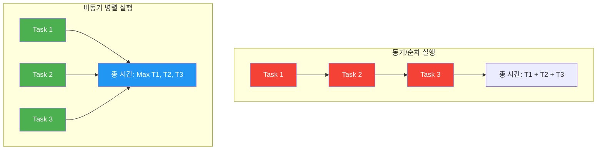
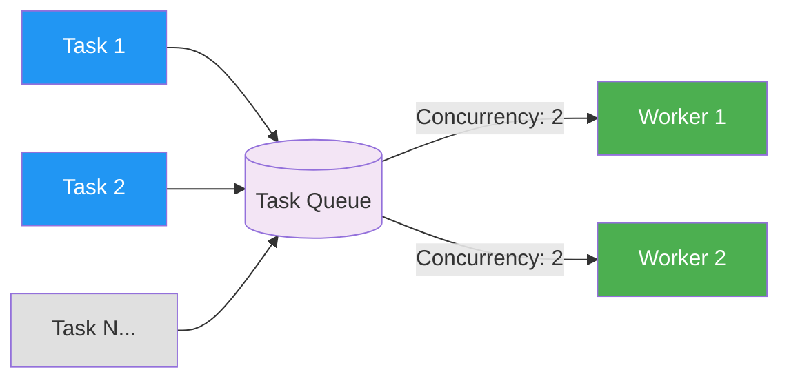

## 시작하며

노디패 스터디 4주차! 지난 3장에서 콜백과 이벤트라는 Node.js 비동기 세계의 입구를 지나왔다면, 이번 4장에서는 그 문 안으로 들어가 본격적인 **비동기 제어 흐름**을 다룹니다. 

사실 요즘은 `Promise`나 `async/await`가 워낙 잘 되어 있어서 "굳이 콜백 패턴을 깊게 공부해야 할까?"라는 의문이 들 수도 있습니다. 저도 처음에는 그렇게 생각했거든요. 하지만 4장을 읽으면서 생각이 180도 바뀌었습니다. 현대적인 비동기 문법들도 결국 그 밑바닥에는 콜백 기반의 메커니즘이 흐르고 있고, 이를 제어하는 로직은 동일한 원리 위에서 작동하고 있었기 때문입니다.

이번 챕터가 특히 중요한 이유는 콜백이 Node.js 비동기 프로그래밍의 가장 밑바닥에 있는 **기초**이기 때문입니다. 건물로 치면 기초 공사와 같아서, 여기가 흔들리면 아무리 화려한 `async/await`를 올려도 결국 이해의 한계에 부딪히게 되더라고요.

이번 장에서는 콜백을 사용할 때 마주치는 가독성의 한계인 '콜백 지옥'을 어떻게 우아하게 탈출하는지, 그리고 순차 실행과 병렬 실행이라는 거대한 두 축을 어떻게 조율하는지를 중점적으로 배웠습니다. 특히 실무에서 마주치는 복잡한 비동기 시나리오들이 결국 이 패턴들의 조합이라는 걸 깨닫는 순간, "아, 이게 바로 기초 체력이구나"라는 감탄이 나오더라고요. 

단순히 코드를 짜는 법이 아니라, 비동기라는 야생의 흐름을 통제하는 '사육사'의 관점을 가질 수 있게 된 아주 유익한 시간이었습니다.

## 비동기 프로그래밍의 어려움과 콜백 지옥

Node.js에서는 연속 전달 방식(Continuation-Passing Style, CPS)으로 비동기 코드를 작성합니다. 이는 매우 강력한 도구이지만, 복잡한 제어 흐름을 만들 때 가독성과 유지보수성에 큰 도전 과제를 던져줍니다.

### CPS의 도전 과제

비동기 API를 사용하다 보면 몇 가지 고전적인 문제에 직면하게 됩니다.

1. **순서 보장의 어려움**: 여러 비동기 작업을 우리가 원하는 순서대로 실행하는 게 생각보다 까다롭습니다.
2. **중첩 구조**: 작업이 연달아 일어날수록 코드가 안쪽으로 계속 파고들게 됩니다.
3. **에러 처리**: 각 단계마다 에러가 발생했는지 체크하고 상위로 넘겨주는 로직을 반복해서 써야 합니다.

이런 문제들이 쌓이고 쌓여서 만들어지는 것이 바로 그 유명한 **콜백 지옥(Callback Hell)**입니다. 작업이 많아질수록 코드는 점점 오른쪽으로 밀려나며 '죽음의 피라미드(Pyramid of Doom)'를 형성하게 되죠.

```javascript
// ❌ 전형적인 콜백 지옥의 모습
function spider(url, nesting, callback) {
  const filename = urlToFilename(url)
  fs.readFile(filename, 'utf8', (err, fileContent) => {
    if (err) {
      if (err.code !== 'ENOENT') {
        return callback(err)
      }

      // 파일이 없으면 다운로드하는 과정에서 또 중첩
      download(url, filename, (err, requestContent) => {
        if (err) {
          return callback(err)
        }

        // 링크 추출 후 또 재귀적으로 중첩
        spiderLinks(url, requestContent, nesting, (err) => {
          if (err) {
            return callback(err)
          }
          callback()
        })
      })
    } else {
      // 파일이 있으면 링크만 처리
      spiderLinks(url, fileContent, nesting, callback)
    }
  })
}
```

위 코드를 보면 로직의 흐름을 따라가는 것 자체가 큰 고역입니다. 에러가 발생했을 때 어디서부터 잘못된 것인지 추적하기도 어렵고, 모든 콜백에서 `err`라는 변수명을 반복해서 사용해야 하는 점도 괴롭더라고요. 클로저가 남용되면서 메모리 사용량이 늘어날 수 있다는 기술적인 문제도 무시할 수 없습니다. 개발자로서 "내가 짠 코드가 누군가에게 지옥이 되면 안 되겠다"라는 책임감을 강하게 느낀 대목이었습니다.

## 콜백 지옥을 탈출하는 모범 사례

책에서는 이런 지옥에서 벗어나기 위한 세 가지 핵심 규칙을 제시합니다. 제가 실무에서 가장 큰 도움을 받은 부분입니다.

### 1. 빠른 종료 (Early Return)

중첩을 줄이기 위한 가장 단순하면서도 강력한 방법입니다. 조건을 만족하지 않거나 에러가 발생했을 때 `else` 블록을 만드는 대신, 즉시 함수를 반환해버리는 것입니다.

```javascript
// ✅ 좋은 예: 빠른 종료 적용
if (err) {
  return callback(err)
}
// 정상 로직은 여기서 들여쓰기 없이 계속됩니다.
```

이렇게 하면 코드가 옆으로 퍼지지 않고 아래로 흐르게 됩니다. 에러 처리가 명확해지고 코드의 가독성이 비약적으로 상승하더라고요.

### 2. 재사용 가능한 함수로 분리

인라인 콜백 대신 명명된 함수를 사용하여 코드를 모듈화하는 것입니다. 익명 함수를 쓰면 당장은 편하지만, 나중에 코드를 다시 읽거나 테스트할 때 정말 힘들어집니다.

```javascript
// 함수를 분리하여 가독성을 높인 모습
function saveFile(filename, contents, callback) {
  mkdirp(path.dirname(filename), (err) => {
    if (err) {
      return callback(err)
    }
    fs.writeFile(filename, contents, callback)
  })
}

function download(url, filename, callback) {
  request(url, (err, response, body) => {
    if (err) {
      return callback(err)
    }
    saveFile(filename, body, (err) => {
      if (err) {
        return callback(err)
      }
      callback(null, body)
    })
  })
}
```

이렇게 분리하면 각 함수를 독립적으로 테스트하기 쉬워지고, 에러가 났을 때 스택 트레이스에도 함수 이름이 찍혀서 디버깅이 훨씬 편해집니다. "작은 함수가 아름답다"는 Node.js의 철학이 여기서도 빛을 발하네요.

## 제어 흐름 패턴: 순차 실행

순차 실행(Sequential Execution)은 비동기 작업들을 하나씩 순서대로 실행하는 패턴입니다. 앞선 작업의 결과가 다음 작업의 입력으로 쓰여야 할 때 주로 사용합니다.

### 알려진 일련의 작업 순차 실행

작업의 개수가 정해져 있고 그 순서가 명확할 때는 콜백을 꼬리에 꼬리를 무는 방식으로 연결합니다. 이때 각 단계의 에러 처리를 잊지 않는 것이 중요합니다.

```javascript
// 순차 실행의 기본 패턴
function task1(callback) {
  asyncOperation((err, result) => {
    if (err) return callback(err)
    console.log('Task 1 완료')
    task2(result, callback)
  })
}

function task2(arg, callback) {
  asyncOperation(arg, (err, result) => {
    if (err) return callback(err)
    console.log('Task 2 완료')
    task3(result, callback)
  })
}

function task3(arg, callback) {
  asyncOperation(arg, (err, result) => {
    if (err) return callback(err)
    console.log('모든 작업 완료')
    callback(null, result)
  })
}
```

이 패턴의 장점은 순서가 확실히 보장된다는 것입니다. 각 단계의 결과물을 다음 단계로 안전하게 넘겨줄 수 있죠. 하지만 병렬로 처리해도 되는 작업들까지 순차적으로 실행하면 전체적인 성능이 떨어질 수 있다는 점을 항상 경계해야 합니다. "안전과 속도 사이의 균형"을 맞추는 게 개발자의 영원한 숙제인 것 같아요.

### 순차 반복 (Sequential Iteration)

작업의 개수가 실행 시점에 결정되는 동적인 상황(예: 배열의 모든 요소를 처리)에서는 재귀적인 Iterator 패턴이 진가를 발휘합니다.

```javascript
// 웹 스파이더의 링크 순차 처리 예제
function spiderLinks(currentUrl, body, nesting, callback) {
  if (nesting === 0) {
    return process.nextTick(callback)
  }

  const links = getPageLinks(currentUrl, body)

  function iterate(index) {
    if (index === links.length) {
      return callback() // 모든 링크 처리 완료
    }

    // 다음 링크를 재귀적으로 처리
    spider(links[index], nesting - 1, (err) => {
      if (err) {
        return callback(err)
      }
      iterate(index + 1)
    })
  }

  iterate(0) // 첫 번째 링크부터 시작
}
```

이 코드를 처음 짰을 때 "와, 자바스크립트의 비동기를 이런 식으로 제어할 수 있구나" 하며 감탄했던 기억이 납니다. 배열을 `for` 루프나 `forEach`로 돌리면서 비동기 작업을 수행하면 우리가 의도한 순서대로 작동하지 않거든요. 이 Iterator 패턴은 비동기 제어의 정석 중 하나라는 생각이 들었습니다.

이 패턴은 동적으로 작업 목록을 구성할 수 있고, 무엇보다 한 번에 하나의 작업만 수행하기 때문에 메모리를 아주 효율적으로 사용합니다. "느려도 안전한 길을 가는 것"이 필요할 때 최고의 선택이더라고요.

## 제어 흐름 패턴: 병렬 실행

병렬 실행(Parallel Execution)은 여러 작업을 동시에 실행하여 전체 실행 시간을 단축하는 패턴입니다. 

### Node.js의 동시성 이해

Node.js는 단일 스레드이지만, 논블로킹 I/O 덕분에 동시성을 구현할 수 있습니다. 이를 시각화해보면 차이가 명확합니다.



병렬 실행을 구현할 때는 완료 카운터를 사용합니다. 모든 작업이 끝났는지 체크하는 로직이 핵심입니다.

```javascript
function spiderLinks(currentUrl, body, nesting, callback) {
  const links = getPageLinks(currentUrl, body)
  if (links.length === 0) return process.nextTick(callback)

  let completed = 0
  let hasErrors = false

  links.forEach((link) => {
    spider(link, nesting - 1, (err) => {
      if (err) {
        hasErrors = true
        return callback(err)
      }
      if (++completed === links.length && !hasErrors) {
        callback()
      }
    })
  })
}
```

### 경쟁 상태 (Race Conditions)와 해결책

병렬 실행은 빠르지만 위험합니다. 여러 작업이 동시에 같은 리소스에 접근할 때 결과가 꼬이는 경쟁 상태가 발생할 수 있기 때문입니다. 

예를 들어, 웹 스파이더에서 특정 URL을 다운로드하려고 할 때 다음과 같은 시나리오가 발생할 수 있습니다.
1. 작업 A가 `spider(url)`을 시작합니다.
2. 파일이 있는지 확인해보니 없습니다. 다운로드를 시작합니다.
3. 작업 A의 다운로드가 끝나기 전에 작업 B가 동일한 `spider(url)`을 시작합니다.
4. 작업 B도 파일이 없는 것을 확인하고 중복으로 다운로드를 시작합니다.

이런 상황이 반복되면 디스크 I/O가 낭비되고, 최악의 경우 파일이 불완전하게 저장될 수 있습니다. 저도 예전에 캐시 로직을 짜다가 이 경쟁 상태 때문에 데이터가 꼬인 경험이 있었는데, 책에서 제안하는 `Set`을 활용한 상호 배제 패턴을 보니 무릎을 탁 치게 되더라고요.

```javascript
// 중복 처리를 방지하기 위한 Set 활용
const spidering = new Set()

function spider(url, nesting, callback) {
  // 이미 처리 중인 URL이라면 즉시 반환
  if (spidering.has(url)) {
    return process.nextTick(callback)
  }
  
  // 처리를 시작하면서 Set에 추가
  spidering.add(url)
  
  const filename = urlToFilename(url)
  fs.readFile(filename, 'utf8', (err, fileContent) => {
    if (err) {
      if (err.code !== 'ENOENT') {
        return callback(err)
      }
      
      // 파일이 없으면 다운로드 수행
      return download(url, filename, (err, requestContent) => {
        if (err) return callback(err)
        spiderLinks(url, requestContent, nesting, callback)
      })
    }
    
    // 파일이 있으면 링크만 처리
    spiderLinks(url, fileContent, nesting, callback)
  })
}
```

이렇게 처리 중인 항목을 관리함으로써 리소스 낭비를 막고 시스템의 무결성을 지킬 수 있습니다. 아주 단순하지만 강력한 기법이었습니다. 실무에서는 이를 더 확장해서 Redis 같은 분산 락(Distributed Lock)으로 구현하기도 하죠.


## 제어 흐름 패턴: 제한된 병렬 실행

무제한 병렬 실행은 성능상 이점이 크지만, 리소스를 과도하게 사용한다는 치명적인 단점이 있습니다. 수천 개의 파일을 동시에 열려고 하면 시스템의 파일 디스크립터 한계를 넘어버리죠.

### 왜 동시성을 제한해야 하는가?

1. **리소스 고갈**: `EMFILE` 에러(Too many open files)로 프로세스가 죽을 수 있습니다.
2. **메모리 부족**: 너무 많은 비동기 객체가 메모리에 쌓이면 성능이 급격히 떨어집니다.
3. **DoS 공격**: 외부 서버에 무제한 요청을 보내는 것은 공격으로 간주될 수 있습니다.

### TaskQueue 클래스 구현

이런 리소스 문제를 해결하기 위해 **TaskQueue**라는 추상화 계층을 만듭니다. 동시에 실행되는 작업의 수를 일정하게 유지하면서 남은 작업들은 큐에서 대기하게 만드는 영리한 방식입니다.



```javascript
import { EventEmitter } from 'events'

export class TaskQueue extends EventEmitter {
  constructor(concurrency) {
    super()
    this.concurrency = concurrency
    this.running = 0
    this.queue = []
  }

  // 작업을 큐에 추가하는 메서드
  pushTask(task) {
    this.queue.push(task)
    // 다음 틱에서 작업 실행 시도
    process.nextTick(this.next.bind(this))
    return this
  }

  // 다음 작업을 꺼내어 실행하는 핵심 로직
  next() {
    // 큐가 비어 있고 실행 중인 작업도 없으면 empty 이벤트 발생
    if (this.running === 0 && this.queue.length === 0) {
      return this.emit('empty')
    }

    // 동시성 제한 수치에 도달할 때까지 큐에서 작업을 꺼내어 실행
    while (this.running < this.concurrency && this.queue.length) {
      const task = this.queue.shift()
      task((err) => {
        if (err) {
          this.emit('error', err)
        }
        this.running-- // 작업 완료 시 실행 중인 수 감소
        process.nextTick(this.next.bind(this)) // 다시 다음 작업 시도
      })
      this.running++ // 실행 중인 수 증가
    }
  }
}
```

이 코드를 보면서 "아, 이게 바로 진짜 엔지니어링이구나"라는 생각이 들었습니다. 복잡한 동시성 제어 로직을 `TaskQueue`라는 클래스로 캡슐화하여, 애플리케이션의 다른 부분에서는 단순히 작업을 밀어넣기만 하면 되도록 만든 설계가 정말 인상적이었습니다. 

특히 `process.nextTick`을 활용해 비동기적으로 작업을 이어가는 방식은 이벤트 루프를 방해하지 않으면서도 효율적으로 큐를 비워내는 똑똑한 기법이더라고요. 실무에서도 이 패턴을 활용해 서버의 부하를 안정적으로 관리할 수 있겠다는 확신이 들었습니다. 우리가 흔히 쓰는 라이브러리들도 내부적으로는 이런 원리로 동작하고 있겠죠?

### TaskQueue의 실전 활용 예시

실제로 이 큐를 웹 스파이더에 적용하면 다음과 같은 모습이 됩니다.

```javascript
const downloadQueue = new TaskQueue(2) // 동시에 2개만 다운로드

downloadQueue.on('error', (err) => {
  console.error('다운로드 중 에러:', err)
})

downloadQueue.on('empty', () => {
  console.log('큐의 모든 작업이 완료되었습니다.')
})

function spiderLinks(currentUrl, body, nesting, callback) {
  const links = getPageLinks(currentUrl, body)
  
  links.forEach((link) => {
    // 작업을 큐에 밀어넣기만 하면 됨
    downloadQueue.pushTask((done) => {
      spider(link, nesting - 1, (err) => {
        if (err) return callback(err)
        done() // 작업이 끝났음을 큐에 알림
      })
    })
  })
}
```

이렇게 하면 수천 개의 링크가 있더라도 시스템은 한 번에 딱 2개씩만 처리하게 됩니다. 서버의 메모리나 네트워크 대역폭을 일정하게 유지할 수 있는 비결인 셈이죠.

## 실전 예제로 보는 진화: 웹 스파이더(Web Spider) 프로젝트

책에서는 비동기 제어 패턴의 진화를 보여주기 위해 '웹 스파이더'라는 아주 좋은 예제를 사용합니다. 특정 URL의 페이지를 다운로드하고, 그 안에 포함된 링크들을 재귀적으로 찾아가며 다운로드하는 프로그램입니다. 이 프로젝트가 버전업되는 과정을 지켜보는 것만으로도 이번 챕터의 핵심을 꿰뚫을 수 있었습니다.

### 버전 1: 콜백 지옥의 탄생
처음에는 단순히 기능을 구현하는 데 집중합니다. 파일을 읽고, 없으면 다운로드하고, 다시 링크를 추출해 재귀 호출을 하는 식이죠. 앞서 보았던 '죽음의 피라미드'가 바로 이 버전 1에서 탄생합니다. 코드는 작동하지만, 아무도 읽고 싶지 않은 괴물이 되어버렸습니다.

### 버전 2: 리팩토링과 순차 실행
가장 먼저 '빠른 종료'와 '함수 분리'를 적용합니다. `download`, `saveFile`, `spiderLinks` 같은 함수로 로직을 쪼개니 코드가 드디어 숨을 쉬기 시작하더라고요. 이때 링크 처리는 하나씩 순서대로 일어납니다. 안정적이지만 속도가 매우 느리다는 단점이 있었습니다.

### 버전 3: 병렬 실행의 짜릿함과 함정
속도를 올리기 위해 `forEach`를 사용해 모든 링크를 동시에 다운로드하기 시작합니다. 실행 시간이 획기적으로 줄어드는 마법을 경험하게 되죠. 하지만 여기서 '경쟁 상태'라는 함정에 빠집니다. 동일한 URL이 여러 번 등장할 때 중복 다운로드가 발생하는 것이죠. 이를 해결하기 위해 `Set`을 도입하며 비로소 완성된 병렬 스파이더가 탄생합니다.

### 버전 4: 리소스 관리와 동시성 제한
마지막 단계는 `TaskQueue`를 도입해 동시 실행 수를 제한하는 것입니다. 수만 개의 링크를 한꺼번에 처리하려고 하면 시스템이 비명을 지르기 때문입니다. 동시에 딱 2개 혹은 5개씩만 처리하도록 조율하면서도, 큐를 통해 전체 작업을 끊김 없이 이어가는 구조입니다. 이 과정이 제가 이번 챕터에서 가장 깊이 감동한 부분이기도 합니다.

"작동하는 코드에서 우아한 코드로, 그리고 견고한 코드로" 발전해 나가는 이 여정이 제가 개발자로서 지향해야 할 길이라는 걸 다시 한번 느꼈습니다. 단순히 라이브러리 사용법을 익히는 것보다, 이런 설계의 흐름을 직접 경험해보는 게 얼마나 중요한지 깨닫게 된 아주 값진 예제였습니다.

## 비교 테이블: 제어 흐름 패턴의 선택

각 패턴의 특징을 정리해보면 상황에 맞는 선택을 하는 데 도움이 됩니다.

| 패턴 | 장점 | 단점 | 적합한 시나리오 |
| :--- | :--- | :--- | :--- |
| **순차 실행** | 메모리 효율 최상, 순서 완벽 보장 | 전체 실행 시간이 가장 길어짐 | 단계별 의존성이 있는 데이터 가공 |
| **무제한 병렬** | 가장 빠른 처리 속도, 구현이 단순 | 리소스 고갈 위험, 순서 보장 안됨 | 소량의 독립적인 비동기 작업 |
| **제한된 병렬** | 리소스 관리 최적화, 안정적인 성능 | 구현 복잡도가 가장 높음 | 대규모 크롤링, 배치 작업, API 호출 |

이 테이블을 보면서 각 패턴이 가진 트레이드오프를 명확히 이해할 수 있었습니다. "무조건 빠른 게 좋은 게 아니라, 시스템의 안정성을 해치지 않는 선에서 속도를 내는 것이 진짜 실력"이라는 걸 깨닫게 된 대목이었습니다.

## 비동기 라이브러리: async

패턴을 직접 구현하는 것도 좋지만, 실무에서는 검증된 라이브러리인 `async`를 활용하는 것이 생산성 면에서 훨씬 유리합니다. `async` 라이브러리는 2010년에 처음 등장하여 Node.js 생태계와 함께 성장해온 유서 깊은 도구입니다.

### 컬렉션을 다루는 다양한 방법

가장 자주 쓰이는 기능은 단연 컬렉션 처리입니다. `async`는 우리가 앞에서 고생하며 구현했던 패턴들을 아주 세련되게 제공합니다.

- **eachSeries**: 항목을 하나씩 순서대로 처리합니다. 작업 간의 순서가 중요하거나 데이터베이스에 순차적으로 접근해야 할 때 유용합니다.
- **each**: 모든 항목을 병렬로 처리합니다. 가장 빠른 속도를 내고 싶을 때 선택하지만, 리소스 한계를 조심해야 합니다.
- **eachLimit**: 우리가 앞에서 구현했던 '제한된 병렬 처리'를 수행합니다. 동시 실행 수를 인자로 넘길 수 있어 리소스를 아주 세밀하게 관리할 수 있습니다.

### 흐름 제어의 추상화

단순 반복 외에도 복잡한 비즈니스 로직을 연결하는 기능들도 강력합니다.

- **waterfall**: 비동기 작업을 순차적으로 실행하면서, 각 단계의 결과값을 다음 단계의 인자로 넘겨줍니다. 콜백 지옥에서 가장 흔하게 발생하는 '데이터 전달' 문제를 우아하게 해결해주더라고요.
- **parallel**: 여러 독립적인 작업을 동시에 실행하고, 모든 결과가 준비되면 최종 콜백을 호출합니다. 여러 개의 API를 호출해서 데이터를 합쳐야 할 때 정말 편리합니다.
- **queue**: TaskQueue를 라이브러리 수준에서 구현한 것입니다. 작업의 우선순위를 정하거나 큐가 비었을 때 이벤트를 받는 등 풍부한 기능을 제공합니다.
- **race**: 여러 작업 중 가장 먼저 끝나는 녀석의 결과만 취합니다. 타임아웃 기능을 구현하거나 여러 서버 중 응답이 가장 빠른 곳의 데이터를 쓸 때 유용하게 쓰이더라고요.

```javascript
// async.waterfall을 활용한 선형적인 코드 흐름
async.waterfall([
  (callback) => {
    console.log('1. 설정 파일 읽는 중...')
    readConfig(callback)
  },
  (config, callback) => {
    console.log('2. 데이터 패치 중...')
    fetchData(config, callback)
  },
  (data, callback) => {
    console.log('3. 결과 저장 중...')
    saveResult(data, callback)
  }
], (err, finalResult) => {
  if (err) return console.error('에러 발생:', err)
  console.log('전체 작업 완료:', finalResult)
})
```

지금은 `async/await`가 이 역할을 더 현대적으로 수행하지만, 여전히 많은 오픈소스들이 콜백 기반으로 되어 있습니다. 특히 레거시 시스템을 유지보수하거나, 초당 수천 건의 요청을 처리해야 하는 고성능 미들웨어를 다룰 때 이런 도구들을 알고 있으면 큰 힘이 됩니다. "무기를 많이 가질수록 전쟁터에서 살아남기 유리하다"는 말처럼 말이죠.

## 실무에 적용할 수 있는 인사이트들

이번 챕터를 공부하며 얻은 실무적인 팁들을 정리해보았습니다. 단순히 이론을 아는 것을 넘어 실제 서비스 운영에 적용할 수 있는 포인트들입니다.

### 1. 동시성 제한 수치의 황금률 찾기

동시성을 무조건 높게 설정한다고 좋은 게 아니더라고요. 너무 높으면 컨텍스트 스위칭 비용이 증가하고 리소스 경쟁이 심화되어 오히려 성능이 떨어집니다. 
- **I/O 작업**: 보통 5~10 정도면 충분한 성능을 냅니다.
- **CPU 집약적 작업**: `os.cpus().length`를 기준으로 설정하여 물리적인 코어 활용을 극대화하는 것이 현명합니다.
- **외부 API 호출**: 상대 서버의 속도 제한(Rate Limit)을 반드시 고려해야 합니다. 보통 1~3 정도로 낮게 잡아야 '차단' 당하는 불상사를 막을 수 있습니다.

### 2. 에러 전파의 명확성 확보

모든 콜백의 첫 번째 인자는 에러여야 한다는 Node.js의 관례는 단순한 약속 그 이상의 가치를 가집니다. 에러가 발생했을 때 이를 가두지 말고 즉시 상위로 전파하거나 로깅을 남겨야 합니다. 빠른 종료(Early Return)는 에러 처리의 기본 중의 기본이며, 이를 지키지 않으면 "왜 데이터가 없지?" 하며 밤을 새워 디버깅하는 지옥을 맛보게 될 것입니다.

### 3. 메모리 관리와 클로저 남용 방지

비동기 콜백을 중첩해서 사용하다 보면 의도치 않게 부모 스코프의 변수들을 계속 참조하게 되어 거대한 클로저가 생성됩니다. 이는 가비지 컬렉터가 메모리를 회수하는 것을 방해하죠. 함수를 외부로 분리하고 명명된 함수를 사용하는 습관을 들이면 메모리 누수를 방지하는 데 큰 도움이 됩니다. 특히 고가용성 서버를 운영한다면 이 부분은 선택이 아닌 필수입니다.

### 4. 디버깅을 위한 명명된 함수 사용

익명 함수(`(err) => { ... }`) 대신 이름을 가진 함수(`function onDataRead(err) { ... }`)를 쓰면 스택 트레이스에 해당 이름이 명확히 찍힙니다. 비동기 환경에서는 에러가 어디서 시작되었는지 찾기가 정말 힘든데, 이 작은 습관 하나가 수십 분의 디버깅 시간을 아껴주더라고요. 팀원들과 코드 리뷰를 할 때도 훨씬 소통이 원활해지는 부가적인 효과도 있었습니다.

### 5. 상태 관리와 중복 작업 방지 (상호 배제)

병렬 처리 시 `Set`이나 `Map`을 사용하여 현재 진행 중인 작업을 관리하는 습관을 들여야 합니다. 특히 웹 크롤러나 대용량 파일 업로드 기능을 만들 때, 동일한 요청이 여러 번 들어오는 상황을 대비한 상호 배제 로직은 시스템의 무결성을 지키는 핵심 장치입니다. 중복 작업을 막는 것만으로도 서버의 부하를 30% 이상 줄일 수 있었던 경험이 떠오르네요.


## 마무리

4장을 마치며 비동기라는 파도를 어떻게 타야 하는지 조금은 알 것 같은 기분이 듭니다. 콜백 지옥은 피할 수 없는 숙명이 아니라, 올바른 패턴과 규칙만 있다면 충분히 통제 가능한 영역이었습니다.

개인적으로는 **TaskQueue**를 직접 구현해본 과정이 가장 기억에 남습니다. 단순한 코드 뭉치가 아니라, 시스템의 리소스를 고려하며 흐름을 조절하는 로직을 짜보면서 개발자로서 한 단계 성장한 느낌을 받았거든요. "비동기는 어렵다"는 막연한 공포가 "비동기는 이렇게 다루면 된다"는 자신감으로 바뀌는 계기가 되었습니다.

다음 포스트에서는 드디어 **5장 "Promise와 async/await"**를 다룰 예정입니다. 4장에서 배운 고전적인 패턴들이 현대의 문법에서 어떻게 더 아름답게 진화했는지, 그리고 우리가 흔히 실수하는 `return await`의 함정은 무엇인지 파헤쳐 보겠습니다.

콜백의 원리를 알았으니, 이제 더 높은 단계의 추상화를 만날 준비가 된 것 같습니다!

### 🏗️ 제어 흐름 설계에 대한 질문

- 여러분의 프로젝트에서는 동시성 제한(Concurrency Limit)을 어느 정도로 설정하고 계신가요? 그 수치를 결정한 기준은 무엇이었나요?
- `async.waterfall`과 같은 패턴을 사용할 때, 중간 단계에서 에러가 발생하면 전체 흐름을 어떻게 복구하시나요?
- 실무에서 콜백 기반의 레거시 코드를 리팩토링할 때, 가장 먼저 손대는 부분은 어디인가요?

### ⚡ 성능과 안정성에 대한 질문

- 병렬 실행 시 발생할 수 있는 경쟁 상태(Race Condition)를 `Set` 이외의 방법(예: DB Lock, Redis 등)으로 해결해 본 경험이 있으신가요?
- 리소스 고갈(`EMFILE` 등)로 인해 서버가 다운된 적이 있나요? 그때 어떤 조치를 취하셨는지 궁금합니다.
- 무제한 병렬 처리가 허용되는 시나리오는 어떤 것들이 있을까요? 어떤 상황에서 "안전하다"고 판단하시나요?

### 🛠️ 도구와 라이브러리에 대한 질문

- `async` 라이브러리 외에 비동기 흐름 제어를 위해 선호하는 도구가 있으신가요? (예: RxJS, Highland 등)
- 현대적인 `Promise` 환경에서도 여전히 콜백 패턴이 유효하다고 생각하시나요? 어떤 경우에 콜백이 더 유리할까요?
- 비동기 작업의 순서를 보장해야 할 때, 라이브러리 없이 순수 자바스크립트만으로 구현하는 것을 선호하시나요? 그 이유는 무엇인가요?

댓글로 공유해주시면 함께 배워나갈 수 있을 것 같습니다!
