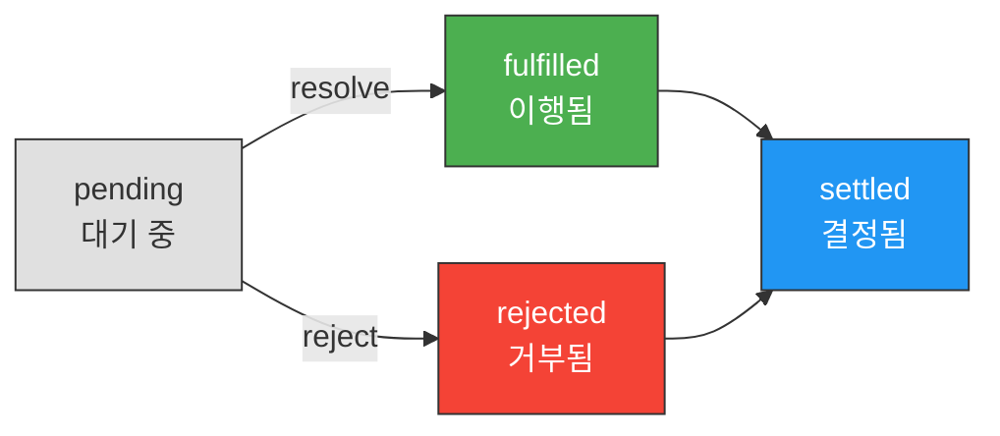
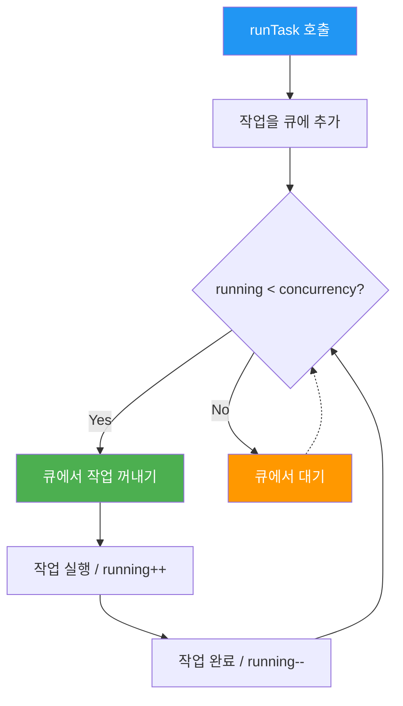

## 시작하며

벌써 노디패 스터디 5주차라니 시간이 정말 빠르네요! 지난 4장에서 콜백 기반의 비동기 제어 흐름을 다루면서 코드가 얼마나 복잡해질 수 있는지, 그리고 이른바 'Zalgo'라고 불리는 동기/비동기 혼재 문제가 얼마나 예측 불가능한 버그를 만드는지 뼈저리게 느꼈습니다. 중첩된 콜백 안에서 에러를 하나하나 체크하고, 비동기 순서를 맞추기 위해 카운터를 돌리던 기억이 아직도 생생한데요.

이번 5장에서는 그런 고통에서 우리를 구원해준 현대 JavaScript 비동기 프로그래밍의 구원자, 프라미스(Promise)와 async/await를 본격적으로 다뤄보겠습니다. 사실 실무에서 매일같이 쓰는 문법이지만, 정작 "프라미스가 내부적으로 어떻게 상태를 관리하는지", "왜 특정 상황에서 try-catch가 먹히지 않는지" 같은 질문을 받으면 선뜻 답하기 어려울 때가 많더라고요.

이번 포스트에서는 단순히 문법을 익히는 것을 넘어, 프라미스의 탄생 배경과 동작 원리, 그리고 실제 웹 스파이더 예제를 통해 어떻게 복잡한 비동기 로직을 우아하게 정돈할 수 있는지 제가 공부하고 고민한 내용들을 모두 정리했습니다. 특히 많은 개발자가 실수하는 `return await`의 미묘한 차이점에 대한 딥다이브 내용도 포함했으니 끝까지 함께해주시면 좋겠습니다!

---

## 1. 프라미스(Promise) 기초

비동기 프로그래밍을 할 때 우리가 마주하는 가장 큰 벽은 '가독성'과 '에러 처리'입니다. 콜백 방식은 함수 안에 함수가 계속 들어가는 형태라 로직을 한눈에 파악하기가 정말 어렵고, 에러가 어디서 터졌는지 추적하기도 쉽지 않았죠. 프라미스는 비동기 작업의 결과를 '객체'라는 구체적인 형태로 캡슐화해서 이 문제를 해결합니다.

### Promise의 상태와 동작 원리

프라미스를 이해하는 핵심은 상태 전이를 파악하는 것이었습니다. 프라미스는 생성되는 순간부터 결정될 때까지 정해진 길을 따라 움직이는데요. 아래 다이어그램으로 그 흐름을 확인해볼게요.



프라미스는 다음과 같은 네 가지 상태를 가집니다:

1.  **pending(대기 중)**: 비동기 작업이 아직 완료되지 않은 초기 상태입니다.
2.  **fulfilled(이행됨)**: 비동기 작업이 성공적으로 완료되어 결과값을 반환한 상태예요.
3.  **rejected(거부됨)**: 작업 중 에러가 발생해서 실패한 상태입니다.
4.  **settled(결정됨)**: 이행되었든 거부되었든 결과가 확정된 상태를 말합니다.

제가 공부하면서 특히 흥미로웠던 점은 프라미스가 한 번 'settled' 상태가 되면 그 결과가 **불변(Immutable)**이 된다는 점입니다. 이 성질 덕분에 비동기 작업의 결과를 여러 번 가져다 써도 항상 동일한 값을 얻을 수 있어 로직이 훨씬 안전해지더라고요.

### 정적 메소드(Static Methods) 활용하기

프라미스는 여러 비동기 작업을 제어하기 위한 강력한 정적 메소드들을 제공합니다. 제가 실무에서 가장 자주 고민하는 부분이 "여러 요청을 어떻게 효율적으로 보낼 것인가"인데, 아래 메소드들이 그 답이 되어주었습니다.

- **Promise.resolve(obj)**: 값을 즉시 이행되는 프라미스로 감싸줍니다. 이미 가지고 있는 데이터를 프라미스 체인에 태울 때 유용해요.
- **Promise.reject(err)**: 즉시 거부되는 프라미스를 생성합니다. 특정 조건에서 비동기 흐름을 중단시켜야 할 때 씁니다.
- **Promise.all(iterable)**: 모든 프라미스가 성공해야만 결과를 반환합니다. 하나라도 실패하면 전체가 거부되기 때문에, 데이터 간의 정합성이 중요한 상황에 적합했습니다.
- **Promise.allSettled(iterable)**: 일부가 실패하더라도 모든 작업이 끝날 때까지 기다립니다. 각 작업의 성패를 상세히 알려주기 때문에, 독립적인 데이터 수집 작업에서 요긴하게 썼습니다.
- **Promise.race(iterable)**: 가장 먼저 끝나는 작업의 결과를 가져옵니다. 타임아웃 처리를 구현할 때 이보다 편한 게 없더라고요.

### 프라미스 체이닝 (Chaining)의 마법

프라미스의 꽃은 역시 체이닝이라고 생각해요. `.then()`이 항상 새로운 프라미스를 반환한다는 원리 덕분에 비동기 로직을 기차 칸처럼 줄줄이 엮을 수 있습니다.

```javascript
// 콜백 방식의 지옥 (과거의 나)
fs.readFile('file1.txt', (err, data1) => {
  if (err) return handleError(err);
  fs.readFile('file2.txt', (err, data2) => {
    if (err) return handleError(err);
    console.log(data1 + data2);
  });
});

// 프라미스 체이닝 (현재의 나)
fsPromises.readFile('file1.txt')
  .then(data1 => {
    // 다음 비동기 작업을 위한 프라미스 반환
    return fsPromises.readFile('file2.txt')
      .then(data2 => data1 + data2);
  })
  .then(result => {
    console.log('최종 결과:', result);
  })
  .catch(err => {
    console.error('어디선가 문제가 생겼네요:', err);
  });
```

이렇게 작성하면 에러가 어디서 터지든 마지막 `.catch()`에서 잡아낼 수 있습니다. 콜백마다 `if (err)`를 붙이던 시절과 비교하면 정말이지 코드가 숨을 쉬는 것 같은 기분이 듭니다.

### Zalgo 문제의 자동 해결

지난 장에서 비동기 함수가 때때로 동기적으로 동작할 때 발생하는 'Zalgo' 문제를 다뤘었죠. 프라미스는 이 문제를 설계 레벨에서 원천 봉쇄합니다. 프라미스의 모든 콜백은 항상 마이크로태스크 큐(Microtask Queue)를 통해 비동기적으로 실행되도록 보장되기 때문입니다. 개발자가 따로 `process.nextTick()`을 고민하지 않아도 일관된 실행 순서를 가질 수 있다는 게 얼마나 큰 축복인지 다시금 느꼈습니다.

---

## 2. 프라미스 활용 패턴

기초를 넘어서면 실제 복잡한 상황을 해결하기 위한 패턴들이 필요해집니다.

### Promisification: 레거시 코드와 공존하기

Node.js 생태계에는 여전히 콜백 기반의 API가 많습니다. 이를 프라미스 방식으로 바꾸는 '프라미스화'는 현대화를 위해 꼭 필요한 과정이더라고요. 직접 구현해볼 수도 있지만, 실제로는 Node.js 내장 도구인 `util.promisify`를 쓰는 게 가장 확실합니다.

```javascript
import { promisify } from 'util';
import { randomBytes } from 'crypto';

// 1. 커스텀 구현 버전 (원리 이해용)
function myPromisify(callbackBasedApi) {
  return function promisified(...args) {
    return new Promise((resolve, reject) => {
      const newArgs = [
        ...args,
        function (err, result) {
          if (err) return reject(err);
          resolve(result);
        }
      ];
      callbackBasedApi(...newArgs);
    });
  };
}

// 2. 실무 권장 버전
const randomBytesP = promisify(randomBytes);

randomBytesP(32)
  .then(buffer => console.log('Random:', buffer.toString('hex')))
  .catch(err => console.error(err));
```

이렇게 변환된 함수들은 async/await 안에서도 자연스럽게 녹아들기 때문에, 레거시 모듈을 가져와 쓸 때 가장 먼저 하는 작업이 되었습니다.

### 비동기 제어 흐름의 최적화: 순차 vs 병렬

책에서 다룬 웹 스파이더 예제를 통해 순차 실행과 병렬 실행의 트레이드오프를 명확히 체감했습니다.

**실행 방식 비교 테이블**:

| 특징 | 순차 실행 (Sequential) | 병렬 실행 (Parallel) |
|------|------------------------|----------------------|
| 실행 방식 | 하나씩 차례대로 (Linear) | 동시에 여러 개 시작 (Concurrent) |
| 구현 도구 | `.reduce()`, `for...of` | `Promise.all()`, `.map()` |
| 시간 복잡도 | O(N * T) | O(max(T)) |
| 리소스 사용 | 낮음 (예측 가능) | 높음 (시스템 부하 위험) |
| 적합한 사례 | 의존성이 있는 작업 | 독립적인 대량의 작업 |

특히 루프를 돌면서 `promise = promise.then(...)` 처럼 동적으로 체인을 구축하는 패턴은 꽤나 신선했습니다. 배열의 요소들을 순서대로 비동기 처리하고 싶을 때 이보다 우아한 방법이 있을까 싶더라고요.

### 제한된 병렬 실행과 TaskQueue

무작정 모든 작업을 병렬로 돌리면 서버가 견디지 못할 때가 있습니다. 이럴 때 필요한 게 동시성 제한입니다. 책에서 소개된 `TaskQueue` 클래스는 큐에 작업을 쌓아두고 정해진 개수만큼만 실행하는 아주 실전적인 방법을 보여줍니다.

```javascript
export class TaskQueue {
  constructor(concurrency) {
    this.concurrency = concurrency;
    this.running = 0;
    this.queue = [];
  }

  runTask(task) {
    return new Promise((resolve, reject) => {
      // 1. 작업을 래핑하여 큐에 추가합니다. 
      // task()가 반환하는 프라미스의 결과를 외부의 resolve, reject와 연결하는 것이 핵심입니다.
      this.queue.push(() => {
        return task().then(resolve, reject);
      });
      // 2. 이벤트 루프의 다음 틱에 실행을 시도합니다.
      process.nextTick(this.next.bind(this));
    });
  }

  next() {
    // 3. 현재 실행 중인 작업(running)이 동시성 제한(concurrency)보다 작고
    // 큐에 대기 중인 작업이 있다면 계속해서 작업을 꺼내 실행합니다.
    while (this.running < this.concurrency && this.queue.length) {
      const task = this.queue.shift();
      task().finally(() => {
        // 4. 작업이 성공하든 실패하든(finally), 실행 카운트를 줄이고 
        // 다시 next()를 호출하여 다음 대기 작업을 처리합니다.
        this.running--;
        this.next();
      });
      this.running++;
    }
  }
}
```

아래 다이어그램은 `TaskQueue`가 동시성을 제한하면서 작업을 처리하는 흐름을 보여줍니다.



이 패턴에서 제가 가장 중요하게 생각한 부분은 `runTask`가 즉시 프라미스를 반환한다는 점입니다. 덕분에 호출하는 쪽에서는 작업이 큐에서 언제 실행되든 관계없이 `await queue.runTask(...)` 처럼 자연스럽게 기다릴 수 있게 되죠.

---

## 3. Async/Await

ES2017에서 등장한 async/await는 프라미스를 다루는 방식에 혁명을 일으켰습니다. 내부적으로는 여전히 프라미스를 쓰지만, 문법적으로는 동기 코드의 옷을 입고 있어서 가독성이 비약적으로 향상되었거든요.

### 비동기를 동기처럼 쓰는 마법

```javascript
async function download(url, filename) {
  console.log(`다운로드 시작: ${url}`);
  try {
    // await를 만나면 이 함수의 실행은 일시 중지되고 제어권이 이벤트 루프로 넘어갑니다.
    // 프라미스가 해결되면 다시 이 지점부터 실행이 재개됩니다.
    const { text: content } = await superagent.get(url);
    await mkdirpPromises(dirname(filename));
    await fsPromises.writeFile(filename, content);
    console.log(`저장 완료: ${url}`);
    return content;
  } catch (err) {
    console.error('실패했어요:', err);
    throw err;
  }
}
```

프라미스 체이닝으로 20줄 가까이 되던 로직이 단 몇 줄로 정리되는 걸 보면서 정말 감탄했습니다. 코드가 위에서 아래로 일직선으로 읽히니까 비즈니스 로직에만 집중할 수 있게 되더라고요.

### 에러 처리의 일원화: try-catch의 부활

async/await의 가장 큰 장점 중 하나는 익숙한 `try-catch` 구문을 비동기 코드에도 그대로 쓸 수 있다는 점입니다.

- **통합 관리**: 동기적으로 발생하는 에러(JSON parsing 등)와 비동기적으로 발생하는 에러(네트워크 에러 등)를 하나의 catch 블록에서 처리할 수 있습니다.
- **finally 활용**: 성공 여부와 관계없이 리소스를 해제하거나 로그를 남길 때 `finally`를 쓸 수 있어 코드가 훨씬 견고해집니다.

이 문법 덕분에 에러 핸들링 전략을 세우는 게 훨씬 단순해졌습니다. "모든 비동기 작업은 에러가 날 수 있다"는 전제하에 구조를 짜는 게 일상이 되었네요.

### 생산자-소비자 패턴 (Producer-Consumer)의 깊은 이해

고급 주제로 다룬 생산자-소비자 패턴은 async/await의 강력함을 보여주는 좋은 사례였습니다. 각 소비자를 무한 루프를 도는 코루틴처럼 동작하게 만드는 방식입니다.

```javascript
export class TaskQueuePC {
  constructor(concurrency) {
    this.taskQueue = [];
    this.consumerQueue = [];

    // 동시성만큼 소비자 실행
    for (let i = 0; i < concurrency; i++) {
      this.consumer();
    }
  }

  // 소비자 코루틴: 작업이 생길 때까지 잠들었다가 깨어납니다.
  async consumer() {
    while (true) {
      try {
        const task = await this.getNextTask();
        await task();
      } catch (err) {
        console.error('Task failed:', err);
      }
    }
  }

  // 작업이 들어올 때까지 기다리는 마법
  async getNextTask() {
    return new Promise((resolve) => {
      // 1. 이미 대기 중인 작업이 있다면 즉시 반환합니다.
      if (this.taskQueue.length !== 0) {
        return resolve(this.taskQueue.shift());
      }
      // 2. 작업이 없으면 현재 소비자의 '깨워줄 스위치(resolve)'를 대기열에 추가합니다.
      // 이제 이 소비자는 새로운 작업이 들어와서 이 resolve가 호출될 때까지 await 상태로 머뭅니다.
      this.consumerQueue.push(resolve);
    });
  }

  runTask(task) {
    return new Promise((resolve, reject) => {
      const taskWrapper = () => {
        const taskPromise = task();
        taskPromise.then(resolve, reject);
        return taskPromise;
      };

      // 3. 잠자고 있는 소비자가 있다면 깨워서 일을 시킵니다.
      if (this.consumerQueue.length !== 0) {
        const consumer = this.consumerQueue.shift();
        consumer(taskWrapper); // 소비자의 getNextTask()에 있는 resolve가 호출됨
      } else {
        // 4. 모든 소비자가 바쁘다면 작업 큐에 추가합니다.
        this.taskQueue.push(taskWrapper);
      }
    });
  }
}
```

이 구조는 메모리 사용량이 일정하게 유지된다는 점에서 아주 매력적이었습니다. 대량의 데이터 처리가 필요한 배치 작업 같은 곳에 적용해보면 좋겠다는 생각이 들더라고요. 소비자의 개수를 조절하는 것만으로 시스템 전체의 부하를 완벽하게 제어할 수 있다는 점이 정말 든든했습니다.


---

## 4. return vs return await — 실수하기 쉬운 함정

스터디 중에 가장 많은 질문이 나왔던 부분이기도 하고, 저도 처음에는 대충 넘겼다가 큰코다칠 뻔한 주제입니다.

### try-catch가 무력화되는 함정

가장 위험한 상황은 `try-catch` 블록 안에서 `await` 없이 프라미스를 그대로 반환할 때 발생합니다.

```javascript
async function dangerousConnection() {
  try {
    // ❌ 프라미스를 기다리지 않고 그냥 반환합니다.
    return db.connect(); 
  } catch (error) {
    // DB 연결이 실패해도 여기로 들어오지 않아요!
    logger.error('DB 연결 실패 로그 누락:', error);
    return null;
  }
}
```

이 코드가 왜 위험할까요? `db.connect()`가 호출되면 즉시 프라미스가 생성되지만, 이 프라미스가 해결되거나 거부되기도 전에 함수는 프라미스 객체 자체를 호출자에게 넘기고 종료되어버립니다. `try-catch` 블록의 감시망을 이미 벗어난 뒤에 에러가 터지기 때문에, 내부의 에러 처리 로직은 아예 실행되지 않는 거죠.

### Stack Trace와 디버깅의 관점

성능보다 더 중요한 건 디버깅의 용이성입니다. `return await`를 사용하면 에러가 발생했을 때 현재 함수가 호출 스택에 남지만, 그냥 `return`만 하면 현재 함수는 이미 종료된 상태라 스택에서 사라져버립니다.

```javascript
async function level3() { throw new Error('펑!'); }
async function level2() { return await level3(); } // ✅ 스택에 level2가 남음
async function level1() { return await level2(); }

// Stack Trace:
// Error: 펑!
//     at level3
//     at async level2  <-- 범인이 누군지 명확히 보임!
//     at async level1
```

### ESLint 규칙의 변천사

흥미롭게도 과거(2018~2022년경)에는 `no-return-await`라는 규칙이 권장되었습니다. "불필요한 마이크로태스크를 추가해서 느리다"는 주장이었죠. 하지만 2023년 이후 이 규칙은 대부분의 환경에서 Deprecated 되었습니다.

1.  **성능 차이 없음**: ECMA 스펙 변경으로 `return await`의 오버헤드가 거의 사라졌습니다.
2.  **정확성이 더 중요**: `try-catch` 버그를 잡는 것이 몇 나노초의 성능보다 훨씬 중요해졌습니다.
3.  **일관성**: 모든 비동기 반환값에 `await`를 붙이는 것이 가독성과 일관성 면에서 더 유리하다는 판단입니다.

### 의사 결정 가이드 테이블

| 상황 | 사용 패턴 | 이유 |
|------|-----------|------|
| **try-catch 블록 내부** | `return await` | **[꼭 필요]** catch 블록이 에러를 잡아야 합니다. |
| **finally 블록이 있을 때** | `return await` | **[꼭 필요]** 비동기 작업이 끝나야 finally가 실행됩니다. |
| **using/await using 사용 시** | `return await` | **[꼭 필요]** 리소스 정리가 올바른 순서로 일어납니다. |
| **그 외 일반 함수** | `return` | 간결성을 위해 생략 가능합니다. (성능 차이 미미) |

### 명시적 리소스 관리와 using 문법의 등장

최근 JavaScript 생태계에서 주목받는 변화 중 하나는 `using` 문법(Explicit Resource Management)의 도입입니다. 이 문법은 비동기 작업과 리소스 정리를 더 안전하게 결합하려고 하는데요.

```javascript
async function withUsing() {
  // await using을 쓰면 블록을 나갈 때 리소스가 자동으로 정리됩니다.
  await using file = await openFile('data.txt');
  // 이때 중요한 것은 file.read()가 끝날 때까지 기다려야 한다는 점입니다.
  return await file.read(); // ✅ return await가 꼭 필요한 이유!
}
```

만약 여기서 `return file.read()`처럼 `await`를 빼버리면 어떻게 될까요? 파일 읽기가 채 끝나기도 전에 `using` 블록이 종료되면서 파일이 닫혀버릴 수 있습니다. 그러면 리소스 접근 에러가 발생하게 되죠. 새로운 문법이 등장할수록 `return await`의 중요성은 점점 더 커지고 있더라고요.

---

## 5. 고급 주제: 무한 재귀와 메모리 누수

프라미스를 다룰 때 정말 조심해야 할 부분 중 하나가 메모리 관리입니다.

### 프라미스 해결 체인의 함정

```javascript
function tick() {
  return delay(1000).then(() => {
    console.log('틱톡...');
    return tick(); // ⚠️ 무한 재귀!
  });
}
```

이 코드는 실행될수록 메모리 사용량이 계속 늘어납니다. 각 프라미스가 다음 프라미스에 의존하는 거대한 체인을 형성하고, 이 체인이 끝날 때까지 어떤 프라미스도 메모리에서 해제되지 않기 때문입니다.

### 안전한 해결책: while과 await의 조합

```javascript
async function safeTick() {
  while (true) {
    try {
      await delay(1000);
      console.log('틱톡...');
    } catch (err) {
      console.error('반복 중단:', err);
      break;
    }
  }
}
```

이렇게 `while(true)` 안에서 `await`를 사용하면, 현재의 비동기 작업이 완전히 끝난 뒤에 다음 루프가 시작됩니다. 프라미스 체인이 쌓이지 않고 매 루프마다 해소되기 때문에, 메모리 누수 걱정 없이 안전하게 무한 루프를 돌릴 수 있습니다. 역시 기본에 충실한 반복문이 비동기에서도 가장 든든한 해결사가 되어주네요.

---

## 6. 제어 흐름 패턴 요약

이번 장에서 다룬 다양한 비동기 제어 흐름 패턴들을 한눈에 비교할 수 있도록 표로 정리해봤습니다.

**비동기 패턴 비교 총정리**:

| 패턴 | 프라미스(Promise) 방식 | Async/Await 방식 | 비고 |
|------|------------------------|------------------|------|
| **순차 실행** | `.then()` 체이닝 또는 `.reduce()` | `await`를 순서대로 나열하거나 `for...of` | 가독성은 Async/Await가 압도적 |
| **병렬 실행** | `Promise.all()` | `Promise.all()` + `await` | 두 방식 모두 동일한 엔진 사용 |
| **제한된 병렬** | `TaskQueue` 클래스 | `TaskQueuePC` (생산자-소비자) | 동시성 제어가 핵심 |
| **무한 루프** | 재귀 호출 (메모리 위험) | `while` + `await` | Async/Await가 훨씬 안전함 |
| **에러 처리** | `.catch()` 체인 | `try-catch` 블록 | 에러 전파 방식의 차이 이해하기 |

---

## 도전해볼 만한 연습 문제 (Exercises)

스터디를 마무리하며 제가 직접 풀어보고 고민했던 연습 문제들입니다. 여러분도 직접 코드를 짜보면서 감을 익히시면 좋을 것 같아요.

### Exercise 5.1: Promise.all() 직접 구현하기
`Promise.all()`을 사용하지 않고, 프라미스와 카운터만으로 동일한 기능을 하는 함수를 만들어보세요.

```javascript
function myPromiseAll(promises) {
  return new Promise((resolve, reject) => {
    const results = [];
    let completed = 0;
    if (promises.length === 0) return resolve(results);

    promises.forEach((p, i) => {
      // 프라미스가 아닌 값이 올 수도 있으므로 Promise.resolve()로 감쌉니다.
      Promise.resolve(p).then(val => {
        results[i] = val;
        if (++completed === promises.length) resolve(results);
      }).catch(reject);
    });
  });
}
```

### Exercise 5.2: TaskQueue를 async/await로 리팩토링하기
기존의 프라미스 기반 `TaskQueue` 내부 로직을 async/await 문법을 사용하여 더 직관적으로 리팩토링해보세요. `next()` 메소드 내부의 비동기 흐름을 어떻게 `await`로 깔끔하게 정리할 수 있을지가 핵심입니다.

### Exercise 5.3: TaskQueuePC를 프라미스만으로 구현하기
반대로, async/await 없이 프라미스만 사용하여 생산자-소비자 패턴을 구현해보세요. 이때 무한 재귀로 인한 메모리 누수가 발생하지 않도록 설계하는 것이 가장 큰 도전 과제입니다.

### Exercise 5.4: 비동기형 map() 구현하기
동시성 제한(concurrency)을 지원하는 `mapAsync(iterable, callback, concurrency)` 함수를 구현해보세요. 대량의 API 요청이나 파일 처리를 할 때 실무에서 정말 유용하게 쓰일 수 있는 유틸리티입니다.

---

## 실무에 적용할 수 있는 인사이트들


이번 5장을 공부하면서 제 실무 코드에 바로 녹여내고 싶었던 핵심 포인트들입니다.

1.  **병렬 처리를 통한 성능 극대화**: 서로 연관 없는 비동기 작업은 무조건 `Promise.all`로 묶어서 실행 시간을 단축해야겠습니다. 우리 서비스의 API 응답 속도를 개선할 수 있는 가장 확실한 방법입니다.
2.  **ESLint 설정 업데이트**: 팀 프로젝트에서 `return await` 실수를 방지하기 위해 `@typescript-eslint/return-await` 규칙을 `always` 또는 `in-try-catch`로 활성화하는 것을 제안해야겠습니다.
3.  **리소스 관리의 정석**: DB 트랜잭션이나 외부 리소스를 다룰 때 에러가 나더라도 반드시 정리가 이뤄지도록 `finally` 블록을 더 적극적으로 활용하겠습니다.
4.  **Zalgo 예방을 위한 설계**: 새로운 모듈을 만들 때 인터페이스를 프라미스 기반으로 설계하여, 호출하는 쪽에서 일관된 비동기 처리를 할 수 있도록 가이드해야겠습니다.

---

## 마무리

프라미스와 async/await는 이제 Node.js 개발자에게는 공기 같은 존재가 되었습니다. 하지만 너무 익숙해서 때로는 그 속에서 일어나는 복잡한 일들을 잊고 살았던 것 같아요. 이번 스터디는 제가 작성하는 코드 한 줄 한 줄이 이벤트 루프에서 어떻게 동작하는지 다시금 생각해보게 만든 뜻깊은 시간이었습니다.

특히 `return await`에 대한 오해를 풀고, 메모리 누수 없는 무한 루프 패턴을 익힌 것이 이번 주의 가장 큰 수확이 아니운지 싶습니다. 역시 기본기가 탄탄해야 그 위에 쌓아 올리는 아키텍처도 무너지지 않는 법이겠죠.

긴 글 읽어주셔서 감사합니다! 다음 포스트에서는 Node.js의 진정한 정수라고 할 수 있는 **6장 '스트림으로 데이터 다루기'**를 다룰 예정입니다. 대용량 데이터를 메모리 효율적으로 처리하는 스트림의 매력에 대해 벌써부터 기대가 크네요. 다음 주에 더 알찬 내용으로 찾아오겠습니다!

### 💡 프라미스 설계 철학에 대한 질문
- 프라미스의 `settled` 상태가 불변(Immutable)으로 설계된 것이 비동기 프로그래밍의 안정성에 어떤 기여를 한다고 보시나요?
- `Promise.all` 사용 시 입력 배열이 너무 커서 메모리 문제가 발생할 가능성은 없을까요? 실무에서는 어떻게 대응하시나요?
- 프라미스가 항상 비동기로 실행된다는 보장(Zalgo 해결)이 없었다면, 우리 코드는 어떤 위험에 노출되었을까요?

### 🛠️ Async/Await 활용과 에러 핸들링 질문
- 실무에서 `try-catch`를 사용할 때와 `.catch()`를 사용할 때 중 어떤 것을 선호하시나요? 팀 내 컨벤션은 어떻게 되어 있나요?
- async 함수 내부에서 `throw new Error()`를 하는 것과 `return Promise.reject()`를 하는 것 사이에 실질적인 차이가 있을까요?
- 병렬 실행 효율을 높이기 위해 `Promise.all` 외에 본인만의 노하우나 사용하는 라이브러리(p-limit 등)가 있다면 무엇인가요?

### ⚠️ 실전 디버깅과 주의사항 질문
- `return await`를 생략해서 발생한 '사라진 에러' 때문에 고생했던 경험이 있으신가요? 어떻게 그 원인을 찾아내셨나요?
- 프라미스 기반의 무한 루프에서 메모리 누수를 감지하기 위한 가장 효과적인 모니터링 방법이나 도구는 무엇이 있을까요?
- 프로젝트 규모가 커질수록 비동기 로직의 복잡도를 낮추기 위해 어떤 패턴(예: Producer-Consumer)을 주로 사용하시나요?

댓글로 공유해주시면 함께 배워나갈 수 있을 것 같습니다!


