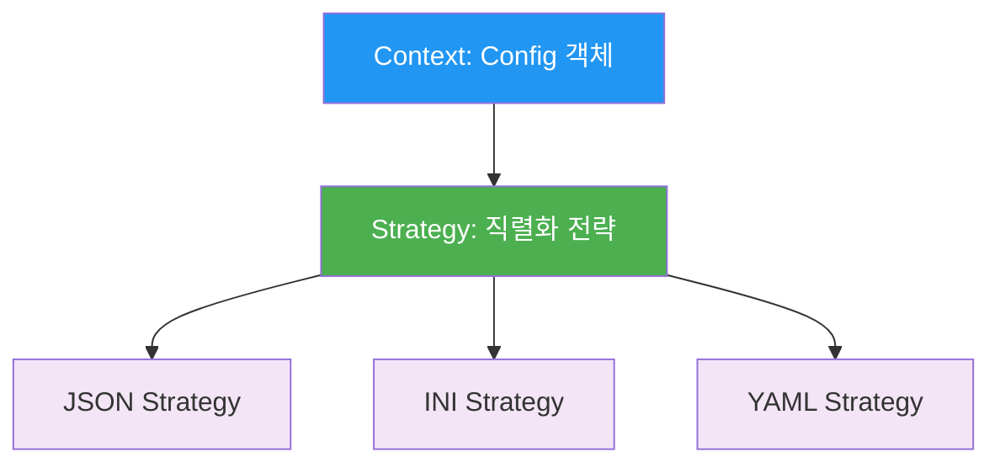
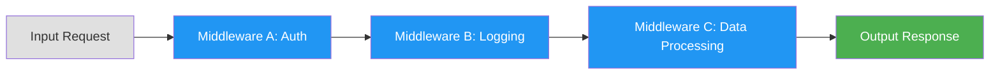

## 시작하며

노디패 스터디 9주차! 지난 8장에서 구조 디자인 패턴을 통해 객체들을 어떻게 구성하고 연결할지 고민했다면, 이번 9장에서는 **행위 디자인 패턴**을 통해 이들이 어떻게 상호작용하고 동작해야 하는지 깊이 있게 다룹니다.

사실 그동안 코드를 짜면서 "이 로직은 상태에 따라 너무 복잡해지는데?"라거나 "비슷한 알고리즘인데 일부분만 다르게 처리할 순 없을까?" 같은 고민을 자주 했었거든요. 이번 장을 정독하고 나니 그런 고민들이 결국 행위 패턴이라는 정교한 설계 지도로 해결될 수 있다는 걸 깨달았습니다.

행위 패턴은 단순히 코드를 깔끔하게 만드는 수준을 넘어, 컴포넌트 간의 결합도를 낮추고 확장성을 극대화하는 실질적인 방법을 제시합니다. 특히 Node.js 생태계에서 독특하게 발전한 미들웨어 패턴이나 자바스크립트 언어 차원에서 지원하는 반복자 패턴을 보며 "아, 이게 이래서 이렇게 설계되었구나" 하는 감탄이 절로 나오더라고요. 스터디원들과 함께 각 패턴의 실무 적용 사례를 나누며 이해의 폭을 넓힐 수 있었습니다.

## 전략 패턴 (Strategy) - 런타임에 알고리즘 교체하기

전략 패턴은 제가 실무에서 가장 유용하게 사용하고 있는 패턴 중 하나입니다. **컨텍스트**라는 객체가 있고, 실제 로직은 **전략(Strategy)**이라는 별도의 객체로 분리하여 런타임에 교환할 수 있게 만드는 방식이죠.

쉽게 비유하자면 자동차의 타이어와 같습니다. 차체(컨텍스트)는 그대로 두고, 노면 상태에 따라 스노우 타이어나 고성능 타이어(전략)를 골라 끼우는 식입니다. 차 전체를 바꿀 필요가 없으니 매우 경제적이고 유연합니다.



이 부분을 읽으면서 "과거에 `if-else`로 덕지덕지 발라놨던 로직들이 떠올라 조금 부끄러워졌습니다." 형식에 따라 처리 방식을 분리할 때 조건문을 쓰기 시작하면, 형식이 추가될 때마다 컨텍스트 코드를 수정해야 하거든요. 전략 패턴은 이를 객체 주입으로 해결합니다.

```javascript
// 환경설정 관리 예제 (Strategy 패턴)
import { promises as fs } from 'fs'
import objectPath from 'object-path'

export class Config {
  constructor(formatStrategy) {
    this.data = {}
    this.formatStrategy = formatStrategy // 전략 주입
  }

  get(configPath) {
    return objectPath.get(this.data, configPath)
  }

  set(configPath, value) {
    return objectPath.set(this.data, configPath, value)
  }

  async load(filePath) {
    console.log(`Deserializing from ${filePath}`)
    // 구체적인 처리 방식은 전략에 위임합니다
    this.data = this.formatStrategy.deserialize(
      await fs.readFile(filePath, 'utf-8')
    )
  }

  async save(filePath) {
    console.log(`Serializing to ${filePath}`)
    await fs.writeFile(filePath,
      this.formatStrategy.serialize(this.data))
  }
}

// 구체적인 전략 구현 예시
import ini from 'ini'

export const iniStrategy = {
  deserialize: data => ini.parse(data),
  serialize: data => ini.stringify(data)
}

export const jsonStrategy = {
  deserialize: data => JSON.parse(data),
  serialize: data => JSON.stringify(data, null, '  ')
}
```

실제로 `Passport.js`에서 인증 방식을 `Local`, `OAuth`, `JWT` 등으로 쉽게 갈아끼울 수 있는 것도 바로 이 전략 패턴 덕분입니다. 실무에서도 결제 수단이 늘어날 때 결제 모듈을 전략으로 분리하니 코드가 정말 깔끔해졌던 기억이 나네요.

## 상태 패턴 (State) - 객체의 상태에 따른 동작 제어

상태 패턴은 전략 패턴과 구조가 비슷하지만 목적이 다릅니다. 전략 패턴은 클라이언트가 전략을 선택하지만, 상태 패턴은 **객체 스스로가 자신의 상태에 따라 전략을 바꿉니다.**

예를 들어 호텔 예약 시스템에서 예약이 '생성'된 상태일 때는 취소가 가능하지만, '체크인'된 상태일 때는 취소가 불가능해야 합니다. 이런 로직을 하나의 거대한 `switch` 문으로 관리하면 금방 스파게티 코드가 됩니다. 상태 패턴은 각 상태를 객체로 만들어 이 문제를 해결합니다.


책에 나온 장애 조치 소켓 예제를 보며 정말 감탄했습니다. 연결이 끊겼을 때는 데이터를 큐에 쌓아두고(`OfflineState`), 다시 연결되면 큐의 내용을 한꺼번에 전송하는(`OnlineState`) 흐름이 상태 객체 안에서 자연스럽게 제어되더라고요.

```javascript
// 상태 패턴을 활용한 장애 조치 소켓 (Context 부분)
import { OfflineState } from './offlineState.js'
import { OnlineState } from './onlineState.js'

export class FailsafeSocket {
  constructor(options) {
    this.options = options
    this.queue = []
    this.currentState = null
    this.states = {
      offline: new OfflineState(this),
      online: new OnlineState(this)
    }
    this.changeState('offline')
  }

  changeState(state) {
    console.log(`Activating state: ${state}`)
    this.currentState = this.states[state]
    this.currentState.activate()
  }

  send(data) {
    // 현재 상태에 동작을 위임합니다
    this.currentState.send(data)
  }
}

// 오프라인 상태 구현 예시
export class OfflineState {
  constructor(failsafeSocket) {
    this.failsafeSocket = failsafeSocket
  }

  send(data) {
    // 오프라인일 때는 데이터를 전송하지 않고 큐에 저장합니다
    this.failsafeSocket.queue.push(data)
  }

  activate() {
    console.log('Trying to connect...')
    // 주기적으로 연결을 시도하며 성공 시 OnlineState로 전환합니다
  }
}
```

이런 세부사항들까지 고려해야 한다는 걸 보고 "상태 패턴은 복잡한 비즈니스 로직을 관리하는 최고의 도구구나"라고 생각했습니다. 게임 캐릭터의 정지/걷기/달리기 상태나 쇼핑몰의 주문 처리 프로세스를 구현할 때 이만한 게 없을 것 같아요.

## 템플릿 패턴 (Template) - 알고리즘의 뼈대 재사용

템플릿 패턴은 클래스의 상속을 활용합니다. **알고리즘의 전체적인 골격은 부모 클래스에 정의**하고, 구체적으로 변해야 하는 부분만 자식 클래스에서 구현하도록 열어두는 방식입니다.

```javascript
// 템플릿 패턴 예시 (추상 클래스 역할)
export class ConfigTemplate {
  async load(file) {
    console.log(`Deserializing from ${file}`)
    // 전체적인 흐름(로드 -> 역직렬화 -> 데이터 저장)은 부모가 정의합니다
    this.data = this._deserialize(
      await fs.readFile(file, 'utf-8')
    )
  }

  async save(file) {
    console.log(`Serializing to ${file}`)
    await fs.writeFile(file, this._serialize(this.data))
  }

  // 구체적인 직렬화 방식은 하위 클래스에 맡깁니다
  _serialize() { throw new Error('_serialize() must be implemented') }
  _deserialize() { throw new Error('_deserialize() must be implemented') }
}

// 구체적인 구현 클래스
export class JsonConfig extends ConfigTemplate {
  _deserialize(data) { return JSON.parse(data) }
  _serialize(data) { return JSON.stringify(data, null, '  ') }
}
```

전략 패턴과 템플릿 패턴 중 무엇을 쓸지 고민될 때가 많은데, 책에서 제시한 비교표가 정리에 큰 도움이 되었습니다.
전략 패턴과 템플릿 패턴 중 무엇을 쓸지 고민될 때가 많은데, 책에서 제시한 비교표가 정리에 큰 도움이 되었습니다.

| 구분 | 전략 (Strategy) | 템플릿 (Template) |
|------|-----------------|-------------------|
| **변경 시점** | 런타임에 동적으로 변경 가능 | 클래스 정의 시점에 고정됨 |
| **구조** | 컴포지션 (has-a) - 유연함 | 상속 (is-a) - 견고함 |
| **유연성** | 매우 높음 (실행 중 교체) | 상대적으로 낮음 (구현체 고정) |

이 표를 보니 런타임 전환이 필요하면 전략, 고정된 변형 세트가 필요하면 템플릿이 유리하다는 걸 명확히 알겠더라고요. Node.js 스트림에서 `_read()`, `_write()`를 직접 구현하는 방식이 바로 이 템플릿 패턴의 전형적인 사례라는 것도 흥미로운 발견이었습니다.

## 반복자 패턴 (Iterator) - 컬렉션 순회의 표준

반복자 패턴은 컬렉션의 내부 구조를 노출하지 않고 요소들을 하나씩 순회할 수 있는 공통 인터페이스를 제공합니다. 자바스크립트에서는 `Symbol.iterator`를 통해 언어 차원에서 이 패턴을 강력하게 지원하죠.

특히 제너레이터(`function*`)를 사용하면 반복자를 만드는 과정이 정말 즐거워집니다. `yield` 키워드 하나로 상태를 유지하며 값을 내뱉는 방식은 코드를 비약적으로 간결하게 만들어 줍니다.

```javascript
// 제너레이터를 활용한 비동기 반복 예시
export class CheckUrls {
  constructor(urls) {
    this.urls = urls
  }

  async *[Symbol.asyncIterator]() {
    for (const url of this.urls) {
      try {
        const checkResult = await superagent.head(url).redirects(2)
        yield `${url} is up, status: ${checkResult.status}`
      } catch (err) {
        yield `${url} is down, error: ${err.message}`
      }
    }
  }
}

// 사용 시에는 for await...of로 깔끔하게!
for await (const status of checkUrls) {
  console.log(status)
}
```

비동기 반복자 부분을 읽으면서 "그동안 스트림과 비동기 반복자 사이에서 갈등했었는데, 상황에 맞는 선택 기준이 생겼습니다." 스트림은 데이터가 밀려오는(Push) 방식에 유리하고, 비동기 반복자는 우리가 필요할 때 가져오는(Pull) 방식에 더 적합하더라고요.

## 미들웨어 패턴 (Middleware) - 파이프라인으로 구성하는 처리 로직

미들웨어 패턴은 Node.js의 정체성과도 같습니다. Express나 Koa를 써봤다면 이미 친숙한 패턴이죠. 요청과 응답 사이에 여러 처리 단계(미들웨어)를 끼워 넣어 데이터를 가공하는 파이프라인 구조입니다.

이 패턴의 진가는 **확장성**에 있습니다. 로그 출력, 세션 체크, 데이터 압축 같은 독립적인 기능들을 미들웨어로 만들어두고 필요한 만큼 조합해서 쓸 수 있으니까요.



책에서 ZeroMQ 메시징에 미들웨어를 적용하는 예제를 보며, 이 패턴이 단순히 웹 프레임워크에 국한되지 않고 어떤 종류의 데이터 파이프라인에도 적용될 수 있다는 걸 깨달았습니다.

```javascript
// 미들웨어 매니저 구현 예시
export class MiddlewareManager {
  constructor() {
    this.middlewares = []
  }

  use(middleware) {
    this.middlewares.push(middleware)
  }

  async run(initialData) {
    let data = initialData
    for (const middleware of this.middlewares) {
      data = await middleware(data)
    }
    return data
  }
}

// 미들웨어 사용 예시
const manager = new MiddlewareManager()
manager.use(data => {
  console.log('Step 1: Parsing')
  return JSON.parse(data)
})
manager.use(data => {
  console.log('Step 2: Processing')
  data.processedAt = new Date()
  return data
})

const result = await manager.run('{"name": "Node.js"}')
```

실무에서 복잡한 배치 작업을 처리할 때 단계를 미들웨어로 나누면 유지보수가 훨씬 수월해질 것 같아요.

## 명령 패턴 (Command) - 의도를 객체로 캡슐화하기
마지막으로 다룬 명령 패턴은 함수 호출을 직접 하지 않고, **실행에 필요한 모든 정보를 객체로 감싸는** 방식입니다. 이렇게 하면 실행 시점을 늦추거나(지연 실행), 네트워크로 전송하거나(직렬화), 실행한 작업을 취소(Undo)하는 것이 가능해집니다.

텍스트 에디터의 '실행 취소' 기능을 생각하면 이해가 빠릅니다. 단순히 상태를 저장하는 게 아니라, 어떤 동작을 했는지 객체로 기록해두는 거죠.

```javascript
// 명령 패턴을 활용한 실행 취소 지원
export function createPostStatusCmd(service, status) {
  let postId = null

  return {
    run() {
      postId = service.postUpdate(status)
    },
    undo() {
      if (postId) {
        service.destroyUpdate(postId)
        postId = null
      }
    },
    serialize() {
      return { type: 'status', action: 'post', status }
    }
  }
}
```

이 패턴을 공부하며 분산 시스템에서의 작업 큐나 이벤트 소싱 아키텍처가 결국 명령 패턴의 확장형이라는 걸 알게 되었습니다. "아, 단순히 함수를 부르는 것보다 객체로 만드는 게 이렇게나 많은 가능성을 열어주는구나" 하고 감탄했습니다.

## 요약 및 패턴 선택 가이드

행위 디자인 패턴은 각자 뚜렷한 목적을 가지고 있습니다. 이를 한눈에 비교할 수 있도록 표로 정리해 보았습니다.

| 패턴 | 목적 | 핵심 개념 |
|------|------|----------|
| **전략** | 런타임 알고리즘 교체 | 컨텍스트 + 상호 교환 가능한 전략 |
| **상태** | 상태별 동작 변경 | 전략의 변형, 상태 전환 |
| **템플릿** | 알고리즘 구조 재사용 | 상속, 템플릿 메서드 |
| **반복자** | 컬렉션 순회 | Iterator/Iterable 프로토콜, 제너레이터 |
| **미들웨어** | 파이프라인 처리 | use(), next(), 전처리/후처리 |
| **명령** | 호출 정보 캡슐화 | 실행 취소, 직렬화, 지연 실행 |

어떤 패턴을 선택해야 할지 고민될 때는 아래 가이드를 참고해 보세요.

- **런타임에 동작을 변경해야 한다** → 전략 패턴
- **객체의 현재 상태에 따라 동작이 달라진다** → 상태 패턴
- **알고리즘 구조는 같고 일부분만 커스터마이징하고 싶다** → 템플릿 패턴
- **컬렉션의 내부 구조를 숨긴 채 요소를 순회해야 한다** → 반복자 패턴
- **요청을 단계별로 전처리하거나 후처리해야 한다** → 미들웨어 패턴
- **작업을 지연시키거나, 취소하거나, 원격으로 전송해야 한다** → 명령 패턴

## 연습문제로 실력 굳히기

책에서 제시된 연습문제들을 통해 각 패턴의 차이점을 더 명확히 이해할 수 있었습니다. 특히 로깅 컴포넌트를 전략, 템플릿, 미들웨어 패턴으로 각각 구현해보는 과정이 매우 인상적이었어요.

- **연습문제 9.1 & 9.2**: 로깅 컴포넌트를 각각 전략 패턴과 템플릿 패턴으로 구현하며 상속과 조합의 차이를 몸소 느낄 수 있습니다.
- **연습문제 9.3**: 창고 아이템의 상태(준비, 입고, 배송)를 상태 패턴으로 모델링하며 상태 전이 규칙의 견고함을 경험합니다.
- **연습문제 9.4**: 미들웨어 패턴을 로깅에 적용하여 직렬화나 파일 저장 기능을 플러그인처럼 추가하는 유연함을 배웁니다.
- **연습문제 9.5**: `AsyncQueue` 클래스에 비동기 반복자를 구현하며 대기열 처리를 현대적인 자바스크립트 문법으로 다루는 법을 익힙니다.

이런 연습문제들은 이론으로만 알던 패턴들을 실제 내 것으로 만드는 데 큰 도움이 되더라고요.

## 실무에 적용할 수 있는 인사이트들

### 1. 비즈니스 로직의 복잡도는 상태 패턴으로 해결

- 조건문이 너무 많아져 로직 파악이 힘들다면 상태 패턴 도입을 검토해야 합니다.
- 각 상태를 클래스로 분리하면 상태 전이 규칙을 명확하게 강제할 수 있습니다.
- 새로운 상태가 추가되어도 기존 컨텍스트 코드를 수정할 필요가 없어 유지보수가 편해집니다.

### 2. 제너레이터와 비동기 반복자로 코드 가독성 향상

- 복잡한 순회 로직이나 페이징 처리가 필요한 API 호출 시 제너레이터를 활용하면 좋습니다.
- `for await...of` 구문을 쓰면 비동기 스트림 데이터를 일반 배열 돌리듯 직관적으로 다룰 수 있습니다.
- 메모리 사용량을 최소화하면서 대량의 데이터를 처리할 때 매우 유용합니다.

### 3. 미들웨어로 공통 관심사 분리

- 인증, 로깅, 에러 핸들링 같은 공통 기능은 반드시 미들웨어로 분리하여 관리해야 합니다.
- 기능의 순서가 중요한 경우 파이프라인의 배치 순서를 신중히 결정해야 합니다.
- 애플리케이션 전반에 걸쳐 일관된 처리 흐름을 보장할 수 있습니다.

## 마무리

9장 행위 디자인 패턴을 마치며, 객체들이 어떻게 대화하고 협력해야 하는지에 대한 눈이 뜨인 느낌입니다. 이전 장들에서 배운 내용들이 행위 패턴과 결합하면서 비로소 하나의 완성된 아키텍처로 조립되는 과정이 정말 즐거웠습니다.

특히 자바스크립트의 유연함이 디자인 패턴들을 얼마나 세련되게 구현해낼 수 있는지 확인한 것이 큰 수확이었습니다. 이제 코드를 볼 때 단순히 "돌아가는 기능"이 아니라 "어떤 패턴으로 소통하고 있는가"를 먼저 살피게 될 것 같습니다.

10~12장은 이번 스터디 범위에 포함되지 않아 건너뛰고, 다음 포스트에서는 드디어 **13장 "고급 레시피"**를 다룰 예정입니다. 실무에서 바로 써먹을 수 있는 Node.js의 강력한 팁들이 가득하다고 하니 벌써부터 기대가 되네요!

디자인 패턴을 하나씩 익힐 때마다 코드를 바라보는 시야가 넓어지는 게 느껴집니다.

### 🏗️ 패턴 설계와 구조에 대한 질문

- 전략 패턴과 상태 패턴은 구조적으로 매우 유사한데, 실무에서 이 둘을 구분하는 기준은 무엇이라고 생각하시나요?
- 템플릿 패턴은 상속을 사용하기 때문에 Node.js의 "상속보다는 조합" 철학과 충돌할 수도 있는데, 이런 상황에서 여러분은 어떤 선택을 하시겠습니까?
- 명령 패턴을 사용하여 '실행 취소(Undo)' 기능을 구현할 때, 명령 객체에 상태를 직접 저장하는 방식과 Memento 패턴을 함께 쓰는 방식 중 어느 쪽이 더 유리할까요?

### ⚡ 실무 적용 및 경험에 대한 질문

- 진행 중인 프로젝트에서 거대한 `if-else`나 `switch` 문을 전략 패턴이나 상태 패턴으로 리팩토링해 본 경험이 있으신가요? 그 결과 어떤 변화가 있었나요?
- Express나 Koa 외에 미들웨어 패턴을 직접 구현하거나 다른 영역(예: 메시지 큐 처리)에 응용해 본 적이 있다면 그 사례를 공유해 주세요.
- 제너레이터나 비동기 반복자를 실무 코드에서 적극적으로 활용하고 계신가요? 콜백이나 프로미스 기반 순회와 비교했을 때 어떤 장단점을 느끼셨나요?

### 🎯 확장성과 성능에 대한 질문

- 미들웨어 파이프라인이 너무 길어질 경우 발생할 수 있는 성능 문제나 디버깅의 어려움을 어떻게 해결하면 좋을까요?
- 수만 개의 명령 객체를 큐에 쌓아두고 처리해야 하는 시스템에서 메모리 누수를 방지하기 위해 고려해야 할 사항은 무엇일까요?
- 대규모 서비스에서 비동기 반복자를 사용할 때, 백프레셔(Backpressure) 문제를 어떻게 관리하는 것이 가장 효율적일까요?

댓글로 공유해주시면 함께 배워나갈 수 있을 것 같습니다!
